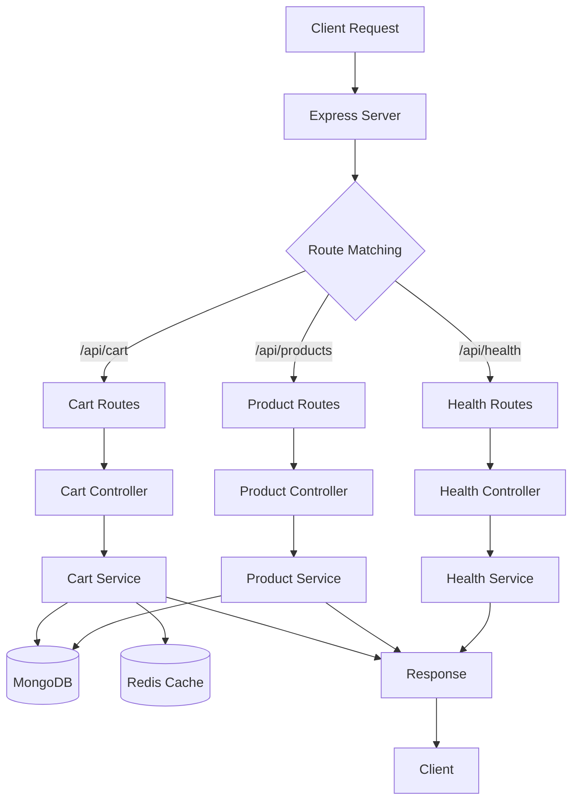

# 🗺️ Server Architecture Map - מפת ארכיטקטורת השרת

## 📊 **מבנה כללי:**

```
📁 server/
├── 🚀 server.ts              # נקודת כניסה ראשית
├── 🏗️ app.ts                 # Express app setup
├── 📁 config/                # הגדרות ותצורה
│   ├── 🗄️ db.ts              # MongoDB connection
│   ├── ⚡ redisClient.ts     # Redis connection  
│   └── 🌍 env.ts             # Environment variables
├── 📁 controllers/           # בקרי API endpoints
│   ├── 🏥 health.controller.ts
│   ├── 🛍️ product.controller.ts
│   └── 🛒 cart.controller.ts
├── 📁 services/              # לוגיקה עסקית
│   ├── 🏥 health.service.ts
│   ├── 🛍️ product.service.ts
│   └── 🛒 cart.service.ts
├── 📁 models/               # מודלי MongoDB
│   ├── 🛍️ product.model.ts
│   └── 🛒 cart.model.ts
├── 📁 routes/               # נתיבי API
│   ├── 🏥 health.routes.ts
│   ├── 🛍️ product.routes.ts
│   └── 🛒 cart.routes.ts
├── 📁 middlewares/          # middleware functions
│   └── 🛡️ error.middleware.ts
├── 📁 utils/                # כלי עזר
│   ├── 📝 logger.ts
│   ├── 📝 quickLog.ts
│   └── 📤 response.ts
└── 📁 seed/                 # נתוני בדיקה
    └── 🌱 products.seed.ts
```

---

## 🔄 **תרשים זרימת נתונים:**

### **🌊 זרימה כללית:**


---

## 🛒 **זרימה מפורטת - Cart System:**

### **📤 הוספת מוצר לעגלה:**
```
1. POST /api/cart/add
   ↓
2. cart.routes.ts → CartController.addToCart
   ↓
3. CartController → CartService.addToCart
   ↓
4. CartService:
   ├── ✅ בדיקת מוצר (MongoDB)
   ├── 🔍 קבלת עגלה נוכחית (Redis → MongoDB)
   ├── ➕ הוספת פריט
   ├── ⚡ עדכון Redis (מיידי)
   └── ⏰ עדכון MongoDB (debounced)
   ↓
5. Response → Client
```

### **🔍 קבלת עגלה:**
```
1. GET /api/cart?sessionId=xxx
   ↓
2. cart.routes.ts → CartController.getCart  
   ↓
3. CartController → CartService.getCart
   ↓
4. CartService:
   ├── ⚡ חיפוש ב-Redis (מהיר)
   ├── 🔍 אם לא נמצא → MongoDB
   ├── 📥 שמירה ב-Redis לפעם הבאה
   └── 🔄 Population של product data
   ↓
5. Response → Client
```

---

## ⚙️ **רכיבי מערכת מפורטים:**

### **🚀 נקודת כניסה - server.ts:**
- ✅ התחברות MongoDB
- ✅ התחברות Redis  
- ✅ יצירת Express app
- ✅ הפעלת השרת על פורט 4001

### **🏗️ Express Setup - app.ts:**
- 🌐 CORS middleware
- 📦 Compression
- 📝 JSON parser
- 🛣️ Routes registration
- 🛡️ Error handler

### **🗄️ Database Layer:**
```
MongoDB (simple_shop):
├── 📦 products collection
│   ├── _id, name, price, stock
│   ├── category, image, description
│   └── featured, rating, isActive
└── 🛒 carts collection
    ├── sessionId, userId (optional)
    ├── items[] (populated products)
    ├── total, createdAt, updatedAt
    └── indexes על sessionId ו-userId
```

### **⚡ Cache Layer (Redis):**
```
Redis Keys:
├── cart:guest:SESSION_ID → Cart JSON
├── cart:user:USER_ID → Cart JSON  
└── TTL: 3600s (1 hour)
```

---

## 🔍 **API Endpoints Map:**

### **🏥 Health Endpoints:**
```
GET /api/health          → בדיקת חיות השרת
GET /api/health/detailed → בדיקה מפורטת (DB, Redis)
```

### **🛍️ Product Endpoints:**
```
GET /api/products        → רשימת כל המוצרים
GET /api/products/:id    → מוצר ספציפי לפי ID
```

### **🛒 Cart Endpoints:**
```
GET    /api/cart                 → קבלת עגלה
GET    /api/cart/count           → ספירת פריטים
POST   /api/cart/add             → הוספת פריט
PUT    /api/cart/update          → עדכון כמות
DELETE /api/cart/remove          → הסרת פריט  
DELETE /api/cart/clear           → ניקוי עגלה
```

---

## ⚡ **Performance Strategy:**

### **🎯 Cache Strategy:**
1. **Redis First** - כל קריאה מתחילה מ-Redis
2. **MongoDB Fallback** - אם אין ב-Redis
3. **Debounced Saves** - עדכון MongoDB כל 5 שניות
4. **Auto Population** - מילוי נתוני מוצרים אוטומטי

### **📊 Monitoring:**
- 📝 Logging בכל פונקציה
- ⏱️ Performance tracking  
- 🔍 Error handling ו-fallbacks

---

## 🛡️ **Error Handling Flow:**

```
Error Occurs
    ↓
Caught by Service
    ↓
Logged with quickLog
    ↓
Passed to Controller
    ↓
Formatted by sendError()
    ↓
Returned to Client
```

---

## 🔄 **Data Flow Patterns:**

### **📥 Input Flow:**
```
Client → Route → Controller → Service → Model/Cache → Database
```

### **📤 Output Flow:**  
```
Database → Cache → Service → Controller → Response → Client
```

### **🔄 Cache Pattern:**
```
Read: Cache → DB (if miss) → Cache (update)
Write: Cache (immediate) → DB (debounced)
```

---

## 🎯 **Key Design Decisions:**

1. **🚀 Redis + MongoDB Hybrid** - מהירות + עמידות
2. **⏰ Debounced Saves** - פחות עומס על DB
3. **🔄 Auto Population** - נתונים מלאים תמיד
4. **📝 Clean Logging** - דיבוג קל ומהיר
5. **🛡️ Error Resilience** - fallbacks לכל תרחיש

---

## 🔧 **Development Tools:**

- 📝 **quickLog** - לוגים נקיים ומהירים
- 🔍 **Health endpoints** - בדיקת מצב המערכת
- 🌱 **Seed script** - נתונים לפיתוח
- 🛠️ **Error middleware** - טיפול מרכזי בשגיאות

---

**🎯 המערכת מתוכננת להיות מהירה, אמינה וקלה לדיבוג!**