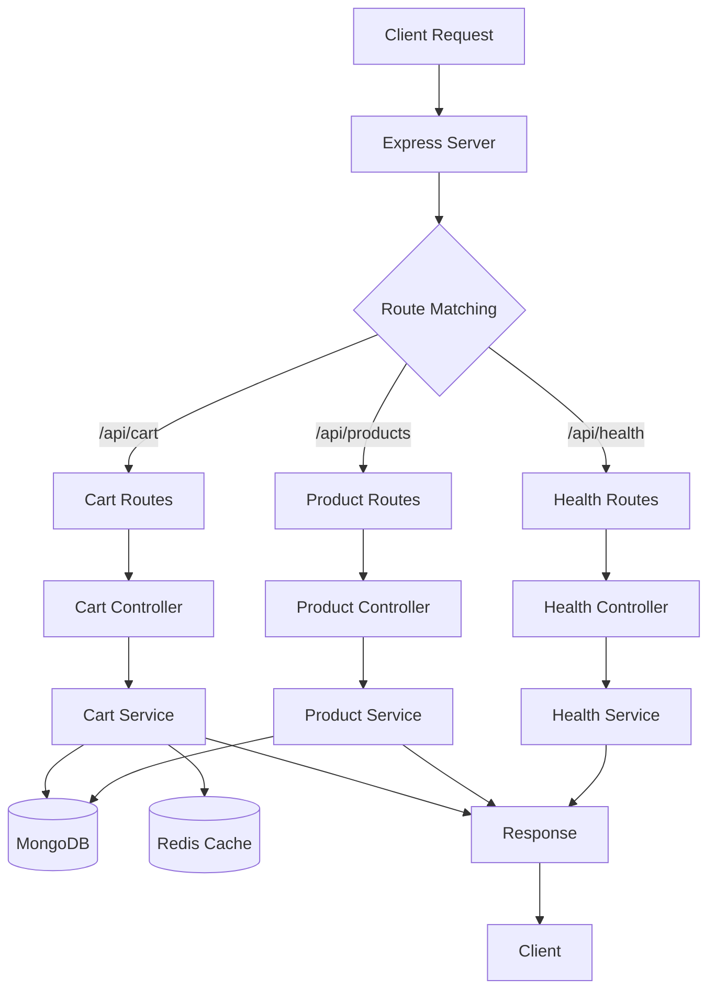

# 🗺️ Server Architecture Map - מפת ארכיטקטורת השרת

## 📊 **מבנה כללי:**

```
📁 server/
├── 🚀 server.ts              # נקודת כניסה ראשית
├── 🏗️ app.ts                 # Express app setup
├── 📁 config/                # הגדרות ותצורה
│   ├── 🗄️ db.ts              # MongoDB connection
│   ├── ⚡ redisClient.ts     # Redis connection  
│   └── 🌍 env.ts             # Environment variables
├── 📁 controllers/           # בקרי API endpoints
│   ├── 🏥 health.controller.ts
│   ├── 🛍️ product.controller.ts
│   └── 🛒 cart.controller.ts
├── 📁 services/              # לוגיקה עסקית
│   ├── 🏥 health.service.ts
│   ├── 🛍️ product.service.ts
│   └── 🛒 cart.service.ts
├── 📁 models/               # מודלי MongoDB
│   ├── 🛍️ product.model.ts
│   └── 🛒 cart.model.ts
├── 📁 routes/               # נתיבי API
│   ├── 🏥 health.routes.ts
│   ├── 🛍️ product.routes.ts
│   └── 🛒 cart.routes.ts
├── 📁 middlewares/          # middleware functions
│   └── 🛡️ error.middleware.ts
├── 📁 utils/                # כלי עזר
│   ├── 📝 logger.ts
│   ├── 📝 quickLog.ts
│   └── 📤 response.ts
└── 📁 seed/                 # נתוני בדיקה
    └── 🌱 products.seed.ts
```

---

## 🔄 **תרשים זרימת נתונים:**

### **🌊 זרימה כללית:**


---

## 🛒 **זרימה מפורטת - Cart System:**

### **📤 הוספת מוצר לעגלה:**
```
1. POST /api/cart/add
   ↓
2. cart.routes.ts → CartController.addToCart
   ↓
3. CartController → CartService.addToCart
   ↓
4. CartService:
   ├── ✅ בדיקת מוצר (MongoDB)
   ├── 🔍 קבלת עגלה נוכחית (Redis → MongoDB)
   ├── ➕ הוספת פריט
   ├── ⚡ עדכון Redis (מיידי)
   └── ⏰ עדכון MongoDB (debounced)
   ↓
5. Response → Client
```

### **🔍 קבלת עגלה:**
```
1. GET /api/cart?sessionId=xxx
   ↓
2. cart.routes.ts → CartController.getCart  
   ↓
3. CartController → CartService.getCart
   ↓
4. CartService:
   ├── ⚡ חיפוש ב-Redis (מהיר)
   ├── 🔍 אם לא נמצא → MongoDB
   ├── 📥 שמירה ב-Redis לפעם הבאה
   └── 🔄 Population של product data
   ↓
5. Response → Client
```

---

## ⚙️ **רכיבי מערכת מפורטים:**

### **🚀 נקודת כניסה - server.ts:**
- ✅ התחברות MongoDB
- ✅ התחברות Redis  
- ✅ יצירת Express app
- ✅ הפעלת השרת על פורט 4001

### **🏗️ Express Setup - app.ts:**
- 🌐 CORS middleware
- 📦 Compression
- 📝 JSON parser
- 🛣️ Routes registration
- 🛡️ Error handler

### **🗄️ Database Layer:**
```
MongoDB (simple_shop):
├── 📦 products collection
│   ├── _id, name, price, stock
│   ├── category, image, description
│   └── featured, rating, isActive
└── 🛒 carts collection
    ├── sessionId, userId (optional)
    ├── items[] (populated products)
    ├── total, createdAt, updatedAt
    └── indexes על sessionId ו-userId
```

### **⚡ Cache Layer (Redis):**
```
Redis Keys:
├── cart:guest:SESSION_ID → Cart JSON
├── cart:user:USER_ID → Cart JSON  
└── TTL: 3600s (1 hour)
```

---

## 🔍 **API Endpoints Map:**

### **🏥 Health Endpoints:**
```
GET /api/health          → בדיקת חיות השרת
GET /api/health/detailed → בדיקה מפורטת (DB, Redis)
```

### **🛍️ Product Endpoints:**
```
GET /api/products        → רשימת כל המוצרים
GET /api/products/:id    → מוצר ספציפי לפי ID
```

### **🛒 Cart Endpoints:**
```
GET    /api/cart                 → קבלת עגלה
GET    /api/cart/count           → ספירת פריטים
POST   /api/cart/add             → הוספת פריט
PUT    /api/cart/update          → עדכון כמות
DELETE /api/cart/remove          → הסרת פריט  
DELETE /api/cart/clear           → ניקוי עגלה
```

---

## 📖 **Detailed Endpoint Logic - מה קורה בכל שכבה:**

### **🛍️ GET /api/products - קבלת כל המוצרים**

#### **Layer 1: Route (product.routes.ts)**
```typescript
router.get("/", ProductController.getProducts)
```
- מקבל את הבקשה
- מעביר ל-Controller

#### **Layer 2: Controller (product.controller.ts)**
```typescript
export async function getProducts(_req: Request, res: Response) {
  const products = await listProducts();
  res.json(ok(products));
}
```
- קורא ל-Service
- **לא בודק אם המערך ריק** - מערך ריק זה OK!
- עוטף בתשובה `ok(products)`

#### **Layer 3: Service (product.service.ts)**
```typescript
export async function listProducts() {
  return ProductModel.find({ isActive: true });
}
```
- שולף מ-MongoDB
- מסנן רק מוצרים פעילים
- מחזיר מערך (ריק או מלא)

#### **Layer 4: Model (product.model.ts)**
```typescript
const productSchema = new Schema({
  name: String,
  price: Number,
  // ...
})
```
- מגדיר את המבנה
- Mongoose מבצע את ה-query

**תוצאה:** תמיד 200 OK + מערך (גם אם ריק)

---

### **🛍️ GET /api/products/:id - קבלת מוצר ספציפי**

#### **Layer 1: Route (product.routes.ts)**
```typescript
router.get("/:id", ProductController.getProduct)
```
- מקבל את ה-ID מה-URL
- מעביר ל-Controller

#### **Layer 2: Controller (product.controller.ts)**
```typescript
export async function getProduct(req: Request, res: Response) {
  const { id } = req.params;
  const product = await getProductById(id);
  if (!product) return res.status(404).json(fail("Product not found")); // ✅ בדיקה!
  res.json(ok(product));
}
```
- שולף את ה-ID
- קורא ל-Service
- **✅ בודק אם המוצר קיים**
- אם לא → 404 Not Found
- אם כן → 200 OK + מוצר

#### **Layer 3: Service (product.service.ts)**
```typescript
export async function getProductById(id: string) {
  return ProductModel.findById(id);
}
```
- מחפש לפי ID
- מחזיר מוצר או `null`

#### **Layer 4: Model**
- Mongoose מבצע `findById`
- מחזיר `null` אם לא נמצא

**תוצאה:** 
- ✅ 200 OK + מוצר (אם נמצא)
- ❌ 404 Not Found (אם לא נמצא)

---

### **🛒 POST /api/cart/add - הוספת מוצר לעגלה**

#### **Layer 1: Route (cart.routes.ts)**
```typescript
router.post("/add", CartController.addToCart)
```
- מקבל body: `{ sessionId, productId, quantity }`

#### **Layer 2: Controller (cart.controller.ts)**
```typescript
static async addToCart(req: Request, res: Response) {
  const { sessionId, productId, quantity } = req.body;
  
  // ✅ בדיקת שדות חובה
  if (!sessionId || !productId || !quantity) {
    return sendError(res, 400, "Missing required fields");
  }
  
  const cart = await CartService.addToCart(sessionId, productId, quantity);
  sendSuccess(res, cart, "Item added to cart");
}
```
- שולף נתונים מה-body
- **✅ בודק שדות חובה**
- קורא ל-Service
- **טיפול בשגיאות ספציפיות** (stock, not found)

#### **Layer 3: Service (cart.service.ts)**
```typescript
static async addToCart(sessionId, productId, quantity) {
  // 1. ✅ בדיקת מוצר
  const product = await ProductModel.findById(productId);
  if (!product) throw new Error("Product not found");
  
  // 2. ✅ בדיקת מלאי
  if (product.stock < quantity) throw new Error("Insufficient stock");
  
  // 3. קבלת עגלה נוכחית
  let cart = await this.getCart(sessionId);
  
  // 4. הוספה/עדכון כמות
  const existingItem = cart.items.find(item => item.product === productId);
  if (existingItem) {
    existingItem.quantity += quantity; // עדכון
  } else {
    cart.items.push({ product: productId, quantity, price: product.price }); // חדש
  }
  
  // 5. חישוב סכום
  cart.total = cart.items.reduce((sum, item) => sum + item.price * item.quantity, 0);
  
  // 6. ⚡ עדכון Redis מיידי
  await this.updateCartInCache(cartId, cart);
  
  // 7. ⏰ תזמון שמירה ל-MongoDB (5 שניות)
  // לא חוסם!
  
  return cart;
}
```
- **7 שלבים מפורטים**
- בדיקות תקינות מלאות
- Cache strategy חכם

#### **Layer 4: Cache & Database**
- Redis - עדכון מיידי
- MongoDB - עדכון debounced

**תוצאה:**
- ✅ 200 OK + עגלה מעודכנת
- ❌ 404 Not Found (מוצר לא קיים)
- ❌ 400 Bad Request (אין מלאי)

---

### **🛒 GET /api/cart - קבלת עגלה**

#### **Layer 1: Route (cart.routes.ts)**
```typescript
router.get("/", CartController.getCart)
```
- מקבל query: `?sessionId=xxx`

#### **Layer 2: Controller (cart.controller.ts)**
```typescript
static async getCart(req: Request, res: Response) {
  const { sessionId } = req.query;
  
  // ✅ בדיקת sessionId
  if (!sessionId) {
    return sendError(res, 400, "Session ID is required");
  }
  
  const cart = await CartService.getCart(sessionId);
  
  // ✅ אם אין עגלה - מחזיר עגלה ריקה
  if (!cart) {
    return sendSuccess(res, { sessionId, items: [], total: 0 });
  }
  
  sendSuccess(res, cart);
}
```
- שולף sessionId מ-query
- **✅ בודק sessionId**
- **✅ מטפל בעגלה ריקה** - לא שגיאה!
- מחזיר עגלה או עגלה ריקה

#### **Layer 3: Service (cart.service.ts)**
```typescript
static async getCart(sessionId: string) {
  const cartId = `guest:${sessionId}`;
  
  // 1. ⚡ נסה Redis קודם (מהיר!)
  const redisCart = await redisClient.get(`cart:${cartId}`);
  if (redisCart) {
    const cart = JSON.parse(redisCart);
    // ✅ בדוק אם צריך populate
    if (cart.items[0] && typeof cart.items[0].product === 'string') {
      // populate products
    }
    return cart;
  }
  
  // 2. 💾 Fallback למונגו
  const dbCart = await CartModel.findOne({ sessionId }).populate("items.product");
  
  if (dbCart) {
    // 3. 📥 שמור ב-Redis לפעם הבאה
    await redisClient.setex(`cart:${cartId}`, 3600, JSON.stringify(dbCart));
    return dbCart;
  }
  
  return null; // אין עגלה
}
```
- **3 שלבים:**
  1. חיפוש ב-Redis
  2. Fallback ל-MongoDB
  3. Cache ב-Redis
- **Auto-population** של נתוני מוצרים

**תוצאה:**
- ✅ 200 OK + עגלה (מלאה או ריקה)
- ❌ 400 Bad Request (חסר sessionId)

---

## 🎯 **Summary - הבדלי לוגיקה:**

| Endpoint | בדיקת קיום | טיפול בריק | Status Codes |
|----------|------------|------------|--------------|
| **GET /products** | ❌ לא | מחזיר `[]` | 200 תמיד |
| **GET /products/:id** | ✅ כן | 404 אם לא נמצא | 200, 404 |
| **POST /cart/add** | ✅ כן (מוצר + מלאי) | 400/404 אם בעיה | 200, 400, 404 |
| **GET /cart** | ✅ כן (sessionId) | מחזיר עגלה ריקה | 200, 400 |

**הכלל:**
- **רשימות (lists)** → מערך ריק = OK
- **פריט יחיד (single item)** → לא נמצא = 404
- **פעולות (actions)** → בדיקות מלאות + שגיאות מפורטות

---

## ⚡ **Performance Strategy:**

### **🎯 Cache Strategy:**
1. **Redis First** - כל קריאה מתחילה מ-Redis
2. **MongoDB Fallback** - אם אין ב-Redis
3. **Debounced Saves** - עדכון MongoDB כל 5 שניות
4. **Auto Population** - מילוי נתוני מוצרים אוטומטי

### **📊 Monitoring:**
- 📝 Logging בכל פונקציה
- ⏱️ Performance tracking  
- 🔍 Error handling ו-fallbacks

---

## 🛡️ **Error Handling Flow:**

```
Error Occurs
    ↓
Caught by Service
    ↓
Logged with quickLog
    ↓
Passed to Controller
    ↓
Formatted by sendError()
    ↓
Returned to Client
```

---

## 🔄 **Data Flow Patterns:**

### **📥 Input Flow:**
```
Client → Route → Controller → Service → Model/Cache → Database
```

### **📤 Output Flow:**  
```
Database → Cache → Service → Controller → Response → Client
```

### **🔄 Cache Pattern:**
```
Read: Cache → DB (if miss) → Cache (update)
Write: Cache (immediate) → DB (debounced)
```

---

## 🎯 **Key Design Decisions:**

1. **🚀 Redis + MongoDB Hybrid** - מהירות + עמידות
2. **⏰ Debounced Saves** - פחות עומס על DB
3. **🔄 Auto Population** - נתונים מלאים תמיד
4. **📝 Clean Logging** - דיבוג קל ומהיר
5. **🛡️ Error Resilience** - fallbacks לכל תרחיש

---

## 🔧 **Development Tools:**

- 📝 **quickLog** - לוגים נקיים ומהירים
- 🔍 **Health endpoints** - בדיקת מצב המערכת
- 🌱 **Seed script** - נתונים לפיתוח
- 🛠️ **Error middleware** - טיפול מרכזי בשגיאות

---

**🎯 המערכת מתוכננת להיות מהירה, אמינה וקלה לדיבוג!**