# 🎯 Server Endpoints - מדריך חזותי מלא

> **📖 מדריך זה מציג את כל ה-endpoints של השרת עם דיאגרמות חזותיות מפורטות**  
> כל endpoint כולל: זרימת נתונים, תנאים, שגיאות, ודוגמאות Request/Response

## 🚀 קישורים מהירים

- **התחל כאן:** [Health Check](#-health-endpoints) - בדיקה שהשרת עובד
- **Authentication:** [Auth Endpoints](#-authentication-endpoints) - הרשמה והתחברות
- **קניות:** [Cart System](#-cart-endpoints) - עגלת קניות
- **מוצרים:** [Products](#-product-endpoints) - קטלוג
- **הזמנות:** [Orders](#-order-endpoints) - ניהול הזמנות
- **Best Practices:** [למטה ↓](#-best-practices) - המלצות ודוגמאות

## 💡 איך להשתמש במדריך?

### לפי תפקיד:

**👨‍💻 Frontend Developer:**
1. ראה את ה-Request/Response examples
2. שים לב ל-Error tables (מה לטפל בצד לקוח)
3. בדוק Authentication requirements

**🔧 Backend Developer:**
1. עקוב אחרי הדיאגרמות - שלב אחרי שלב
2. שים לב ל-Side Effects (stock, cart, emails)
3. הבן את ההבדל בין MongoDB ו-Redis

**🧪 QA/Tester:**
1. השתמש ב-Error tables לבדיקות
2. תכנן test cases לפי הזרימות
3. בדוק את כל התנאים בדיאגרמות

**📚 מתכנת מתחיל:**
1. התחל ב-[Common Workflows](#-common-workflows)
2. קרא את הדיאגרמות משמאל לימין
3. עקוב אחרי הצבעים (כחול→ירוק=הצלחה)

---

## 🎨 מקרא צבעים מהיר

| צבע | משמעות | דוגמה |
|-----|--------|-------|
| 🔵 **כחול** | נקודת כניסה - Request | `POST /api/auth/login` |
| 🟢 **ירוק** | הצלחה - Response 200/201 | `✅ 200: Success` |
| 🔴 **אדום** | שגיאה - Errors 400/401/404/409 | `❌ 401: Unauthorized` |
| 🟡 **צהוב** | MongoDB - מסד נתונים ראשי | `Find user in MongoDB` |
| 🟠 **כתום** | Redis - Cache מהיר | `Get cart from Redis` |

---

## 📋 Table of Contents
- [🎯 Server Endpoints - מדריך חזותי מלא](#-server-endpoints---מדריך-חזותי-מלא)
  - [🚀 קישורים מהירים](#-קישורים-מהירים)
  - [💡 איך להשתמש במדריך?](#-איך-להשתמש-במדריך)
    - [לפי תפקיד:](#לפי-תפקיד)
  - [🎨 מקרא צבעים מהיר](#-מקרא-צבעים-מהיר)
  - [📋 Table of Contents](#-table-of-contents)
  - [🔐 Authentication Endpoints](#-authentication-endpoints)
    - [POST /api/auth/register](#post-apiauthregister)
    - [POST /api/auth/login](#post-apiauthlogin)
    - [POST /api/auth/logout](#post-apiauthlogout)
    - [GET /api/auth/verify](#get-apiauthverify)
    - [GET /api/auth/profile](#get-apiauthprofile)
    - [PUT /api/auth/profile](#put-apiauthprofile)
    - [PUT /api/auth/password](#put-apiauthpassword)
    - [DELETE /api/auth/account](#delete-apiauthaccount)
    - [GET /api/auth/stats](#get-apiauthstats)
  - [🛒 Cart Endpoints](#-cart-endpoints)
    - [📊 סיכום מהיר - Cart Operations](#-סיכום-מהיר---cart-operations)
    - [GET /api/cart](#get-apicart)
    - [POST /api/cart/add](#post-apicartadd)
    - [PUT /api/cart/update](#put-apicartupdate)
    - [DELETE /api/cart/remove](#delete-apicartremove)
    - [DELETE /api/cart/clear](#delete-apicartclear)
    - [GET /api/cart/count](#get-apicartcount)
    - [POST /api/cart/merge](#post-apicartmerge)
  - [📦 Product Endpoints](#-product-endpoints)
    - [📊 סיכום מהיר - Product Operations](#-סיכום-מהיר---product-operations)
    - [GET /api/products](#get-apiproducts)
    - [GET /api/products/:id](#get-apiproductsid)
  - [📋 Order Endpoints](#-order-endpoints)
    - [📊 סיכום מהיר - Order Operations](#-סיכום-מהיר---order-operations)
    - [POST /api/orders](#post-apiorders)
    - [GET /api/orders](#get-apiorders)
    - [GET /api/orders/:id](#get-apiordersid)
    - [POST /api/orders/:id/cancel](#post-apiordersidcancel)
    - [PUT /api/orders/:id/status](#put-apiordersidstatus)
    - [GET /api/orders/stats](#get-apiordersstats)
  - [❤️ Health Endpoints](#️-health-endpoints)
    - [GET /api/health](#get-apihealth)
    - [GET /api/health/ping](#get-apihealthping)
  - [🎯 Legend](#-legend)
    - [Color Coding:](#color-coding)
    - [Common HTTP Status Codes:](#common-http-status-codes)
    - [Middleware Flow:](#middleware-flow)
  - [📚 Summary](#-summary)
  - [🎯 Common Workflows](#-common-workflows)
    - [🛒 תהליך קנייה מלא (Guest → User)](#-תהליך-קנייה-מלא-guest--user)
    - [🔐 תהליך Authentication מלא](#-תהליך-authentication-מלא)
    - [📦 תהליך ניהול מלאי](#-תהליך-ניהול-מלאי)
  - [💡 Best Practices](#-best-practices)
    - [🔒 Security](#-security)
    - [⚡ Performance](#-performance)
    - [🐛 Error Handling](#-error-handling)
    - [📊 Data Consistency](#-data-consistency)
  - [🎓 למידה והבנה](#-למידה-והבנה)
    - [קריאה מומלצת לפי נושא:](#קריאה-מומלצת-לפי-נושא)

---

## 🔐 Authentication Endpoints

> **מטרה:** ניהול משתמשים - הרשמה, התחברות, ניהול פרופיל  
> **Authentication:** JWT Token ב-httpOnly cookie  
> **Rate Limiting:** מוגבל ל-5 ניסיונות לדקה

---

### POST /api/auth/register
**📝 תיאור:** יצירת משתמש חדש במערכת

**🔒 Security:** Password מוצפן ב-bcrypt, Token נשמר ב-httpOnly cookie

**⏱️ Rate Limit:** 5 בקשות לדקה


**📥 Request Example:**
```json
{
  "name": "John Doe",
  "email": "john@example.com",
  "password": "securepass123"
}
```

**✅ Success Response (201):**
```json
{
  "status": "success",
  "data": {
    "user": {
      "_id": "507f1f77bcf86cd799439011",
      "name": "John Doe",
      "email": "john@example.com"
    },
    "token": "eyJhbGciOiJIUzI1NiIsInR5cCI6IkpXVCJ9..."
  }
}
```

**❌ Possible Errors:**
| Status | Message | Cause |
|--------|---------|-------|
| 400 | Name, email, password required | חסרים שדות חובה |
| 400 | Invalid email format | פורמט email לא תקין |
| 400 | Password must be 6+ chars | סיסמה קצרה מדי |
| 409 | Email already registered | Email כבר קיים במערכת |
| 429 | Too Many Requests | יותר מדי ניסיונות |

---

### POST /api/auth/login
**📝 תיאור:** התחברות למערכת עם email וסיסמה

**🔒 Security:** bcrypt password comparison, JWT token generation

```mermaid
flowchart TD
    Request([POST /api/auth/login]) --> Middleware1[Parse JSON body]
    Middleware1 --> RateLimit{Rate limit check}
    RateLimit -->|Exceeded| Return429[❌ 429 Too Many Requests]
    RateLimit -->|OK| RouteHandler[authRoutes.post /login]
    
    RouteHandler --> Controller[AuthController.login]
    
    Controller --> ValidateInput{Validate input}
    ValidateInput -->|Missing fields| Return400["❌ 400: Email and password required"]
    ValidateInput -->|Invalid email| Return400Email["❌ 400: Invalid email format"]
    ValidateInput -->|Valid| CallService[Call AuthService.login]
    
    CallService --> FindUser[(Find user by email in MongoDB)]
    FindUser --> UserExists{User found?}
    UserExists -->|No| Return401User["❌ 401: Invalid credentials"]
    UserExists -->|Yes| CheckActive{User is active?}
    
    CheckActive -->|No| Return403["❌ 403: Account deactivated"]
    CheckActive -->|Yes| ComparePassword[Compare password with bcrypt]
    
    ComparePassword --> PasswordMatch{Password matches?}
    PasswordMatch -->|No| Return401Pass["❌ 401: Invalid credentials"]
    PasswordMatch -->|Yes| GenerateJWT[Generate JWT token]
    
    GenerateJWT --> SetCookie[Set httpOnly cookie]
    SetCookie --> PrepareResponse[Prepare response object]
    PrepareResponse --> Return200["✅ 200: Login successful + token + user data"]
    
    
    style Request fill:#e3f2fd
    style Return200 fill:#c8e6c9
    style Return429 fill:#ffcdd2
**📥 Request Example:**
```json
{
  "email": "john@example.com",
  "password": "securepass123"
}
```

**✅ Success Response (200):**
```json
{
  "status": "success",
  "data": {
    "user": {
      "_id": "507f1f77bcf86cd799439011",
      "name": "John Doe",
      "email": "john@example.com"
    },
    "token": "eyJhbGciOiJIUzI1NiIsInR5cCI6IkpXVCJ9..."
  }
}
```

**❌ Possible Errors:**
| Status | Message | Cause |
|--------|---------|-------|
| 400 | Email and password required | חסרים שדות חובה |
| 400 | Invalid email format | פורמט email לא תקין |
| 401 | Invalid credentials | Email או סיסמה שגויים |
| 403 | Account deactivated | החשבון מושבת |
| 429 | Too Many Requests | יותר מדי ניסיונות התחברות |

---

### POST /api/auth/logout
**📝 תיאור:** התנתקות מהמערכת - מחיקת session cookie

**🔒 Security:** מחיקת httpOnly cookie מהדפדפן
    "token": "eyJhbGciOiJIUzI1NiIsInR5cCI6IkpXVCJ9..."
  }
}
```

---

### POST /api/auth/logout

```mermaid
flowchart TD
    Request([POST /api/auth/logout]) --> Middleware1[Parse JSON body]
    Middleware1 --> OptionalAuth[optionalAuth middleware]
    OptionalAuth --> RouteHandler[authRoutes.post /logout]
    
    RouteHandler --> Controller[AuthController.logout]
**✅ Success Response (200):**
```json
{
  "status": "success",
  "message": "Logged out successfully"
}
```

**💡 Note:** ה-logout עובד גם עבור משתמשים לא מחוברים (optionalAuth)

---

### GET /api/auth/verify
**📝 תיאור:** בדיקת תקינות Token - מוודא שהמשתמש מחובר

**🔒 Security:** מחייב JWT token תקף
  "status": "success",
  "message": "Logged out successfully"
}
```

---

### GET /api/auth/verify

```mermaid
flowchart TD
    Request([GET /api/auth/verify]) --> RequireAuth[requireAuth middleware]
    
    RequireAuth --> CheckToken{Has valid token?}
    CheckToken -->|No| Return401["❌ 401: No token provided"]
    CheckToken -->|Yes| VerifyJWT[Verify JWT signature]
    
    VerifyJWT --> TokenValid{Token valid?}
    TokenValid -->|No| Return401Invalid["❌ 401: Invalid token"]
    TokenValid -->|Yes| FindUser[(Find user by ID in MongoDB)]
    
    FindUser --> UserExists{User exists?}
    UserExists -->|No| Return401User["❌ 401: User not found"]
    UserExists -->|Yes| AttachUser[Attach user to req.user]
    
    AttachUser --> RouteHandler[authRoutes.get /verify]
    RouteHandler --> Controller[AuthController.verifyToken]
    Controller --> Return200["✅ 200: Token valid + user data"]
    
    
**✅ Success Response (200):**
```json
{
  "status": "success",
  "data": {
    "user": {
      "_id": "507f1f77bcf86cd799439011",
      "name": "John Doe",
      "email": "john@example.com"
    }
  }
}
```

**❌ Possible Errors:**
| Status | Message | Cause |
|--------|---------|-------|
| 401 | No token provided | אין cookie/token בבקשה |
| 401 | Invalid token | Token לא תקף או פג תוקף |
| 401 | User not found | המשתמש נמחק מהמערכת |

---

### GET /api/auth/profile
**📝 תיאור:** קבלת פרטי המשתמש המחובר

**🔒 Security:** מחייב התחברות (requireAuth)ple.com"
    }
  }
}
```

---

### GET /api/auth/profile

```mermaid
flowchart TD
    Request([GET /api/auth/profile]) --> RequireAuth[requireAuth middleware]
    RequireAuth --> CheckToken{Valid token?}
    CheckToken -->|No| Return401["❌ 401: Unauthorized"]
    CheckToken -->|Yes| RouteHandler[authRoutes.get /profile]
    
    RouteHandler --> Controller[AuthController.getProfile]
    Controller --> GetUserId[Get userId from req.user]
    GetUserId --> FindUser[(Find user by ID in MongoDB)]
    
    FindUser --> UserExists{User found?}
    UserExists -->|No| Return404["❌ 404: User not found"]
    UserExists -->|Yes| PrepareResponse[Prepare user object - exclude password]
    PrepareResponse --> Return200["✅ 200: User profile data"]
**✅ Success Response (200):**
```json
{
  "status": "success",
  "data": {
    "user": {
      "_id": "507f1f77bcf86cd799439011",
      "name": "John Doe",
      "email": "john@example.com",
      "createdAt": "2024-01-15T10:30:00.000Z"
    }
  }
}
```

**❌ Possible Errors:**
| Status | Message | Cause |
|--------|---------|-------|
| 401 | Unauthorized | לא מחובר |
| 404 | User not found | המשתמש לא נמצא |

---

### PUT /api/auth/profile
**📝 תיאור:** עדכון פרטי המשתמש (שם ו-email)

**🔒 Security:** מחייב התחברות, בודק ש-email חדש לא תפוס01-15T10:30:00.000Z"
    }
  }
}
```

---

### PUT /api/auth/profile

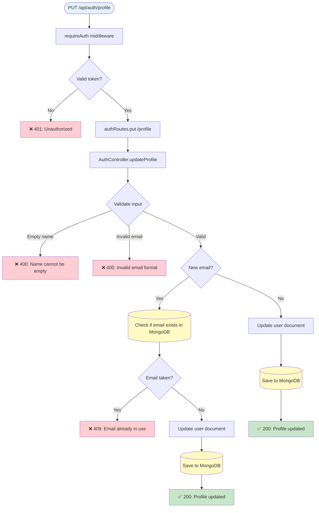

**Request:**
```json
{
  "name": "John Updated",
  "email": "john.new@example.com"
}
```

**Response (200):**
```json
{
  "status": "success",
  "data": {
    "user": {
      "_id": "507f1f77bcf86cd799439011",
      "name": "John Updated",
      "email": "john.new@example.com"
    }
  }
}
```

---

### PUT /api/auth/password

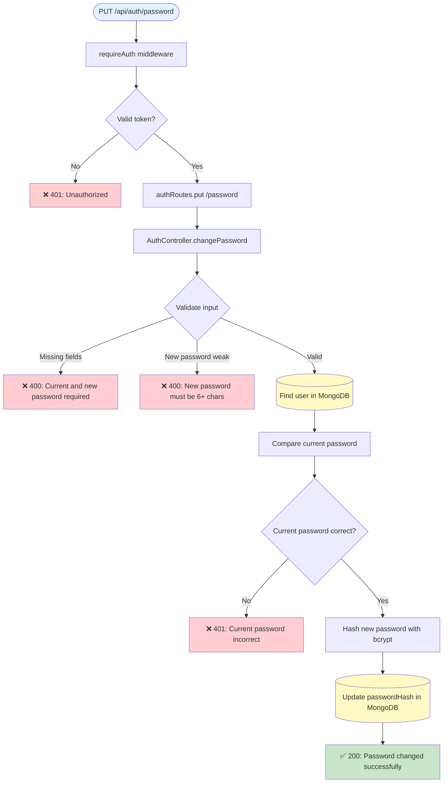

**Request:**
```json
{
  "currentPassword": "oldpass123",
  "newPassword": "newpass456"
}
```

**Response (200):**
```json
{
  "status": "success",
  "message": "Password changed successfully"
}
```

---

### DELETE /api/auth/account

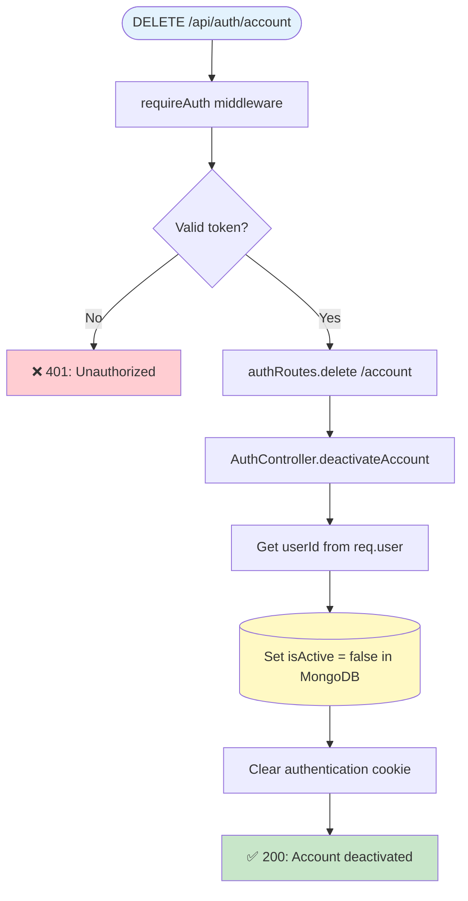

**Response (200):**
```json
{
  "status": "success",
  "message": "Account deactivated successfully"
}
```

---

### GET /api/auth/stats

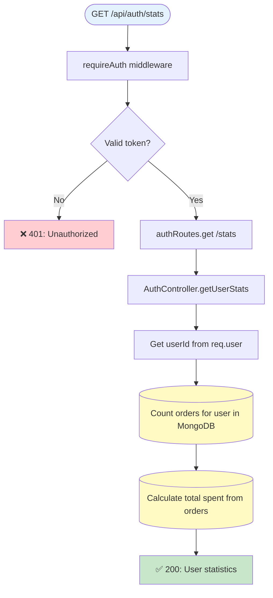

**Response (200):**
```json
{
  "status": "success",
  "data": {
    "stats": {
      "totalOrders": 5,
      "totalSpent": 299.95
    }
  }
}
```

---

## 🛒 Cart Endpoints

> **מטרה:** ניהול עגלת קניות - תמיכה במשתמשים מחוברים ואורחים  
> **Storage:**  
> - משתמשים מחוברים → MongoDB (קבוע)  
> - משתמשים אורחים → Redis (זמני, 24 שעות TTL)  
> **Session:** Cookie עם sessionId לאורחים

### 📊 סיכום מהיר - Cart Operations

| Endpoint | Method | Auth | Purpose |
|----------|--------|------|---------|
| `/api/cart` | GET | Optional | קבלת עגלה |
| `/api/cart/add` | POST | Optional | הוספת מוצר |
| `/api/cart/update` | PUT | Optional | עדכון כמות |
| `/api/cart/remove` | DELETE | Optional | הסרת מוצר |
| `/api/cart/clear` | DELETE | Optional | ריקון עגלה |
| `/api/cart/count` | GET | Optional | ספירת פריטים |
| `/api/cart/merge` | POST | Required | מיזוג עגלה אורח→משתמש |

---

### GET /api/cart
**📝 תיאור:** קבלת עגלת הקניות - עובד גם למשתמשים מחוברים וגם לאורחים

**🔑 Key Feature:** Auto-populate product details (name, price, image)

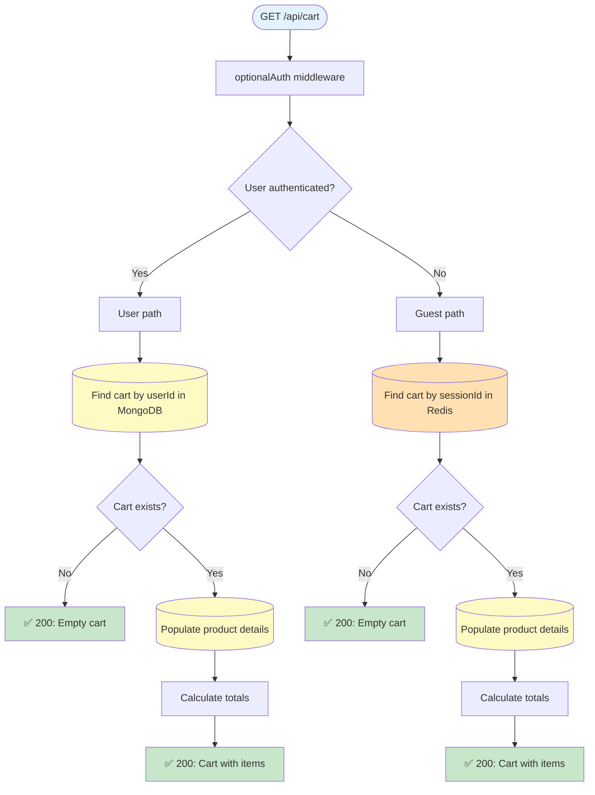

**Response (200):**
```json
{
  "status": "success",
  "data": {
    "cart": {
      "items": [
        {
          "productId": "507f1f77bcf86cd799439011",
          "name": "Product Name",
          "price": 29.99,
          "quantity": 2,
          "subtotal": 59.98
        }
      ],
      "totalItems": 2,
      "totalPrice": 59.98
    }
  }
}
```

---

### POST /api/cart/add

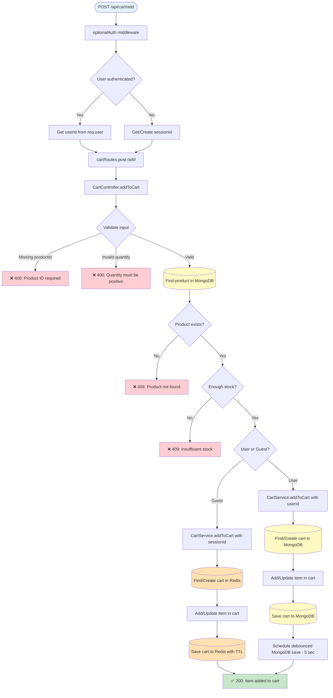

**Request:**
```json
{
  "productId": "507f1f77bcf86cd799439011",
  "quantity": 2
}
```

**Response (200):**
```json
{
  "status": "success",
  "data": {
    "cart": {
      "items": [
        {
          "productId": "507f1f77bcf86cd799439011",
          "quantity": 2,
          "price": 29.99
        }
      ],
      "totalItems": 2,
      "totalPrice": 59.98
    }
  }
}
```

---

### PUT /api/cart/update

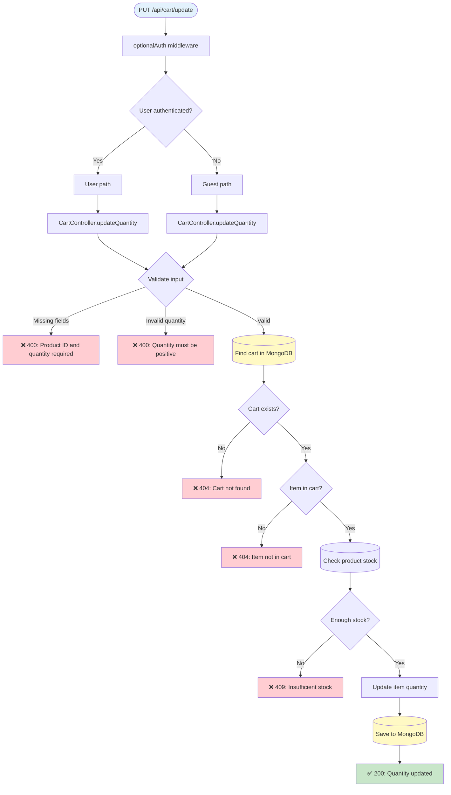

**Request:**
```json
{
  "productId": "507f1f77bcf86cd799439011",
  "quantity": 3
}
```

**Response (200):**
```json
{
  "status": "success",
  "data": {
    "cart": {
      "items": [
        {
          "productId": "507f1f77bcf86cd799439011",
          "quantity": 3,
          "price": 29.99
        }
      ],
      "totalItems": 3,
      "totalPrice": 89.97
    }
  }
}
```

---

### DELETE /api/cart/remove

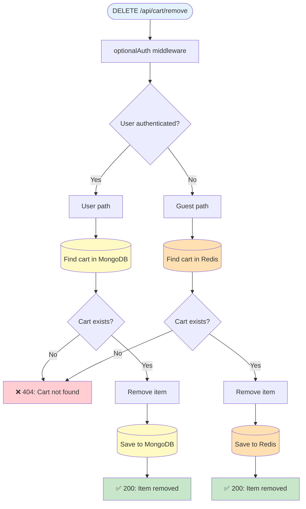

**Request:**
```json
{
  "productId": "507f1f77bcf86cd799439011"
}
```

**Response (200):**
```json
{
  "status": "success",
  "message": "Item removed from cart"
}
```

---

### DELETE /api/cart/clear

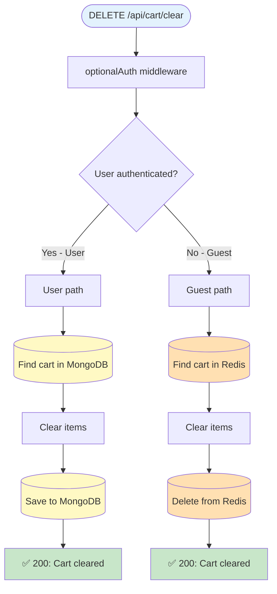

**Response (200):**
```json
{
  "status": "success",
  "message": "Cart cleared successfully"
}
```

---

### GET /api/cart/count

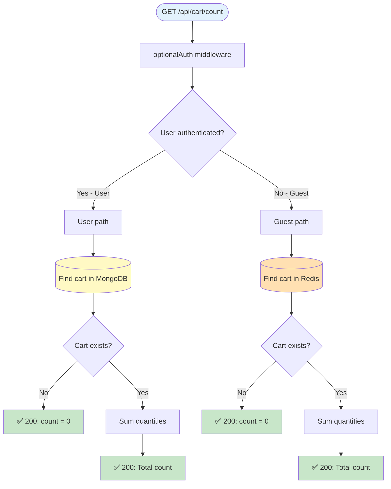

**Response (200):**
```json
{
  "status": "success",
  "data": {
    "count": 5
  }
}
```

---

### POST /api/cart/merge

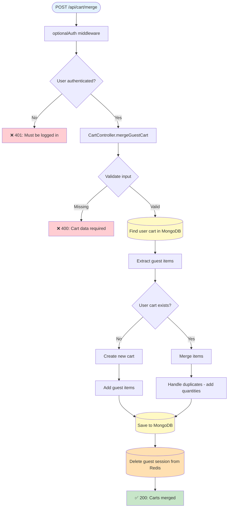

**Request:**
```json
{
  "guestCart": {
    "items": [
      {
        "productId": "507f1f77bcf86cd799439011",
        "quantity": 2
      }
    ]
  }
}
```

**Response (200):**
```json
{
  "status": "success",
  "data": {
    "cart": {
      "items": [
        {
          "productId": "507f1f77bcf86cd799439011",
          "quantity": 4
        }
      ],
      "totalItems": 4
    }
  }
}
```

---

## 📦 Product Endpoints

> **מטרה:** קטלוג מוצרים - חיפוש, סינון, הצגת פרטים  
> **Database:** MongoDB - products collection  
> **Features:** Text search, category filter, price range, sorting

### 📊 סיכום מהיר - Product Operations

| Endpoint | Method | Auth | Purpose |
|----------|--------|------|---------|
| `/api/products` | GET | None | רשימת מוצרים + filters |
| `/api/products/:id` | GET | None | פרטי מוצר בודד |

**🔍 Available Filters:**
- `search` - חיפוש טקסט בשם/תיאור
- `category` - סינון לפי קטגוריה
- `minPrice` / `maxPrice` - טווח מחירים
- `sort` - מיון (price_asc, price_desc, name, newest)

---

### GET /api/products
**📝 תיאור:** קבלת רשימת מוצרים עם אפשרויות סינון וחיפוש

**🎯 Use Cases:** דף ראשי, חיפוש, קטגוריות

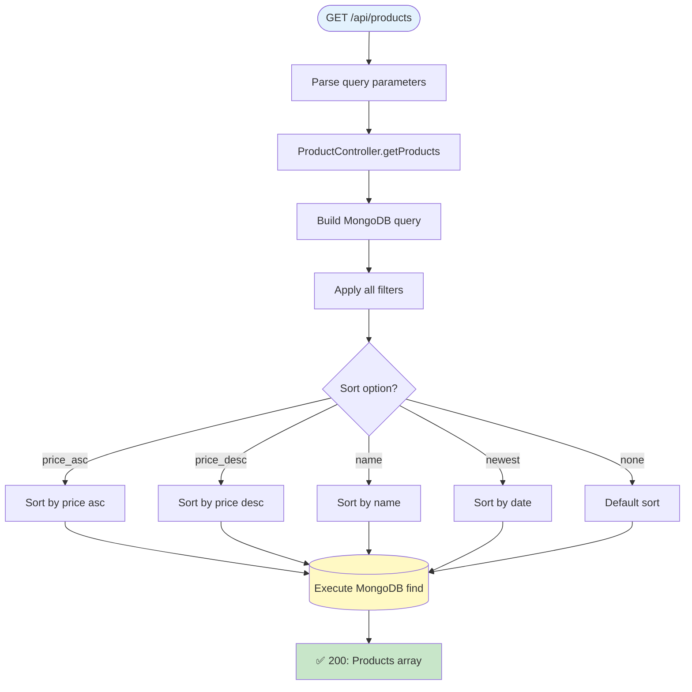

**Query Parameters:**
- `search` - Text search on name/description
- `category` - Filter by category
- `minPrice` - Minimum price
- `maxPrice` - Maximum price
- `sort` - Sort order (price_asc, price_desc, name, newest)

**Response (200):**
```json
{
  "status": "success",
  "data": {
    "products": [
      {
        "_id": "507f1f77bcf86cd799439011",
        "name": "Product Name",
        "description": "Product description",
        "price": 29.99,
        "stock": 100,
        "category": "electronics",
        "imageUrl": "https://example.com/image.jpg"
      }
    ]
  }
}
```

---

### GET /api/products/:id

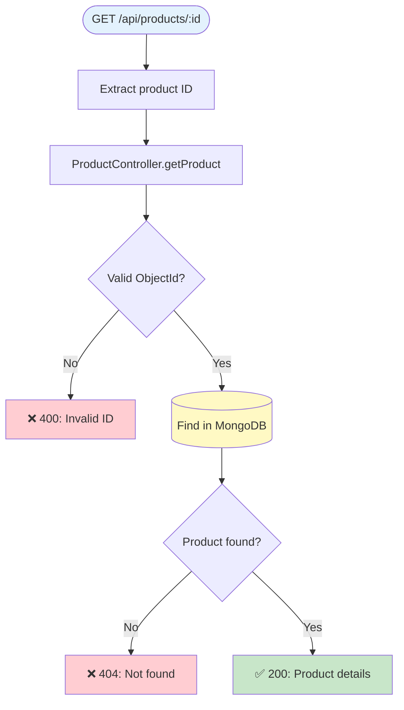

**Response (200):**
```json
{
  "status": "success",
  "data": {
    "product": {
      "_id": "507f1f77bcf86cd799439011",
      "name": "Product Name",
      "description": "Detailed product description",
      "price": 29.99,
      "stock": 100,
      "category": "electronics",
      "imageUrl": "https://example.com/image.jpg",
      "createdAt": "2024-01-15T10:30:00.000Z"
    }
  }
}
```

---

## 📋 Order Endpoints

> **מטרה:** ניהול הזמנות - יצירה, צפייה, ביטול, עדכון סטטוס  
> **Auth:** כל הפעולות דורשות התחברות (חוץ מעדכון סטטוס = Admin only)  
> **Database:** MongoDB - orders collection  
> **Side Effects:** עדכון stock, מחיקת cart, שליחת emails

### 📊 סיכום מהיר - Order Operations

| Endpoint | Method | Auth | Purpose |
|----------|--------|------|---------|
| `/api/orders` | POST | Required | יצירת הזמנה חדשה |
| `/api/orders` | GET | Required | רשימת הזמנות שלי |
| `/api/orders/:id` | GET | Required | פרטי הזמנה |
| `/api/orders/:id/cancel` | POST | Required | ביטול הזמנה |
| `/api/orders/:id/status` | PUT | Admin | עדכון סטטוס (admin) |
| `/api/orders/stats` | GET | Required | סטטיסטיקות |

**📦 Order Statuses:**
- `pending` - ממתינה לעיבוד
- `processing` - בעיבוד
- `shipped` - נשלחה
- `delivered` - נמסרה
- `cancelled` - בוטלה

---

### POST /api/orders
**📝 תיאור:** יצירת הזמנה חדשה מהעגלה

**⚠️ Important:** פעולה זו מורידה stock ומוחקת את העגלה!

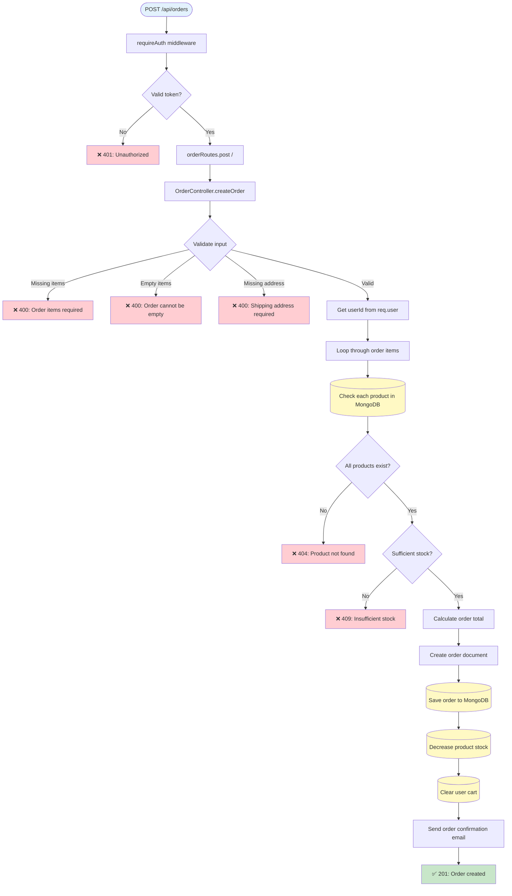

**Request:**
```json
{
  "items": [
    {
      "productId": "507f1f77bcf86cd799439011",
      "quantity": 2
    }
  ],
  "shippingAddress": {
    "street": "123 Main St",
    "city": "New York",
    "zipCode": "10001",
    "country": "USA"
  }
}
```

**Response (201):**
```json
{
  "status": "success",
  "data": {
    "order": {
      "_id": "507f1f77bcf86cd799439012",
      "userId": "507f1f77bcf86cd799439011",
      "items": [
        {
          "productId": "507f1f77bcf86cd799439011",
          "productName": "Product Name",
          "price": 29.99,
          "quantity": 2,
          "subtotal": 59.98
        }
      ],
      "totalAmount": 59.98,
      "status": "pending",
      "shippingAddress": {...},
      "createdAt": "2024-01-15T10:30:00.000Z"
    }
  }
}
```

---

### GET /api/orders

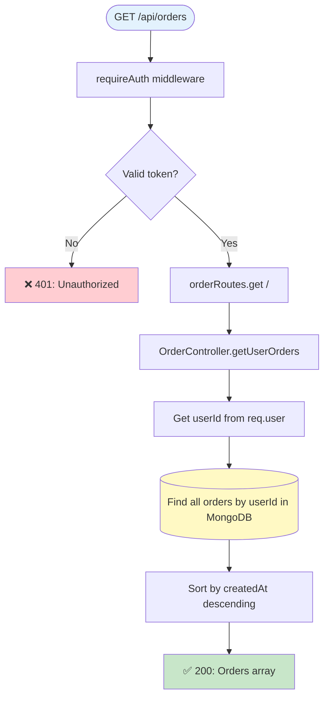

**Response (200):**
```json
{
  "status": "success",
  "data": {
    "orders": [
      {
        "_id": "507f1f77bcf86cd799439012",
        "userId": "507f1f77bcf86cd799439011",
        "items": [...],
        "totalAmount": 59.98,
        "status": "pending",
        "createdAt": "2024-01-15T10:30:00.000Z"
      }
    ]
  }
}
```

---

### GET /api/orders/:id

```mermaid
flowchart TD
    Request([GET /api/orders/:id]) --> RequireAuth[requireAuth middleware]
    RequireAuth --> CheckToken{Valid token?}
    CheckToken -->|No| Return401["❌ 401: Unauthorized"]
    CheckToken -->|Yes| ExtractId[Extract :id from params]
    
    ExtractId --> RouteHandler[orderRoutes.get /:id]
    RouteHandler --> Controller[OrderController.getOrderById]
    Controller --> ValidateId{Valid ObjectId?}
    ValidateId -->|No| Return400["❌ 400: Invalid order ID"]
    ValidateId -->|Yes| FindOrder[(Find order by _id in MongoDB)]
    
    FindOrder --> OrderExists{Order found?}
    OrderExists -->|No| Return404["❌ 404: Order not found"]
    OrderExists -->|Yes| CheckOwnership{Order belongs to user?}
    
    CheckOwnership -->|No| Return403["❌ 403: Not your order"]
    CheckOwnership -->|Yes| Return200["✅ 200: Order details"]
    
    
    style Request fill:#e3f2fd
    style Return200 fill:#c8e6c9
    style Return401 fill:#ffcdd2
    style Return400 fill:#ffcdd2
    style Return404 fill:#ffcdd2
    style Return403 fill:#ffcdd2
    style FindOrder fill:#fff9c4
```

**Response (200):**
```json
{
  "status": "success",
  "data": {
    "order": {
      "_id": "507f1f77bcf86cd799439012",
      "userId": "507f1f77bcf86cd799439011",
      "items": [...],
      "totalAmount": 59.98,
      "status": "pending",
      "shippingAddress": {...},
      "createdAt": "2024-01-15T10:30:00.000Z"
    }
  }
}
```

---

### POST /api/orders/:id/cancel

```mermaid
flowchart TD
    Request([POST /api/orders/:id/cancel]) --> RequireAuth[requireAuth middleware]
    RequireAuth --> CheckToken{Valid token?}
    CheckToken -->|No| Return401["❌ 401: Unauthorized"]
    CheckToken -->|Yes| ExtractId[Extract :id from params]
    
    ExtractId --> RouteHandler[orderRoutes.post /:id/cancel]
    RouteHandler --> Controller[OrderController.cancelOrder]
    Controller --> FindOrder[(Find order by _id in MongoDB)]
    
    FindOrder --> OrderExists{Order found?}
    OrderExists -->|No| Return404["❌ 404: Order not found"]
    OrderExists -->|Yes| CheckOwnership{Order belongs to user?}
    
    CheckOwnership -->|No| Return403["❌ 403: Not your order"]
    CheckOwnership -->|Yes| CheckStatus{Order status?}
    
    CheckStatus -->|Already cancelled| Return400["❌ 400: Order already cancelled"]
    CheckStatus -->|Shipped/Delivered| Return400Late["❌ 400: Cannot cancel shipped order"]
    CheckStatus -->|Pending| UpdateStatus[Set status = cancelled]
    
    UpdateStatus --> RestoreStock[(Restore product stock in MongoDB)]
    RestoreStock --> SaveOrder[(Save order changes)]
    SaveOrder --> SendEmail[Send cancellation email]
    SendEmail --> Return200["✅ 200: Order cancelled"]
    
    
    style Request fill:#e3f2fd
    style Return200 fill:#c8e6c9
    style Return401 fill:#ffcdd2
    style Return404 fill:#ffcdd2
    style Return403 fill:#ffcdd2
    style Return400 fill:#ffcdd2
    style Return400Late fill:#ffcdd2
    style FindOrder fill:#fff9c4
    style RestoreStock fill:#fff9c4
    style SaveOrder fill:#fff9c4
```

**Response (200):**
```json
{
  "status": "success",
  "message": "Order cancelled successfully",
  "data": {
    "order": {
      "_id": "507f1f77bcf86cd799439012",
      "status": "cancelled"
    }
  }
}
```

---

### PUT /api/orders/:id/status

```mermaid
flowchart TD
    Request([PUT /api/orders/:id/status]) --> RequireAuth[requireAuth middleware]
    RequireAuth --> CheckToken{Valid token?}
    CheckToken -->|No| Return401["❌ 401: Unauthorized"]
    CheckToken -->|Yes| CheckAdmin{Is admin?}
    
    CheckAdmin -->|No| Return403["❌ 403: Admin only"]
    CheckAdmin -->|Yes| ExtractId[Extract :id from params]
    
    ExtractId --> RouteHandler[orderRoutes.put /:id/status]
    RouteHandler --> Controller[OrderController.updateOrderStatus]
    Controller --> ValidateInput{Validate input}
    ValidateInput -->|Missing status| Return400["❌ 400: Status required"]
    ValidateInput -->|Invalid status| Return400Invalid["❌ 400: Invalid status value"]
    ValidateInput -->|Valid| FindOrder[(Find order in MongoDB)]
    
    FindOrder --> OrderExists{Order found?}
    OrderExists -->|No| Return404["❌ 404: Order not found"]
    OrderExists -->|Yes| UpdateStatus[Update order.status]
    
    UpdateStatus --> SaveOrder[(Save to MongoDB)]
    SaveOrder --> SendEmail[Send status update email]
    SendEmail --> Return200["✅ 200: Status updated"]
    
    
    style Request fill:#e3f2fd
    style Return200 fill:#c8e6c9
    style Return401 fill:#ffcdd2
    style Return403 fill:#ffcdd2
    style Return400 fill:#ffcdd2
    style Return400Invalid fill:#ffcdd2
    style Return404 fill:#ffcdd2
    style FindOrder fill:#fff9c4
    style SaveOrder fill:#fff9c4
```

**Request:**
```json
{
  "status": "shipped"
}
```

**Response (200):**
```json
{
  "status": "success",
  "message": "Order status updated",
  "data": {
    "order": {
      "_id": "507f1f77bcf86cd799439012",
      "status": "shipped"
    }
  }
}
```

---

### GET /api/orders/stats

```mermaid
flowchart TD
    Request([GET /api/orders/stats]) --> RequireAuth[requireAuth middleware]
    RequireAuth --> CheckToken{Valid token?}
    CheckToken -->|No| Return401["❌ 401: Unauthorized"]
    CheckToken -->|Yes| RouteHandler[orderRoutes.get /stats]
    
    RouteHandler --> Controller[OrderController.getOrderStats]
    Controller --> GetUserId[Get userId from req.user]
    GetUserId --> AggregateOrders[(MongoDB aggregation pipeline)]
    
    AggregateOrders --> CountByStatus[Count orders by status]
    CountByStatus --> CalculateTotals[Calculate total spent]
    CalculateTotals --> FindRecent[Find recent orders]
    FindRecent --> Return200["✅ 200: Order statistics"]
    
    
    style Request fill:#e3f2fd
    style Return200 fill:#c8e6c9
    style Return401 fill:#ffcdd2
    style AggregateOrders fill:#fff9c4
```

**Response (200):**
```json
{
  "status": "success",
  "data": {
    "stats": {
      "totalOrders": 5,
      "totalSpent": 299.95,
      "ordersByStatus": {
        "pending": 1,
        "shipped": 2,
        "delivered": 2,
        "cancelled": 0
      }
    }
  }
}
```

---

## ❤️ Health Endpoints

### GET /api/health

```mermaid
flowchart TD
    Request([GET /api/health]) --> RouteHandler[healthRoutes.get /]
    RouteHandler --> Controller[HealthController.getHealth]
    
    Controller --> CheckMongo[(Check MongoDB connection)]
    CheckMongo --> MongoOK{MongoDB connected?}
    MongoOK -->|Yes| MongoHealthy[mongo: healthy]
    MongoOK -->|No| MongoDown[mongo: down]
    
    MongoHealthy --> CheckRedisYes[(Check Redis connection)]
    MongoDown --> CheckRedisNo[(Check Redis connection)]
    
    CheckRedisYes --> RedisOKYes{Redis connected?}
    CheckRedisNo --> RedisOKNo{Redis connected?}
    
    RedisOKYes -->|Yes| BothHealthy["✅ Both healthy"]
    RedisOKYes -->|No| DegradedYes["⚠️ One down"]
    
    RedisOKNo -->|Yes| DegradedNo["⚠️ One down"]
    RedisOKNo -->|No| AllDown["❌ Both down"]
    
    BothHealthy --> Return200["✅ 200: All systems healthy"]
    DegradedYes --> Return503["⚠️ 503: Degraded service"]
    DegradedNo --> Return503
    AllDown --> Return503
    
    
    style Request fill:#e3f2fd
    style Return200 fill:#c8e6c9
    style Return503 fill:#fff3e0
    style CheckMongo fill:#fff9c4
    style CheckRedisYes fill:#ffe0b2
    style CheckRedisNo fill:#ffe0b2
```

**Response (200):**
```json
{
  "status": "success",
  "data": {
    "health": {
      "status": "healthy",
      "mongodb": "connected",
      "redis": "connected",
      "uptime": 12345,
      "timestamp": "2024-01-15T10:30:00.000Z"
    }
  }
}
```

---

### GET /api/health/ping

```mermaid
flowchart TD
    Request([GET /api/health/ping]) --> RouteHandler[healthRoutes.get /ping]
    RouteHandler --> Controller[HealthController.ping]
    Controller --> Return200["✅ 200: pong"]
    
    
    style Request fill:#e3f2fd
    style Return200 fill:#c8e6c9
```

**Response (200):**
```json
{
  "status": "success",
  "message": "pong"
}
```

---

## 🎯 Legend

### Color Coding:
- 🔵 **Blue** - Request entry point
- 🟢 **Green** - Successful response
- 🔴 **Red** - Error response
- 🟡 **Yellow (MongoDB)** - MongoDB operations
- 🟠 **Orange (Redis)** - Redis operations

### Common HTTP Status Codes:
- **200 OK** - Success
- **201 Created** - Resource created
- **400 Bad Request** - Invalid input
- **401 Unauthorized** - Authentication required
- **403 Forbidden** - Permission denied
- **404 Not Found** - Resource not found
- **409 Conflict** - Resource conflict (e.g., duplicate, stock issue)
- **429 Too Many Requests** - Rate limit exceeded
- **503 Service Unavailable** - Service degraded

### Middleware Flow:
1. **Rate Limit** - Check request rate
2. **CORS** - Validate origin
3. **Parse Body** - Parse JSON
4. **Auth Middleware** - optionalAuth or requireAuth
5. **Route Handler** - Match route
6. **Controller** - Business logic
7. **Service** - Data operations
8. **Database** - MongoDB/Redis
9. **Response** - Send result

---

## 📚 Summary

מסמך זה מספק **מפות חזותיות מלאות** לכל ה-endpoints של השרת:

✅ **כל 28 ה-endpoints** ממופים בפירוט  
✅ **כל השכבות** - Middleware → Routes → Controllers → Services → Database  
✅ **כל התנאים** - נתיבי הצלחה ושגיאה  
✅ **זרימות Authentication** - optionalAuth vs requireAuth  
✅ **פעולות Database** - אינטראקציות MongoDB ו-Redis  
✅ **דוגמאות Request/Response** - JSON payloads אמיתיים  
✅ **דיאגרמות עם צבעים** - קל לזהות את כל השלבים  

---

## 🎯 Common Workflows

### 🛒 תהליך קנייה מלא (Guest → User)

```
1. אורח מוסיף מוצרים לעגלה
   POST /api/cart/add (Guest - Redis)
   
2. אורח רואה את העגלה
   GET /api/cart (Guest - Redis)
   
3. אורח מחליט להירשם
   POST /api/auth/register
   
4. מיזוג עגלת אורח לעגלת משתמש
   POST /api/cart/merge (Redis → MongoDB)
   
5. יצירת הזמנה
   POST /api/orders
   → Stock מתעדכן
   → Cart נמחק
   → Email נשלח
   
6. צפייה בהזמנה
   GET /api/orders/:id
```

### 🔐 תהליך Authentication מלא

```
1. הרשמה
   POST /api/auth/register
   → Password מוצפן (bcrypt)
   → JWT Token נוצר
   → Cookie נשמר
   
2. בדיקת סטטוס
   GET /api/auth/verify
   → Token תקף
   
3. עדכון פרופיל
   PUT /api/auth/profile
   
4. שינוי סיסמה
   PUT /api/auth/password
   → Password ישן מאומת
   → Password חדש מוצפן
   
5. התנתקות
   POST /api/auth/logout
   → Cookie נמחק
```

### 📦 תהליך ניהול מלאי

```
1. הצגת מוצרים
   GET /api/products?category=electronics
   
2. לקוח מוסיף לעגלה
   POST /api/cart/add
   → בדיקת stock
   
3. יצירת הזמנה
   POST /api/orders
   → stock מתעדכן: stock -= quantity
   
4. ביטול הזמנה
   POST /api/orders/:id/cancel
   → stock מוחזר: stock += quantity
```

---

## 💡 Best Practices

### 🔒 Security

1. **Always verify JWT** - כל הפעולות הרגישות דורשות requireAuth
2. **Rate Limiting** - Auth endpoints מוגבלים ל-5 ניסיונות/דקה
3. **httpOnly Cookies** - Tokens לא נגישים ל-JavaScript
4. **Password Hashing** - bcrypt עם salt
5. **Input Validation** - כל ה-inputs עוברים validation לפני שימוש

### ⚡ Performance

1. **Redis for Guest Carts** - מהיר פי 10 מ-MongoDB
2. **Debounced MongoDB Saves** - Cart saves מתבצעים כל 5 שניות
3. **Product Population** - Lazy loading של פרטי מוצרים
4. **Index על fields חשובים** - email, userId, sessionId

### 🐛 Error Handling

1. **Specific Error Messages** - כל שגיאה עם הסבר ברור
2. **HTTP Status Codes** - שימוש נכון ב-status codes
3. **Validation Errors** - 400 עם פירוט השדות החסרים
4. **Not Found** - 404 למשאבים שלא קיימים
5. **Unauthorized** - 401 כשאין token, 403 כשאין הרשאה

### 📊 Data Consistency

1. **Transaction-like Operations** - בהזמנה: stock מתעדכן רק אם הכל תקין
2. **Stock Validation** - בדיקה לפני כל פעולת cart
3. **Cart Cleanup** - עגלות אורח נמחקות אחרי 24 שעות
4. **Orphan Prevention** - מחיקת cart אחרי יצירת הזמנה

---

## 🎓 למידה והבנה

### קריאה מומלצת לפי נושא:

**מתחילים? התחל כאן:**
1. GET /api/health/ping - הכי פשוט
2. GET /api/products - בלי auth
3. POST /api/auth/register - הבן JWT
4. GET /api/cart - הבן User vs Guest

**רוצה להבין Authentication?**
1. POST /api/auth/register - יצירת משתמש
2. POST /api/auth/login - התחברות
3. GET /api/auth/verify - בדיקת token
4. POST /api/auth/logout - התנתקות

**רוצה להבין Cart System?**
1. GET /api/cart - הבדל User/Guest
2. POST /api/cart/add - הוספה
3. POST /api/cart/merge - מיזוג
4. DELETE /api/cart/clear - ניקוי

**רוצה להבין Orders?**
1. POST /api/orders - יצירה + side effects
2. GET /api/orders - רשימה
3. POST /api/orders/:id/cancel - ביטול + stock restore

---

**Perfect for:**
- 🔍 הבנת התנהגות endpoints מדויקת
- 🐛 איתור באגים ב-API
- 📖 תיעוד API למפתחים
- 🧪 כתיבת טסטים
- 👥 Onboarding לצוות חדש
- 🎓 למידה ו-הוראה
