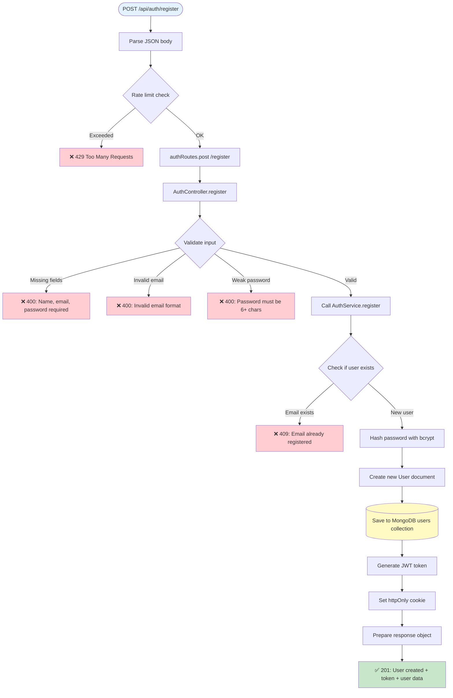
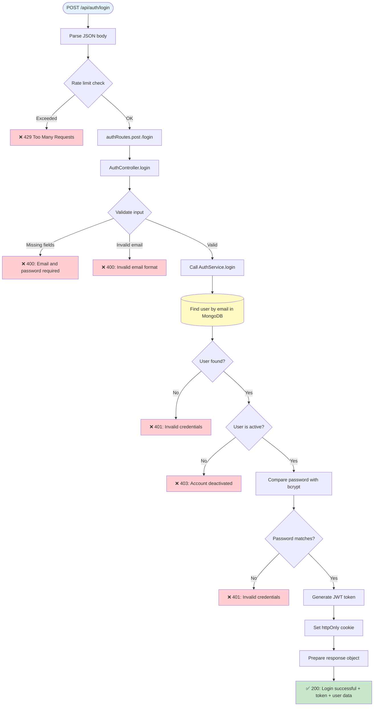
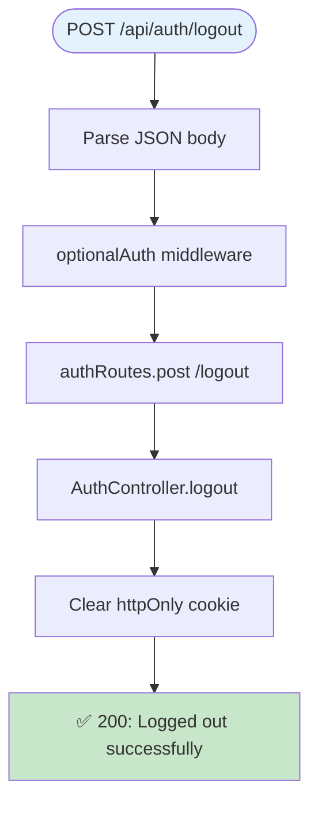
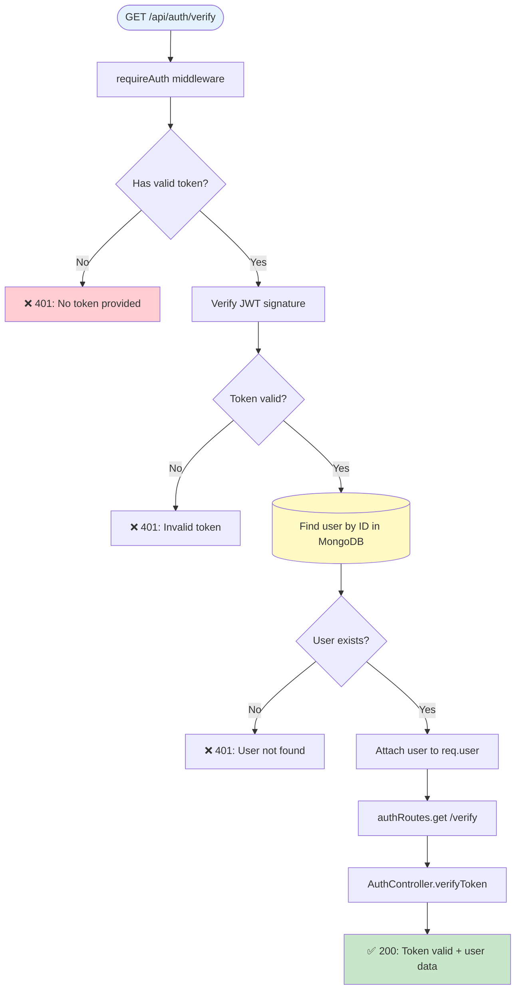
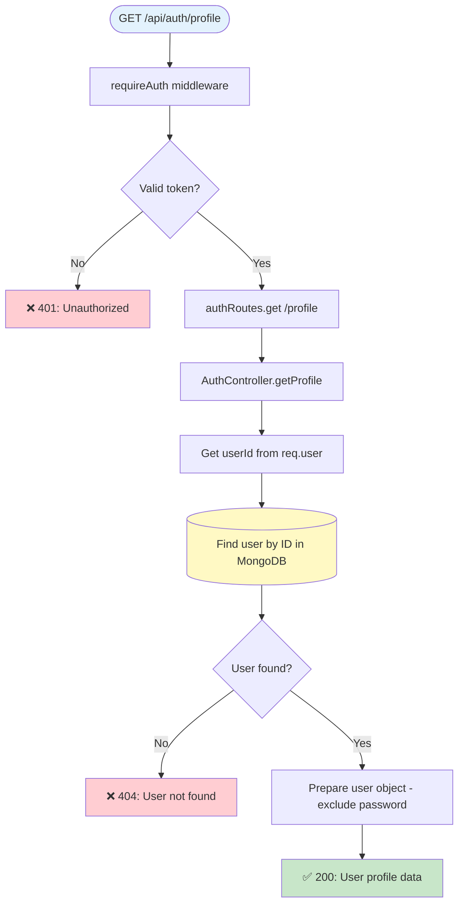
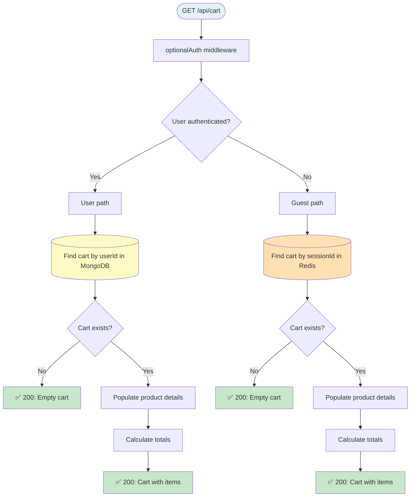
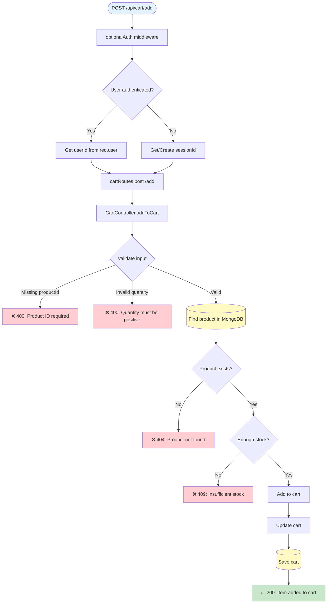
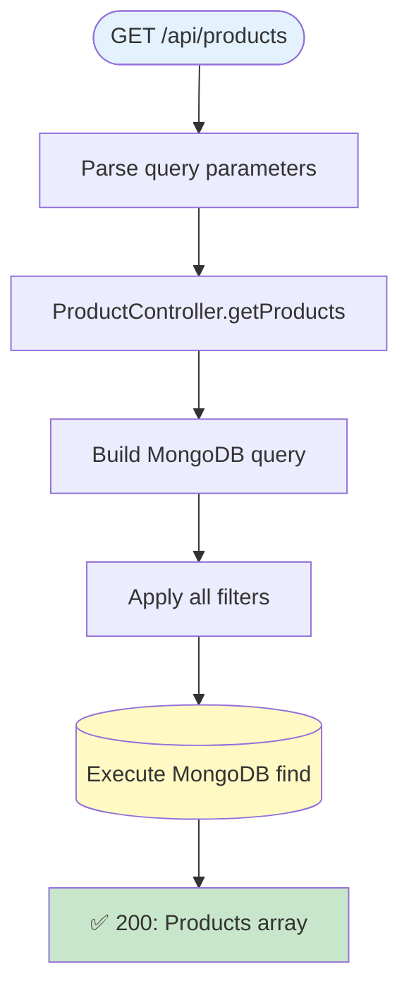
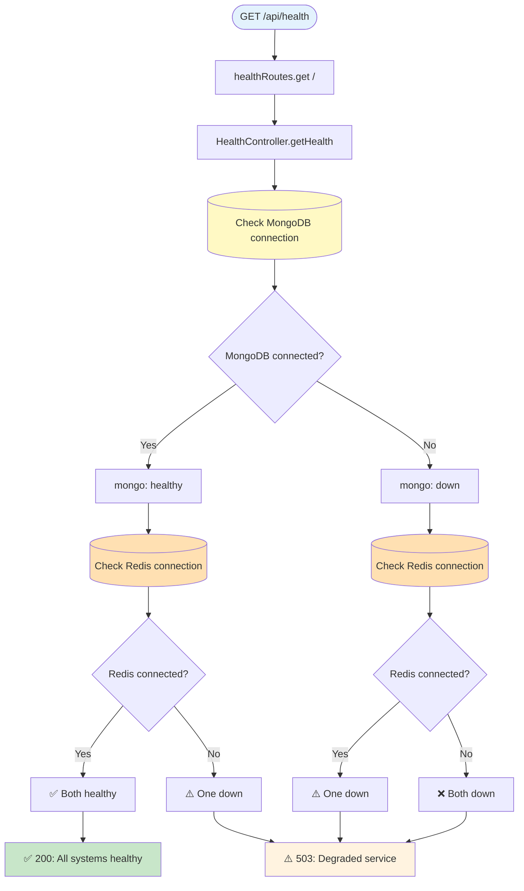
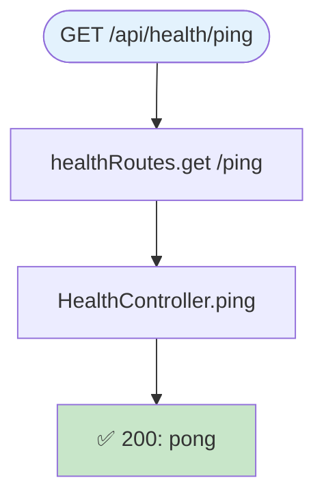

# 🎯 Server Endpoints - מדריך חזותי מלא

> **📖 מדריך זה מציג את כל ה-endpoints של השרת עם דיאגרמות חזותיות מפורטות**  
> כל endpoint כולל: זרימת נתונים, תנאים, שגיאות, ודוגמאות Request/Response

## 🚀 קישורים מהירים

- **התחל כאן:** [Health Check](#️-health-endpoints) - בדיקה שהשרת עובד
- **Authentication:** [Auth Endpoints](#-authentication-endpoints) - הרשמה והתחברות
- **קניות:** [Cart System](#-cart-endpoints) - עגלת קניות
- **מוצרים:** [Products](#-product-endpoints) - קטלוג
- **הזמנות:** [Orders](#-order-endpoints) - ניהול הזמנות
- **Best Practices:** [למטה ↓](#-best-practices) - המלצות ודוגמאות

## 💡 איך להשתמש במדריך?

### לפי תפקיד:

**👨‍💻 Frontend Developer:**
1. ראה את ה-Request/Response examples
2. שים לב ל-Error tables (מה לטפל בצד לקוח)
3. בדוק Authentication requirements

**🔧 Backend Developer:**
1. עקוב אחרי הדיאגרמות - שלב אחרי שלב
2. שים לב ל-Side Effects (stock, cart, emails)
3. הבן את ההבדל בין MongoDB ו-Redis

**🧪 QA/Tester:**
1. השתמש ב-Error tables לבדיקות
2. תכנן test cases לפי הזרימות
3. בדוק את כל התנאים בדיאגרמות

**📚 מתכנת מתחיל:**
1. התחל ב-[Common Workflows](#-common-workflows)
2. קרא את הדיאגרמות משמאל לימין
3. עקוב אחרי הצבעים (כחול→ירוק=הצלחה)

---

## 🎨 מקרא צבעים מהיר

| צבע | משמעות | דוגמה |
|-----|--------|-------|
| 🔵 **כחול** | נקודת כניסה - Request | `POST /api/auth/login` |
| 🟢 **ירוק** | הצלחה - Response 200/201 | `✅ 200: Success` |
| 🔴 **אדום** | שגיאה - Errors 400/401/404/409 | `❌ 401: Unauthorized` |
| 🟡 **צהוב** | MongoDB - מסד נתונים ראשי | `Find user in MongoDB` |
| 🟠 **כתום** | Redis - Cache מהיר | `Get cart from Redis` |

---

## 🔐 Authentication Endpoints

> **מטרה:** ניהול משתמשים - הרשמה, התחברות, ניהול פרופיל  
> **Authentication:** JWT Token ב-httpOnly cookie  
> **Rate Limiting:** מוגבל ל-5 ניסיונות לדקה

---

### POST /api/auth/register

**📝 תיאור:** יצירת משתמש חדש במערכת

**🔒 Security:** Password מוצפן ב-bcrypt, Token נשמר ב-httpOnly cookie



📥 **Request Example:**

```json
{
  "name": "John Doe",
  "email": "john@example.com",
  "password": "securepass123"
}
```

✅ **Success Response (201):**

```json
{
  "status": "success",
  "data": {
    "user": {
      "_id": "507f1f77bcf86cd799439011",
      "name": "John Doe",
      "email": "john@example.com"
    },
    "token": "eyJhbGciOiJIUzI1NiIsInR5cCI6IkpXVCJ9..."
  }
}
```

❌ **Possible Errors:**

| Status | Message | Cause |
|--------|---------|-------|
| 400 | Name, email, password required | חסרים שדות חובה |
| 400 | Invalid email format | פורמט email לא תקין |
| 400 | Password must be 6+ chars | סיסמה קצרה מדי |
| 409 | Email already registered | Email כבר קיים במערכת |
| 429 | Too Many Requests | יותר מדי ניסיונות |

---

### POST /api/auth/login

**📝 תיאור:** התחברות למערכת עם email וסיסמה

**🔒 Security:** bcrypt password comparison, JWT token generation



📥 **Request Example:**

```json
{
  "email": "john@example.com",
  "password": "securepass123"
}
```

✅ **Success Response (200):**

```json
{
  "status": "success",
  "data": {
    "user": {
      "_id": "507f1f77bcf86cd799439011",
      "name": "John Doe",
      "email": "john@example.com"
    },
    "token": "eyJhbGciOiJIUzI1NiIsInR5cCI6IkpXVCJ9..."
  }
}
```

❌ **Possible Errors:**

| Status | Message | Cause |
|--------|---------|-------|
| 400 | Email and password required | חסרים שדות חובה |
| 400 | Invalid email format | פורמט email לא תקין |
| 401 | Invalid credentials | Email או סיסמה שגויים |
| 403 | Account deactivated | החשבון מושבת |
| 429 | Too Many Requests | יותר מדי ניסיונות התחברות |

---

### POST /api/auth/logout

**📝 תיאור:** התנתקות מהמערכת - מחיקת session cookie

**🔒 Security:** מחיקת httpOnly cookie מהדפדפן



✅ **Success Response (200):**

```json
{
  "status": "success",
  "message": "Logged out successfully"
}
```

💡 **Note:** ה-logout עובד גם עבור משתמשים לא מחוברים (optionalAuth)

---

### GET /api/auth/verify

**📝 תיאור:** בדיקת תקינות Token - מוודא שהמשתמש מחובר

**🔒 Security:** מחייב JWT token תקף



✅ **Success Response (200):**

```json
{
  "status": "success",
  "data": {
    "user": {
      "_id": "507f1f77bcf86cd799439011",
      "name": "John Doe",
      "email": "john@example.com"
    }
  }
}
```

❌ **Possible Errors:**

| Status | Message | Cause |
|--------|---------|-------|
| 401 | No token provided | אין cookie/token בבקשה |
| 401 | Invalid token | Token לא תקף או פג תוקף |
| 401 | User not found | המשתמש נמחק מהמערכת |

---

### GET /api/auth/profile

**📝 תיאור:** קבלת פרטי המשתמש המחובר

**🔒 Security:** מחייב התחברות (requireAuth)



✅ **Success Response (200):**

```json
{
  "status": "success",
  "data": {
    "user": {
      "_id": "507f1f77bcf86cd799439011",
      "name": "John Doe",
      "email": "john@example.com",
      "createdAt": "2024-01-15T10:30:00.000Z"
    }
  }
}
```

❌ **Possible Errors:**

| Status | Message | Cause |
|--------|---------|-------|
| 401 | Unauthorized | לא מחובר |
| 404 | User not found | המשתמש לא נמצא |

---

## 🛒 Cart Endpoints

> **מטרה:** ניהול עגלת קניות - תמיכה במשתמשים מחוברים ואורחים  
> **Storage:**  
> - משתמשים מחוברים → MongoDB (קבוע)  
> - משתמשים אורחים → Redis (זמני, 24 שעות TTL)

### GET /api/cart

**📝 תיאור:** קבלת עגלת הקניות - עובד גם למשתמשים מחוברים וגם לאורחים



✅ **Success Response (200):**

```json
{
  "status": "success",
  "data": {
    "cart": {
      "items": [
        {
          "productId": "507f1f77bcf86cd799439011",
          "name": "Product Name",
          "price": 29.99,
          "quantity": 2,
          "subtotal": 59.98
        }
      ],
      "totalItems": 2,
      "totalPrice": 59.98
    }
  }
}
```

---

### POST /api/cart/add

**📝 תיאור:** הוספת מוצר לעגלה



📥 **Request Example:**

```json
{
  "productId": "507f1f77bcf86cd799439011",
  "quantity": 2
}
```

✅ **Success Response (200):**

```json
{
  "status": "success",
  "data": {
    "cart": {
      "items": [
        {
          "productId": "507f1f77bcf86cd799439011",
          "quantity": 2,
          "price": 29.99
        }
      ],
      "totalItems": 2,
      "totalPrice": 59.98
    }
  }
}
```

---

## 📦 Product Endpoints

### GET /api/products

**📝 תיאור:** קבלת רשימת מוצרים עם אפשרויות סינון וחיפוש



✅ **Success Response (200):**

```json
{
  "status": "success",
  "data": {
    "products": [
      {
        "_id": "507f1f77bcf86cd799439011",
        "name": "Product Name",
        "description": "Product description",
        "price": 29.99,
        "stock": 100,
        "category": "electronics"
      }
    ]
  }
}
```

---

### GET /api/products/:id

**📝 תיאור:** קבלת פרטי מוצר בודד


✅ **Success Response (200):**

```json
{
  "status": "success",
  "data": {
    "product": {
      "_id": "507f1f77bcf86cd799439011",
      "name": "Product Name",
      "description": "Detailed product description",
      "price": 29.99,
      "stock": 100,
      "category": "electronics",
      "imageUrl": "https://example.com/image.jpg"
    }
  }
}
```

---

## ❤️ Health Endpoints

### GET /api/health

**📝 תיאור:** בדיקת סטטוס השרת - MongoDB, Redis, זמן הפעולה



✅ **Success Response (200):**

```json
{
  "status": "success",
  "data": {
    "health": {
      "status": "healthy",
      "mongodb": "connected",
      "redis": "connected",
      "uptime": 12345,
      "timestamp": "2024-01-15T10:30:00.000Z"
    }
  }
}
```

---

### GET /api/health/ping

**📝 תיאור:** בדיקה פשוטה - האם השרת עובד



✅ **Success Response (200):**

```json
{
  "status": "success",
  "message": "pong"
}
```

---

## 💡 Best Practices

### 🔒 Security

1. **Always verify JWT** - כל הפעולות הרגישות דורשות requireAuth
2. **Rate Limiting** - Auth endpoints מוגבלים ל-5 ניסיונות/דקה
3. **httpOnly Cookies** - Tokens לא נגישים ל-JavaScript
4. **Password Hashing** - bcrypt עם salt
5. **Input Validation** - כל ה-inputs עוברים validation לפני שימוש

### ⚡ Performance

1. **Redis for Guest Carts** - מהיר פי 10 מ-MongoDB
2. **Debounced MongoDB Saves** - Cart saves מתבצעים כל 5 שניות
3. **Product Population** - Lazy loading של פרטי מוצרים
4. **Index על fields חשובים** - email, userId, sessionId

### 🐛 Error Handling

1. **Specific Error Messages** - כל שגיאה עם הסבר ברור
2. **HTTP Status Codes** - שימוש נכון ב-status codes
3. **Validation Errors** - 400 עם פירוט השדות החסרים
4. **Not Found** - 404 למשאבים שלא קיימים
5. **Unauthorized** - 401 כשאין token, 403 כשאין הרשאה

---

**Perfect for:**
- 🔍 הבנת התנהגות endpoints מדויקת
- 🐛 איתור באגים ב-API
- 📖 תיעוד API למפתחים
- 🧪 כתיבת טסטים
- 👥 Onboarding לצוות חדש
