# 🎯 Server Endpoints - Complete Visual Map

## 📋 Table of Contents
- [🔐 Authentication Endpoints](#-authentication-endpoints)
  - [POST /api/auth/register](#post-apiauthregister)
  - [POST /api/auth/login](#post-apiauthlogin)
  - [POST /api/auth/logout](#post-apiauthlogout)
  - [GET /api/auth/verify](#get-apiauthverify)
  - [GET /api/auth/profile](#get-apiauthprofile)
  - [PUT /api/auth/profile](#put-apiauthprofile)
  - [PUT /api/auth/password](#put-apiauthpassword)
  - [DELETE /api/auth/account](#delete-apiauthaccount)
  - [GET /api/auth/stats](#get-apiauthstats)
- [🛒 Cart Endpoints](#-cart-endpoints)
  - [GET /api/cart](#get-apicart)
  - [POST /api/cart/add](#post-apicartadd)
  - [PUT /api/cart/update](#put-apicartupdate)
  - [DELETE /api/cart/remove](#delete-apicartremove)
  - [DELETE /api/cart/clear](#delete-apicartclear)
  - [GET /api/cart/count](#get-apicartcount)
  - [POST /api/cart/merge](#post-apicartmerge)
- [📦 Product Endpoints](#-product-endpoints)
  - [GET /api/products](#get-apiproducts)
  - [GET /api/products/:id](#get-apiproductsid)
- [📋 Order Endpoints](#-order-endpoints)
  - [POST /api/orders](#post-apiorders)
  - [GET /api/orders](#get-apiorders)
  - [GET /api/orders/:id](#get-apiordersid)
  - [POST /api/orders/:id/cancel](#post-apiordersidcancel)
  - [PUT /api/orders/:id/status](#put-apiordersidstatus)
  - [GET /api/orders/stats](#get-apiordersstats)
- [❤️ Health Endpoints](#-health-endpoints)
  - [GET /api/health](#get-apihealth)
  - [GET /api/health/ping](#get-apihealthping)

---

## 🔐 Authentication Endpoints

### POST /api/auth/register

```mermaid
flowchart TD
    Request([POST /api/auth/register]) --> Middleware1[Parse JSON body]
    Middleware1 --> RateLimit{Rate limit check}
    RateLimit -->|Exceeded| Return429[❌ 429 Too Many Requests]
    RateLimit -->|OK| RouteHandler[authRoutes.post /register]
    
    RouteHandler --> Controller[AuthController.register]
    
    Controller --> ValidateInput{Validate input}
    ValidateInput -->|Missing fields| Return400["❌ 400: Name, email, password required"]
    ValidateInput -->|Invalid email| Return400Email["❌ 400: Invalid email format"]
    ValidateInput -->|Weak password| Return400Pass["❌ 400: Password must be 6+ chars"]
    ValidateInput -->|Valid| CallService[Call AuthService.register]
    
    CallService --> CheckExists{Check if user exists}
    CheckExists -->|Email exists| Return409["❌ 409: Email already registered"]
    CheckExists -->|New user| HashPassword[Hash password with bcrypt]
    
    HashPassword --> CreateUser[Create new User document]
    CreateUser --> SaveMongo[(Save to MongoDB users collection)]
    SaveMongo --> GenerateJWT[Generate JWT token]
    
    GenerateJWT --> SetCookie[Set httpOnly cookie]
    SetCookie --> PrepareResponse[Prepare response object]
    PrepareResponse --> Return201["✅ 201: User created + token + user data"]
    
    Return429 --> End([Response sent])
    Return400 --> End
    Return400Email --> End
    Return400Pass --> End
    Return409 --> End
    Return201 --> End
    
    style Request fill:#e3f2fd
    style Return201 fill:#c8e6c9
    style Return429 fill:#ffcdd2
    style Return400 fill:#ffcdd2
    style Return400Email fill:#ffcdd2
    style Return400Pass fill:#ffcdd2
    style Return409 fill:#ffcdd2
    style SaveMongo fill:#fff9c4
```

**Request:**
```json
{
  "name": "John Doe",
  "email": "john@example.com",
  "password": "securepass123"
}
```

**Response (201):**
```json
{
  "status": "success",
  "data": {
    "user": {
      "_id": "507f1f77bcf86cd799439011",
      "name": "John Doe",
      "email": "john@example.com"
    },
    "token": "eyJhbGciOiJIUzI1NiIsInR5cCI6IkpXVCJ9..."
  }
}
```

---

### POST /api/auth/login


**Request:**
```json
{
  "email": "john@example.com",
  "password": "securepass123"
}
```

**Response (200):**
```json
{
  "status": "success",
  "data": {
    "user": {
      "_id": "507f1f77bcf86cd799439011",
      "name": "John Doe",
      "email": "john@example.com"
    },
    "token": "eyJhbGciOiJIUzI1NiIsInR5cCI6IkpXVCJ9..."
  }
}
```

---

### POST /api/auth/logout

```mermaid
flowchart TD
    Request([POST /api/auth/logout]) --> Middleware1[Parse JSON body]
    Middleware1 --> OptionalAuth[optionalAuth middleware]
    OptionalAuth --> RouteHandler[authRoutes.post /logout]
    
    RouteHandler --> Controller[AuthController.logout]
    Controller --> ClearCookie[Clear token cookie]
    ClearCookie --> Return200["✅ 200: Logged out successfully"]
    
    Return200 --> End([Response sent])
    
    style Request fill:#e3f2fd
    style Return200 fill:#c8e6c9
```

**Response (200):**
```json
{
  "status": "success",
  "message": "Logged out successfully"
}
```

---

### GET /api/auth/verify

```mermaid
flowchart TD
    Request([GET /api/auth/verify]) --> RequireAuth[requireAuth middleware]
    
    RequireAuth --> CheckToken{Has valid token?}
    CheckToken -->|No| Return401["❌ 401: No token provided"]
    CheckToken -->|Yes| VerifyJWT[Verify JWT signature]
    
    VerifyJWT --> TokenValid{Token valid?}
    TokenValid -->|No| Return401Invalid["❌ 401: Invalid token"]
    TokenValid -->|Yes| FindUser[(Find user by ID in MongoDB)]
    
    FindUser --> UserExists{User exists?}
    UserExists -->|No| Return401User["❌ 401: User not found"]
    UserExists -->|Yes| AttachUser[Attach user to req.user]
    
    AttachUser --> RouteHandler[authRoutes.get /verify]
    RouteHandler --> Controller[AuthController.verifyToken]
    Controller --> Return200["✅ 200: Token valid + user data"]
    
    Return401 --> End([Response sent])
    Return401Invalid --> End
    Return401User --> End
    Return200 --> End
    
    style Request fill:#e3f2fd
    style Return200 fill:#c8e6c9
    style Return401 fill:#ffcdd2
    style Return401Invalid fill:#ffcdd2
    style Return401User fill:#ffcdd2
    style FindUser fill:#fff9c4
```

**Response (200):**
```json
{
  "status": "success",
  "data": {
    "user": {
      "_id": "507f1f77bcf86cd799439011",
      "name": "John Doe",
      "email": "john@example.com"
    }
  }
}
```

---

### GET /api/auth/profile

```mermaid
flowchart TD
    Request([GET /api/auth/profile]) --> RequireAuth[requireAuth middleware]
    RequireAuth --> CheckToken{Valid token?}
    CheckToken -->|No| Return401["❌ 401: Unauthorized"]
    CheckToken -->|Yes| RouteHandler[authRoutes.get /profile]
    
    RouteHandler --> Controller[AuthController.getProfile]
    Controller --> GetUserId[Get userId from req.user]
    GetUserId --> FindUser[(Find user by ID in MongoDB)]
    
    FindUser --> UserExists{User found?}
    UserExists -->|No| Return404["❌ 404: User not found"]
    UserExists -->|Yes| PrepareResponse[Prepare user object - exclude password]
    PrepareResponse --> Return200["✅ 200: User profile data"]
    
    Return401 --> End([Response sent])
    Return404 --> End
    Return200 --> End
    
    style Request fill:#e3f2fd
    style Return200 fill:#c8e6c9
    style Return401 fill:#ffcdd2
    style Return404 fill:#ffcdd2
    style FindUser fill:#fff9c4
```

**Response (200):**
```json
{
  "status": "success",
  "data": {
    "user": {
      "_id": "507f1f77bcf86cd799439011",
      "name": "John Doe",
      "email": "john@example.com",
      "createdAt": "2024-01-15T10:30:00.000Z"
    }
  }
}
```

---

### PUT /api/auth/profile

```mermaid
flowchart TD
    Request([PUT /api/auth/profile]) --> RequireAuth[requireAuth middleware]
    RequireAuth --> CheckToken{Valid token?}
    CheckToken -->|No| Return401["❌ 401: Unauthorized"]
    CheckToken -->|Yes| RouteHandler[authRoutes.put /profile]
    
    RouteHandler --> Controller[AuthController.updateProfile]
    Controller --> ValidateInput{Validate input}
    ValidateInput -->|Empty name| Return400["❌ 400: Name cannot be empty"]
    ValidateInput -->|Invalid email| Return400Email["❌ 400: Invalid email format"]
    ValidateInput -->|Valid| CheckEmailExists{New email?}
    
    CheckEmailExists -->|Yes| FindByEmail[(Check if email exists in MongoDB)]
    FindByEmail --> EmailTaken{Email taken?}
    EmailTaken -->|Yes| Return409["❌ 409: Email already in use"]
    EmailTaken -->|No| UpdateUser
    CheckEmailExists -->|No| UpdateUser[Update user document]
    
    UpdateUser --> SaveChanges[(Save to MongoDB)]
    SaveChanges --> Return200["✅ 200: Profile updated"]
    
    Return401 --> End([Response sent])
    Return400 --> End
    Return400Email --> End
    Return409 --> End
    Return200 --> End
    
    style Request fill:#e3f2fd
    style Return200 fill:#c8e6c9
    style Return401 fill:#ffcdd2
    style Return400 fill:#ffcdd2
    style Return400Email fill:#ffcdd2
    style Return409 fill:#ffcdd2
    style FindByEmail fill:#fff9c4
    style SaveChanges fill:#fff9c4
```

**Request:**
```json
{
  "name": "John Updated",
  "email": "john.new@example.com"
}
```

**Response (200):**
```json
{
  "status": "success",
  "data": {
    "user": {
      "_id": "507f1f77bcf86cd799439011",
      "name": "John Updated",
      "email": "john.new@example.com"
    }
  }
}
```

---

### PUT /api/auth/password


**Request:**
```json
{
  "currentPassword": "oldpass123",
  "newPassword": "newpass456"
}
```

**Response (200):**
```json
{
  "status": "success",
  "message": "Password changed successfully"
}
```

---

### DELETE /api/auth/account

```mermaid
flowchart TD
    Request([DELETE /api/auth/account]) --> RequireAuth[requireAuth middleware]
    RequireAuth --> CheckToken{Valid token?}
    CheckToken -->|No| Return401["❌ 401: Unauthorized"]
    CheckToken -->|Yes| RouteHandler[authRoutes.delete /account]
    
    RouteHandler --> Controller[AuthController.deactivateAccount]
    Controller --> GetUserId[Get userId from req.user]
    GetUserId --> UpdateUser[(Set isActive = false in MongoDB)]
    
    UpdateUser --> ClearCookie[Clear authentication cookie]
    ClearCookie --> Return200["✅ 200: Account deactivated"]
    
    Return401 --> End([Response sent])
    Return200 --> End
    
    style Request fill:#e3f2fd
    style Return200 fill:#c8e6c9
    style Return401 fill:#ffcdd2
    style UpdateUser fill:#fff9c4
```

**Response (200):**
```json
{
  "status": "success",
  "message": "Account deactivated successfully"
}
```

---

### GET /api/auth/stats

```mermaid
flowchart TD
    Request([GET /api/auth/stats]) --> RequireAuth[requireAuth middleware]
    RequireAuth --> CheckToken{Valid token?}
    CheckToken -->|No| Return401["❌ 401: Unauthorized"]
    CheckToken -->|Yes| RouteHandler[authRoutes.get /stats]
    
    RouteHandler --> Controller[AuthController.getUserStats]
    Controller --> GetUserId[Get userId from req.user]
    GetUserId --> CountOrders[(Count orders for user in MongoDB)]
    
    CountOrders --> CalculateTotal[(Calculate total spent from orders)]
    CalculateTotal --> Return200["✅ 200: User statistics"]
    
    Return401 --> End([Response sent])
    Return200 --> End
    
    style Request fill:#e3f2fd
    style Return200 fill:#c8e6c9
    style Return401 fill:#ffcdd2
    style CountOrders fill:#fff9c4
    style CalculateTotal fill:#fff9c4
```

**Response (200):**
```json
{
  "status": "success",
  "data": {
    "stats": {
      "totalOrders": 5,
      "totalSpent": 299.95
    }
  }
}
```

---

## 🛒 Cart Endpoints

### GET /api/cart

```mermaid
flowchart TD
    Request([GET /api/cart]) --> OptionalAuth[optionalAuth middleware]
    OptionalAuth --> CheckAuth{User authenticated?}
    
    CheckAuth -->|Yes| GetUserId[Get userId from req.user]
    CheckAuth -->|No| GetSessionId[Get/Create sessionId from cookies]
    
    GetUserId --> RouteHandler[cartRoutes.get /]
    GetSessionId --> RouteHandler
    
    RouteHandler --> Controller[CartController.getCart]
    Controller --> ServiceCall{User or Guest?}
    
    ServiceCall -->|User| FindUserCart[(Find cart by userId in MongoDB)]
    ServiceCall -->|Guest| FindGuestCart[(Find cart by sessionId in Redis)]
    
    FindUserCart --> UserCartExists{Cart exists?}
    FindGuestCart --> GuestCartExists{Cart exists?}
    
    UserCartExists -->|No| ReturnEmpty["✅ 200: Empty cart"]
    UserCartExists -->|Yes| PopulateProducts[(Populate product details from MongoDB)]
    
    GuestCartExists -->|No| ReturnEmpty
    GuestCartExists -->|Yes| PopulateProductsGuest[(Populate product details from MongoDB)]
    
    PopulateProducts --> CalculateTotal[Calculate cart totals]
    PopulateProductsGuest --> CalculateTotal
    
    CalculateTotal --> Return200["✅ 200: Cart with items"]
    
    ReturnEmpty --> End([Response sent])
    Return200 --> End
    
    style Request fill:#e3f2fd
    style Return200 fill:#c8e6c9
    style ReturnEmpty fill:#c8e6c9
    style FindUserCart fill:#fff9c4
    style FindGuestCart fill:#ffe0b2
    style PopulateProducts fill:#fff9c4
    style PopulateProductsGuest fill:#fff9c4
```

**Response (200):**
```json
{
  "status": "success",
  "data": {
    "cart": {
      "items": [
        {
          "productId": "507f1f77bcf86cd799439011",
          "name": "Product Name",
          "price": 29.99,
          "quantity": 2,
          "subtotal": 59.98
        }
      ],
      "totalItems": 2,
      "totalPrice": 59.98
    }
  }
}
```

---

### POST /api/cart/add

```mermaid
flowchart TD
    Request([POST /api/cart/add]) --> OptionalAuth[optionalAuth middleware]
    OptionalAuth --> CheckAuth{User authenticated?}
    
    CheckAuth -->|Yes| GetUserId[Get userId from req.user]
    CheckAuth -->|No| GetSessionId[Get/Create sessionId]
    
    GetUserId --> RouteHandler[cartRoutes.post /add]
    GetSessionId --> RouteHandler
    
    RouteHandler --> Controller[CartController.addToCart]
    Controller --> ValidateInput{Validate input}
    ValidateInput -->|Missing productId| Return400["❌ 400: Product ID required"]
    ValidateInput -->|Invalid quantity| Return400Qty["❌ 400: Quantity must be positive"]
    ValidateInput -->|Valid| CheckProduct[(Find product in MongoDB)]
    
    CheckProduct --> ProductExists{Product exists?}
    ProductExists -->|No| Return404["❌ 404: Product not found"]
    ProductExists -->|Yes| CheckStock{Enough stock?}
    
    CheckStock -->|No| Return409["❌ 409: Insufficient stock"]
    CheckStock -->|Yes| ServiceCall{User or Guest?}
    
    ServiceCall -->|User| AddToUserCart[CartService.addToCart with userId]
    ServiceCall -->|Guest| AddToGuestCart[CartService.addToCart with sessionId]
    
    AddToUserCart --> FindCart[(Find/Create cart in MongoDB)]
    AddToGuestCart --> FindGuestCartRedis[(Find/Create cart in Redis)]
    
    FindCart --> UpdateCart[Add/Update item in cart]
    FindGuestCartRedis --> UpdateGuestCart[Add/Update item in cart]
    
    UpdateCart --> SaveMongo[(Save cart to MongoDB)]
    UpdateGuestCart --> SaveRedis[(Save cart to Redis with TTL)]
    
    SaveMongo --> ScheduleFlush[Schedule debounced MongoDB save - 5 sec]
    SaveRedis --> Return200["✅ 200: Item added to cart"]
    
    ScheduleFlush --> Return200
    
    Return400 --> End([Response sent])
    Return400Qty --> End
    Return404 --> End
    Return409 --> End
    Return200 --> End
    
    style Request fill:#e3f2fd
    style Return200 fill:#c8e6c9
    style Return400 fill:#ffcdd2
    style Return400Qty fill:#ffcdd2
    style Return404 fill:#ffcdd2
    style Return409 fill:#ffcdd2
    style CheckProduct fill:#fff9c4
    style FindCart fill:#fff9c4
    style SaveMongo fill:#fff9c4
    style FindGuestCartRedis fill:#ffe0b2
    style SaveRedis fill:#ffe0b2
```

**Request:**
```json
{
  "productId": "507f1f77bcf86cd799439011",
  "quantity": 2
}
```

**Response (200):**
```json
{
  "status": "success",
  "data": {
    "cart": {
      "items": [
        {
          "productId": "507f1f77bcf86cd799439011",
          "quantity": 2,
          "price": 29.99
        }
      ],
      "totalItems": 2,
      "totalPrice": 59.98
    }
  }
}
```

---

### PUT /api/cart/update

```mermaid
flowchart TD
    Request([PUT /api/cart/update]) --> OptionalAuth[optionalAuth middleware]
    OptionalAuth --> CheckAuth{User authenticated?}
    
    CheckAuth -->|Yes| GetUserId[Get userId]
    CheckAuth -->|No| GetSessionId[Get sessionId]
    
    GetUserId --> RouteHandler[cartRoutes.put /update]
    GetSessionId --> RouteHandler
    
    RouteHandler --> Controller[CartController.updateQuantity]
    Controller --> ValidateInput{Validate input}
    ValidateInput -->|Missing fields| Return400["❌ 400: Product ID and quantity required"]
    ValidateInput -->|Invalid quantity| Return400Qty["❌ 400: Quantity must be positive"]
    ValidateInput -->|Valid| ServiceCall{User or Guest?}
    
    ServiceCall -->|User| FindUserCart[(Find cart in MongoDB)]
    ServiceCall -->|Guest| FindGuestCartRedis[(Find cart in Redis)]
    
    FindUserCart --> CartExists{Cart exists?}
    FindGuestCartRedis --> CartExists
    
    CartExists -->|No| Return404["❌ 404: Cart not found"]
    CartExists -->|Yes| FindItem{Item in cart?}
    
    FindItem -->|No| Return404Item["❌ 404: Item not in cart"]
    FindItem -->|Yes| CheckProduct[(Check product stock in MongoDB)]
    
    CheckProduct --> StockSufficient{Enough stock?}
    StockSufficient -->|No| Return409["❌ 409: Insufficient stock"]
    StockSufficient -->|Yes| UpdateQuantity[Update item quantity]
    
    UpdateQuantity --> SaveChanges{User or Guest?}
    SaveChanges -->|User| SaveMongo[(Save to MongoDB)]
    SaveChanges -->|Guest| SaveRedis[(Save to Redis)]
    
    SaveMongo --> Return200["✅ 200: Quantity updated"]
    SaveRedis --> Return200
    
    Return400 --> End([Response sent])
    Return400Qty --> End
    Return404 --> End
    Return404Item --> End
    Return409 --> End
    Return200 --> End
    
    style Request fill:#e3f2fd
    style Return200 fill:#c8e6c9
    style Return400 fill:#ffcdd2
    style Return400Qty fill:#ffcdd2
    style Return404 fill:#ffcdd2
    style Return404Item fill:#ffcdd2
    style Return409 fill:#ffcdd2
    style FindUserCart fill:#fff9c4
    style SaveMongo fill:#fff9c4
    style FindGuestCartRedis fill:#ffe0b2
    style SaveRedis fill:#ffe0b2
```

**Request:**
```json
{
  "productId": "507f1f77bcf86cd799439011",
  "quantity": 3
}
```

**Response (200):**
```json
{
  "status": "success",
  "data": {
    "cart": {
      "items": [
        {
          "productId": "507f1f77bcf86cd799439011",
          "quantity": 3,
          "price": 29.99
        }
      ],
      "totalItems": 3,
      "totalPrice": 89.97
    }
  }
}
```

---

### DELETE /api/cart/remove

```mermaid
flowchart TD
    Request([DELETE /api/cart/remove]) --> OptionalAuth[optionalAuth middleware]
    OptionalAuth --> CheckAuth{User authenticated?}
    
    CheckAuth -->|Yes| GetUserId[Get userId]
    CheckAuth -->|No| GetSessionId[Get sessionId]
    
    GetUserId --> RouteHandler[cartRoutes.delete /remove]
    GetSessionId --> RouteHandler
    
    RouteHandler --> Controller[CartController.removeFromCart]
    Controller --> ValidateInput{Validate input}
    ValidateInput -->|Missing productId| Return400["❌ 400: Product ID required"]
    ValidateInput -->|Valid| ServiceCall{User or Guest?}
    
    ServiceCall -->|User| FindUserCart[(Find cart in MongoDB)]
    ServiceCall -->|Guest| FindGuestCartRedis[(Find cart in Redis)]
    
    FindUserCart --> CartExists{Cart exists?}
    FindGuestCartRedis --> CartExists
    
    CartExists -->|No| Return404["❌ 404: Cart not found"]
    CartExists -->|Yes| RemoveItem[Remove item from cart.items]
    
    RemoveItem --> SaveChanges{User or Guest?}
    SaveChanges -->|User| SaveMongo[(Save to MongoDB)]
    SaveChanges -->|Guest| SaveRedis[(Save to Redis)]
    
    SaveMongo --> Return200["✅ 200: Item removed"]
    SaveRedis --> Return200
    
    Return400 --> End([Response sent])
    Return404 --> End
    Return200 --> End
    
    style Request fill:#e3f2fd
    style Return200 fill:#c8e6c9
    style Return400 fill:#ffcdd2
    style Return404 fill:#ffcdd2
    style FindUserCart fill:#fff9c4
    style SaveMongo fill:#fff9c4
    style FindGuestCartRedis fill:#ffe0b2
    style SaveRedis fill:#ffe0b2
```

**Request:**
```json
{
  "productId": "507f1f77bcf86cd799439011"
}
```

**Response (200):**
```json
{
  "status": "success",
  "message": "Item removed from cart"
}
```

---

### DELETE /api/cart/clear

```mermaid
flowchart TD
    Request([DELETE /api/cart/clear]) --> OptionalAuth[optionalAuth middleware]
    OptionalAuth --> CheckAuth{User authenticated?}
    
    CheckAuth -->|Yes| GetUserId[Get userId]
    CheckAuth -->|No| GetSessionId[Get sessionId]
    
    GetUserId --> RouteHandler[cartRoutes.delete /clear]
    GetSessionId --> RouteHandler
    
    RouteHandler --> Controller[CartController.clearCart]
    Controller --> ServiceCall{User or Guest?}
    
    ServiceCall -->|User| FindUserCart[(Find cart in MongoDB)]
    ServiceCall -->|Guest| FindGuestCartRedis[(Find cart in Redis)]
    
    FindUserCart --> ClearItems[Set items = empty array]
    FindGuestCartRedis --> ClearItems
    
    ClearItems --> SaveChanges{User or Guest?}
    SaveChanges -->|User| SaveMongo[(Save to MongoDB)]
    SaveChanges -->|Guest| DeleteRedis[(Delete from Redis)]
    
    SaveMongo --> Return200["✅ 200: Cart cleared"]
    DeleteRedis --> Return200
    
    Return200 --> End([Response sent])
    
    style Request fill:#e3f2fd
    style Return200 fill:#c8e6c9
    style FindUserCart fill:#fff9c4
    style SaveMongo fill:#fff9c4
    style FindGuestCartRedis fill:#ffe0b2
    style DeleteRedis fill:#ffe0b2
```

**Response (200):**
```json
{
  "status": "success",
  "message": "Cart cleared successfully"
}
```

---

### GET /api/cart/count

```mermaid
flowchart TD
    Request([GET /api/cart/count]) --> OptionalAuth[optionalAuth middleware]
    OptionalAuth --> CheckAuth{User authenticated?}
    
    CheckAuth -->|Yes| GetUserId[Get userId]
    CheckAuth -->|No| GetSessionId[Get sessionId]
    
    GetUserId --> RouteHandler[cartRoutes.get /count]
    GetSessionId --> RouteHandler
    
    RouteHandler --> Controller[CartController.getCartCount]
    Controller --> ServiceCall{User or Guest?}
    
    ServiceCall -->|User| FindUserCart[(Find cart in MongoDB)]
    ServiceCall -->|Guest| FindGuestCartRedis[(Find cart in Redis)]
    
    FindUserCart --> CartExists{Cart exists?}
    FindGuestCartRedis --> CartExists
    
    CartExists -->|No| ReturnZero["✅ 200: count = 0"]
    CartExists -->|Yes| CountItems[Sum all item quantities]
    
    CountItems --> Return200["✅ 200: Total count"]
    
    ReturnZero --> End([Response sent])
    Return200 --> End
    
    style Request fill:#e3f2fd
    style Return200 fill:#c8e6c9
    style ReturnZero fill:#c8e6c9
    style FindUserCart fill:#fff9c4
    style FindGuestCartRedis fill:#ffe0b2
```

**Response (200):**
```json
{
  "status": "success",
  "data": {
    "count": 5
  }
}
```

---

### POST /api/cart/merge


**Request:**
```json
{
  "guestCart": {
    "items": [
      {
        "productId": "507f1f77bcf86cd799439011",
        "quantity": 2
      }
    ]
  }
}
```

**Response (200):**
```json
{
  "status": "success",
  "data": {
    "cart": {
      "items": [
        {
          "productId": "507f1f77bcf86cd799439011",
          "quantity": 4
        }
      ],
      "totalItems": 4
    }
  }
}
```

---

## 📦 Product Endpoints

### GET /api/products

```mermaid
flowchart TD
    Request([GET /api/products]) --> ParseQuery[Parse query parameters]
    ParseQuery --> RouteHandler[productRoutes.get /]
    
    RouteHandler --> Controller[ProductController.getProducts]
    Controller --> BuildQuery[Build MongoDB query object]
    
    BuildQuery --> HasSearch{Has search param?}
    HasSearch -->|Yes| AddTextSearch[Add text search on name/description]
    HasSearch -->|No| HasCategory
    
    AddTextSearch --> HasCategory{Has category param?}
    HasCategory -->|Yes| FilterCategory[Add category filter]
    HasCategory -->|No| HasPrice
    
    FilterCategory --> HasPrice{Has price range?}
    HasPrice -->|Yes| FilterPrice[Add min/max price filter]
    HasPrice -->|No| HasSort
    
    FilterPrice --> HasSort{Has sort param?}
    HasSort -->|price_asc| SortPriceAsc[Sort by price ascending]
    HasSort -->|price_desc| SortPriceDesc[Sort by price descending]
    HasSort -->|name| SortName[Sort by name]
    HasSort -->|newest| SortDate[Sort by createdAt desc]
    HasSort -->|No sort| DefaultSort[Default sort]
    
    SortPriceAsc --> ExecuteQuery[(Execute MongoDB find)]
    SortPriceDesc --> ExecuteQuery
    SortName --> ExecuteQuery
    SortDate --> ExecuteQuery
    DefaultSort --> ExecuteQuery
    
    ExecuteQuery --> Return200["✅ 200: Products array"]
    
    Return200 --> End([Response sent])
    
    style Request fill:#e3f2fd
    style Return200 fill:#c8e6c9
    style ExecuteQuery fill:#fff9c4
```

**Query Parameters:**
- `search` - Text search on name/description
- `category` - Filter by category
- `minPrice` - Minimum price
- `maxPrice` - Maximum price
- `sort` - Sort order (price_asc, price_desc, name, newest)

**Response (200):**
```json
{
  "status": "success",
  "data": {
    "products": [
      {
        "_id": "507f1f77bcf86cd799439011",
        "name": "Product Name",
        "description": "Product description",
        "price": 29.99,
        "stock": 100,
        "category": "electronics",
        "imageUrl": "https://example.com/image.jpg"
      }
    ]
  }
}
```

---

### GET /api/products/:id

```mermaid
flowchart TD
    Request([GET /api/products/:id]) --> ExtractId[Extract :id from URL params]
    ExtractId --> RouteHandler[productRoutes.get /:id]
    
    RouteHandler --> Controller[ProductController.getProduct]
    Controller --> ValidateId{Valid ObjectId?}
    ValidateId -->|No| Return400["❌ 400: Invalid product ID format"]
    ValidateId -->|Yes| FindProduct[(Find product by _id in MongoDB)]
    
    FindProduct --> ProductExists{Product found?}
    ProductExists -->|No| Return404["❌ 404: Product not found"]
    ProductExists -->|Yes| Return200["✅ 200: Product details"]
    
    Return400 --> End([Response sent])
    Return404 --> End
    Return200 --> End
    
    style Request fill:#e3f2fd
    style Return200 fill:#c8e6c9
    style Return400 fill:#ffcdd2
    style Return404 fill:#ffcdd2
    style FindProduct fill:#fff9c4
```

**Response (200):**
```json
{
  "status": "success",
  "data": {
    "product": {
      "_id": "507f1f77bcf86cd799439011",
      "name": "Product Name",
      "description": "Detailed product description",
      "price": 29.99,
      "stock": 100,
      "category": "electronics",
      "imageUrl": "https://example.com/image.jpg",
      "createdAt": "2024-01-15T10:30:00.000Z"
    }
  }
}
```

---

## 📋 Order Endpoints

### POST /api/orders

```mermaid
flowchart TD
    Request([POST /api/orders]) --> RequireAuth[requireAuth middleware]
    RequireAuth --> CheckToken{Valid token?}
    CheckToken -->|No| Return401["❌ 401: Unauthorized"]
    CheckToken -->|Yes| RouteHandler[orderRoutes.post /]
    
    RouteHandler --> Controller[OrderController.createOrder]
    Controller --> ValidateInput{Validate input}
    ValidateInput -->|Missing items| Return400["❌ 400: Order items required"]
    ValidateInput -->|Empty items| Return400Empty["❌ 400: Order cannot be empty"]
    ValidateInput -->|Missing address| Return400Addr["❌ 400: Shipping address required"]
    ValidateInput -->|Valid| GetUserId[Get userId from req.user]
    
    GetUserId --> ValidateItems[Loop through order items]
    ValidateItems --> CheckProduct[(Check each product in MongoDB)]
    CheckProduct --> ProductExists{All products exist?}
    ProductExists -->|No| Return404["❌ 404: Product not found"]
    ProductExists -->|Yes| CheckStock{Sufficient stock?}
    
    CheckStock -->|No| Return409["❌ 409: Insufficient stock"]
    CheckStock -->|Yes| CalculateTotal[Calculate order total]
    
    CalculateTotal --> CreateOrder[Create order document]
    CreateOrder --> SaveOrder[(Save order to MongoDB)]
    SaveOrder --> UpdateStock[(Decrease product stock)]
    UpdateStock --> ClearCart[(Clear user cart)]
    ClearCart --> SendEmail[Send order confirmation email]
    SendEmail --> Return201["✅ 201: Order created"]
    
    Return401 --> End([Response sent])
    Return400 --> End
    Return400Empty --> End
    Return400Addr --> End
    Return404 --> End
    Return409 --> End
    Return201 --> End
    
    style Request fill:#e3f2fd
    style Return201 fill:#c8e6c9
    style Return401 fill:#ffcdd2
    style Return400 fill:#ffcdd2
    style Return400Empty fill:#ffcdd2
    style Return400Addr fill:#ffcdd2
    style Return404 fill:#ffcdd2
    style Return409 fill:#ffcdd2
    style CheckProduct fill:#fff9c4
    style SaveOrder fill:#fff9c4
    style UpdateStock fill:#fff9c4
    style ClearCart fill:#fff9c4
```

**Request:**
```json
{
  "items": [
    {
      "productId": "507f1f77bcf86cd799439011",
      "quantity": 2
    }
  ],
  "shippingAddress": {
    "street": "123 Main St",
    "city": "New York",
    "zipCode": "10001",
    "country": "USA"
  }
}
```

**Response (201):**
```json
{
  "status": "success",
  "data": {
    "order": {
      "_id": "507f1f77bcf86cd799439012",
      "userId": "507f1f77bcf86cd799439011",
      "items": [
        {
          "productId": "507f1f77bcf86cd799439011",
          "productName": "Product Name",
          "price": 29.99,
          "quantity": 2,
          "subtotal": 59.98
        }
      ],
      "totalAmount": 59.98,
      "status": "pending",
      "shippingAddress": {...},
      "createdAt": "2024-01-15T10:30:00.000Z"
    }
  }
}
```

---

### GET /api/orders

```mermaid
flowchart TD
    Request([GET /api/orders]) --> RequireAuth[requireAuth middleware]
    RequireAuth --> CheckToken{Valid token?}
    CheckToken -->|No| Return401["❌ 401: Unauthorized"]
    CheckToken -->|Yes| RouteHandler[orderRoutes.get /]
    
    RouteHandler --> Controller[OrderController.getUserOrders]
    Controller --> GetUserId[Get userId from req.user]
    GetUserId --> FindOrders[(Find all orders by userId in MongoDB)]
    
    FindOrders --> SortOrders[Sort by createdAt descending]
    SortOrders --> Return200["✅ 200: Orders array"]
    
    Return401 --> End([Response sent])
    Return200 --> End
    
    style Request fill:#e3f2fd
    style Return200 fill:#c8e6c9
    style Return401 fill:#ffcdd2
    style FindOrders fill:#fff9c4
```

**Response (200):**
```json
{
  "status": "success",
  "data": {
    "orders": [
      {
        "_id": "507f1f77bcf86cd799439012",
        "userId": "507f1f77bcf86cd799439011",
        "items": [...],
        "totalAmount": 59.98,
        "status": "pending",
        "createdAt": "2024-01-15T10:30:00.000Z"
      }
    ]
  }
}
```

---

### GET /api/orders/:id

```mermaid
flowchart TD
    Request([GET /api/orders/:id]) --> RequireAuth[requireAuth middleware]
    RequireAuth --> CheckToken{Valid token?}
    CheckToken -->|No| Return401["❌ 401: Unauthorized"]
    CheckToken -->|Yes| ExtractId[Extract :id from params]
    
    ExtractId --> RouteHandler[orderRoutes.get /:id]
    RouteHandler --> Controller[OrderController.getOrderById]
    Controller --> ValidateId{Valid ObjectId?}
    ValidateId -->|No| Return400["❌ 400: Invalid order ID"]
    ValidateId -->|Yes| FindOrder[(Find order by _id in MongoDB)]
    
    FindOrder --> OrderExists{Order found?}
    OrderExists -->|No| Return404["❌ 404: Order not found"]
    OrderExists -->|Yes| CheckOwnership{Order belongs to user?}
    
    CheckOwnership -->|No| Return403["❌ 403: Not your order"]
    CheckOwnership -->|Yes| Return200["✅ 200: Order details"]
    
    Return401 --> End([Response sent])
    Return400 --> End
    Return404 --> End
    Return403 --> End
    Return200 --> End
    
    style Request fill:#e3f2fd
    style Return200 fill:#c8e6c9
    style Return401 fill:#ffcdd2
    style Return400 fill:#ffcdd2
    style Return404 fill:#ffcdd2
    style Return403 fill:#ffcdd2
    style FindOrder fill:#fff9c4
```

**Response (200):**
```json
{
  "status": "success",
  "data": {
    "order": {
      "_id": "507f1f77bcf86cd799439012",
      "userId": "507f1f77bcf86cd799439011",
      "items": [...],
      "totalAmount": 59.98,
      "status": "pending",
      "shippingAddress": {...},
      "createdAt": "2024-01-15T10:30:00.000Z"
    }
  }
}
```

---

### POST /api/orders/:id/cancel

```mermaid
flowchart TD
    Request([POST /api/orders/:id/cancel]) --> RequireAuth[requireAuth middleware]
    RequireAuth --> CheckToken{Valid token?}
    CheckToken -->|No| Return401["❌ 401: Unauthorized"]
    CheckToken -->|Yes| ExtractId[Extract :id from params]
    
    ExtractId --> RouteHandler[orderRoutes.post /:id/cancel]
    RouteHandler --> Controller[OrderController.cancelOrder]
    Controller --> FindOrder[(Find order by _id in MongoDB)]
    
    FindOrder --> OrderExists{Order found?}
    OrderExists -->|No| Return404["❌ 404: Order not found"]
    OrderExists -->|Yes| CheckOwnership{Order belongs to user?}
    
    CheckOwnership -->|No| Return403["❌ 403: Not your order"]
    CheckOwnership -->|Yes| CheckStatus{Order status?}
    
    CheckStatus -->|Already cancelled| Return400["❌ 400: Order already cancelled"]
    CheckStatus -->|Shipped/Delivered| Return400Late["❌ 400: Cannot cancel shipped order"]
    CheckStatus -->|Pending| UpdateStatus[Set status = cancelled]
    
    UpdateStatus --> RestoreStock[(Restore product stock in MongoDB)]
    RestoreStock --> SaveOrder[(Save order changes)]
    SaveOrder --> SendEmail[Send cancellation email]
    SendEmail --> Return200["✅ 200: Order cancelled"]
    
    Return401 --> End([Response sent])
    Return404 --> End
    Return403 --> End
    Return400 --> End
    Return400Late --> End
    Return200 --> End
    
    style Request fill:#e3f2fd
    style Return200 fill:#c8e6c9
    style Return401 fill:#ffcdd2
    style Return404 fill:#ffcdd2
    style Return403 fill:#ffcdd2
    style Return400 fill:#ffcdd2
    style Return400Late fill:#ffcdd2
    style FindOrder fill:#fff9c4
    style RestoreStock fill:#fff9c4
    style SaveOrder fill:#fff9c4
```

**Response (200):**
```json
{
  "status": "success",
  "message": "Order cancelled successfully",
  "data": {
    "order": {
      "_id": "507f1f77bcf86cd799439012",
      "status": "cancelled"
    }
  }
}
```

---

### PUT /api/orders/:id/status

```mermaid
flowchart TD
    Request([PUT /api/orders/:id/status]) --> RequireAuth[requireAuth middleware]
    RequireAuth --> CheckToken{Valid token?}
    CheckToken -->|No| Return401["❌ 401: Unauthorized"]
    CheckToken -->|Yes| CheckAdmin{Is admin?}
    
    CheckAdmin -->|No| Return403["❌ 403: Admin only"]
    CheckAdmin -->|Yes| ExtractId[Extract :id from params]
    
    ExtractId --> RouteHandler[orderRoutes.put /:id/status]
    RouteHandler --> Controller[OrderController.updateOrderStatus]
    Controller --> ValidateInput{Validate input}
    ValidateInput -->|Missing status| Return400["❌ 400: Status required"]
    ValidateInput -->|Invalid status| Return400Invalid["❌ 400: Invalid status value"]
    ValidateInput -->|Valid| FindOrder[(Find order in MongoDB)]
    
    FindOrder --> OrderExists{Order found?}
    OrderExists -->|No| Return404["❌ 404: Order not found"]
    OrderExists -->|Yes| UpdateStatus[Update order.status]
    
    UpdateStatus --> SaveOrder[(Save to MongoDB)]
    SaveOrder --> SendEmail[Send status update email]
    SendEmail --> Return200["✅ 200: Status updated"]
    
    Return401 --> End([Response sent])
    Return403 --> End
    Return400 --> End
    Return400Invalid --> End
    Return404 --> End
    Return200 --> End
    
    style Request fill:#e3f2fd
    style Return200 fill:#c8e6c9
    style Return401 fill:#ffcdd2
    style Return403 fill:#ffcdd2
    style Return400 fill:#ffcdd2
    style Return400Invalid fill:#ffcdd2
    style Return404 fill:#ffcdd2
    style FindOrder fill:#fff9c4
    style SaveOrder fill:#fff9c4
```

**Request:**
```json
{
  "status": "shipped"
}
```

**Response (200):**
```json
{
  "status": "success",
  "message": "Order status updated",
  "data": {
    "order": {
      "_id": "507f1f77bcf86cd799439012",
      "status": "shipped"
    }
  }
}
```

---

### GET /api/orders/stats

```mermaid
flowchart TD
    Request([GET /api/orders/stats]) --> RequireAuth[requireAuth middleware]
    RequireAuth --> CheckToken{Valid token?}
    CheckToken -->|No| Return401["❌ 401: Unauthorized"]
    CheckToken -->|Yes| RouteHandler[orderRoutes.get /stats]
    
    RouteHandler --> Controller[OrderController.getOrderStats]
    Controller --> GetUserId[Get userId from req.user]
    GetUserId --> AggregateOrders[(MongoDB aggregation pipeline)]
    
    AggregateOrders --> CountByStatus[Count orders by status]
    CountByStatus --> CalculateTotals[Calculate total spent]
    CalculateTotals --> FindRecent[Find recent orders]
    FindRecent --> Return200["✅ 200: Order statistics"]
    
    Return401 --> End([Response sent])
    Return200 --> End
    
    style Request fill:#e3f2fd
    style Return200 fill:#c8e6c9
    style Return401 fill:#ffcdd2
    style AggregateOrders fill:#fff9c4
```

**Response (200):**
```json
{
  "status": "success",
  "data": {
    "stats": {
      "totalOrders": 5,
      "totalSpent": 299.95,
      "ordersByStatus": {
        "pending": 1,
        "shipped": 2,
        "delivered": 2,
        "cancelled": 0
      }
    }
  }
}
```

---

## ❤️ Health Endpoints

### GET /api/health

```mermaid
flowchart TD
    Request([GET /api/health]) --> RouteHandler[healthRoutes.get /]
    RouteHandler --> Controller[HealthController.getHealth]
    
    Controller --> CheckMongo[(Check MongoDB connection)]
    CheckMongo --> MongoOK{MongoDB connected?}
    MongoOK -->|Yes| MongoHealthy[mongo: healthy]
    MongoOK -->|No| MongoDown[mongo: down]
    
    MongoHealthy --> CheckRedis
    MongoDown --> CheckRedis
    
    CheckRedis[(Check Redis connection)]
    CheckRedis --> RedisOK{Redis connected?}
    RedisOK -->|Yes| RedisHealthy[redis: healthy]
    RedisOK -->|No| RedisDown[redis: down]
    
    RedisHealthy --> DetermineStatus
    RedisDown --> DetermineStatus
    
    DetermineStatus{Both healthy?}
    DetermineStatus -->|Yes| Return200["✅ 200: All systems healthy"]
    DetermineStatus -->|No| Return503["⚠️ 503: Degraded service"]
    
    Return200 --> End([Response sent])
    Return503 --> End
    
    style Request fill:#e3f2fd
    style Return200 fill:#c8e6c9
    style Return503 fill:#fff3e0
    style CheckMongo fill:#fff9c4
    style CheckRedis fill:#ffe0b2
```

**Response (200):**
```json
{
  "status": "success",
  "data": {
    "health": {
      "status": "healthy",
      "mongodb": "connected",
      "redis": "connected",
      "uptime": 12345,
      "timestamp": "2024-01-15T10:30:00.000Z"
    }
  }
}
```

---

### GET /api/health/ping

```mermaid
flowchart TD
    Request([GET /api/health/ping]) --> RouteHandler[healthRoutes.get /ping]
    RouteHandler --> Controller[HealthController.ping]
    Controller --> Return200["✅ 200: pong"]
    
    Return200 --> End([Response sent])
    
    style Request fill:#e3f2fd
    style Return200 fill:#c8e6c9
```

**Response (200):**
```json
{
  "status": "success",
  "message": "pong"
}
```

---

## 🎯 Legend

### Color Coding:
- 🔵 **Blue** - Request entry point
- 🟢 **Green** - Successful response
- 🔴 **Red** - Error response
- 🟡 **Yellow (MongoDB)** - MongoDB operations
- 🟠 **Orange (Redis)** - Redis operations

### Common HTTP Status Codes:
- **200 OK** - Success
- **201 Created** - Resource created
- **400 Bad Request** - Invalid input
- **401 Unauthorized** - Authentication required
- **403 Forbidden** - Permission denied
- **404 Not Found** - Resource not found
- **409 Conflict** - Resource conflict (e.g., duplicate, stock issue)
- **429 Too Many Requests** - Rate limit exceeded
- **503 Service Unavailable** - Service degraded

### Middleware Flow:
1. **Rate Limit** - Check request rate
2. **CORS** - Validate origin
3. **Parse Body** - Parse JSON
4. **Auth Middleware** - optionalAuth or requireAuth
5. **Route Handler** - Match route
6. **Controller** - Business logic
7. **Service** - Data operations
8. **Database** - MongoDB/Redis
9. **Response** - Send result

---

## 📚 Summary

This document provides **complete visual maps** for all server endpoints including:

✅ **All 28 endpoints** mapped in detail  
✅ **Every layer** - Middleware → Routes → Controllers → Services → Database  
✅ **All conditions** - Success and error paths  
✅ **Authentication flows** - optionalAuth vs requireAuth  
✅ **Database operations** - MongoDB and Redis interactions  
✅ **Request/Response examples** - Real JSON payloads  
✅ **Color-coded diagrams** - Easy visual parsing  

**Perfect for:**
- 🔍 Understanding exact endpoint behavior
- 🐛 Debugging API issues
- 📖 API documentation reference
- 🧪 Writing tests
- 👥 Team onboarding
