# 🗺️ Simple Shop - מפת המערכת החזותית המלאה

> **🎯 מדריך ויזואלי מלא למערכת Simple Shop - כל הזרימות, ההחלטות, ואינטראקציות בתרשימים אינטראקטיביים**

---

## 🚀 התחל כאן - Quick Start Guide

### 👨‍💻 למתכנתים:
- 🏗️ התחל בـ **System Architecture** - הבן את הרמות
- 🔐 עבור להـ **Authentication Flow** - איך משתמשים מחוברים
- 🛒 עבור להـ **Cart Flow** - איך העגלה עובדת
- ❌ סיים בـ **Error Handling** - איך טועלים בבעיות

### 🎨 לעצמאים UI/UX:
- 👤 התחל בـ **Component Lifecycle** - איך הקומפוננטות עובדות
- 🎭 עבור להـ **State Management** - איך Redux שומר את הנתונים
- 🔄 עבור להـ **Cart Merge Flow** - למה זה חשוב

### 🧪 ל-QA/Testers:
- 🔐 בדוק את **Authentication Flow** - כל ה-edge cases
- 🛒 בדוק את **Cart Flow** - כמויות, מלאי, guest/user
- 📦 בדוק את **Orders System** - יצירה, ביטול, statuses

---

## 📋 Table of Contents
- [🗺️ Simple Shop - מפת המערכת החזותית המלאה](#️-simple-shop---מפת-המערכת-החזותית-המלאה)
  - [🚀 התחל כאן - Quick Start Guide](#-התחל-כאן---quick-start-guide)
    - [👨‍💻 למתכנתים:](#-למתכנתים)
    - [🎨 לעצמאים UI/UX:](#-לעצמאים-uiux)
    - [🧪 ל-QA/Testers:](#-ל-qatesters)
  - [📋 Table of Contents](#-table-of-contents)
  - [🎨 מקרא צבעים וסימנים](#-מקרא-צבעים-וסימנים)
    - [תרשים Architecture:](#תרשים-architecture)
    - [תרשימי Flow:](#תרשימי-flow)
  - [🏗️ System Architecture](#️-system-architecture)
  - [🔐 Authentication Flow with Conditions](#-authentication-flow-with-conditions)
  - [🛒 Cart Flow with Multiple Conditions](#-cart-flow-with-multiple-conditions)
  - [📦 Orders System Flow](#-orders-system-flow)
  - [👤 Profile Management Flow](#-profile-management-flow)
  - [🔄 Cart Merge Flow (Login/Register)](#-cart-merge-flow-loginregister)
  - [🎭 State Management Flow with Redux](#-state-management-flow-with-redux)
  - [🔄 Complete Component Lifecycle with Conditions](#-complete-component-lifecycle-with-conditions)
  - [❌ Error Handling Flow Map](#-error-handling-flow-map)
  - [🗄️ Database Relationships (ERD)](#️-database-relationships-erd)
  - [🔒 Security \& Middleware Flow](#-security--middleware-flow)
  - [🔍 Search \& Filter Flow](#-search--filter-flow)
  - [📧 Notification \& Email Flow](#-notification--email-flow)
  - [👨‍💼 Admin Dashboard Flow (Future)](#-admin-dashboard-flow-future)
  - [💳 Payment Flow (Future Integration)](#-payment-flow-future-integration)
  - [🔄 Token Refresh \& Session Management](#-token-refresh--session-management)
  - [🎯 Summary \& How to Use This Document](#-summary--how-to-use-this-document)
    - [📚 למה קובץ זה שימושי:](#-למה-קובץ-זה-שימושי)
    - [🎯 איך להשתמש:](#-איך-להשתמש)
    - [🔧 איך עוديים אלו:](#-איך-עוديים-אלו)
  - [💡 Best Practices לקריאת Diagrams](#-best-practices-לקריאת-diagrams)

---

## 🎨 מקרא צבעים וסימנים

### תרשים Architecture:
| צבע | משמעות | דוגמה |
|-----|--------|-------|
| 🔵 **כחול** | Frontend & UI | NavBar, Redux Store |
| 🟢 **ירוק** | Backend & Services | Controllers, Services |
| 🟠 **כתום** | Database & Cache | MongoDB, Redis |
| 🔵 **רוז** | Communication | HTTP/JSON API |

### תרשימי Flow:
| צבע | משמעות | דוגמה |
|-----|--------|-------|
| 🟢 **ירוק** | Success/Valid | ✅ Allow access, ✅ Valid data |
| 🔴 **אדום** | Error/Invalid | ❌ Access denied, ❌ Invalid input |
| 🟡 **צהוב** | Warning/Caution | ⚠️ Low stock, ⚠️ Confirmation |
| 🔵 **כחול** | Process/Action | 📋 Load data, 🔄 Merge carts |

---

## 🏗️ System Architecture

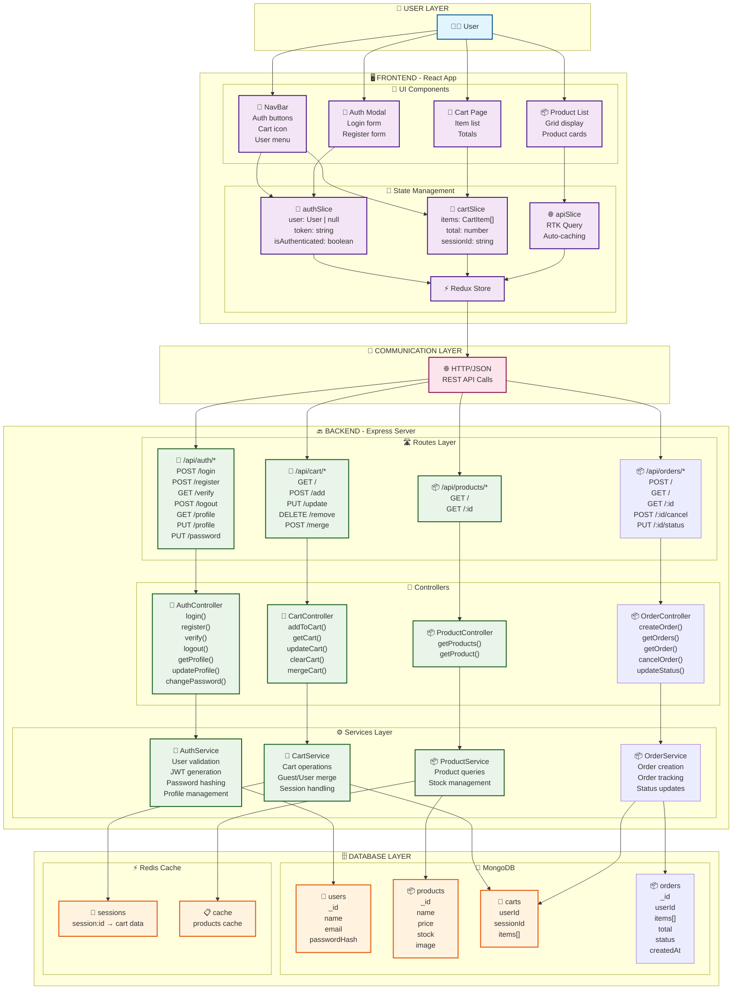

---

## 🔐 Authentication Flow with Conditions

> **מטרה:** זה מציג כיצד משתמש מזדהה, מתחבר, ומטוען לעגלה שלו או עגלת אורח

**🔑 Key Points:**
- Token expiration handling - אם Token פג תוקף, refresh מיד
- Guest cart merge - כשאורח מתחבר, עגלתו מתמזגת לחשבון
- Rate limiting - 5 ניסיונות לדקה בלבד

---

## 🛒 Cart Flow with Multiple Conditions

> **מטרה:** מציג את כל הגדלים שחייבים לבדוק כשמוסיפים מוצר לעגלה

**🔑 Key Points:**
- Guest carts stored in Redis (מהיר, זמני 24h)
- User carts stored in MongoDB (קבוע, זוכר תמיד)
- Guest dedup - אם פריט כבר בעגלת אורח, רק מעדכנים כמות (לא מוסיפים כפול)
- Stock validation - אם אין מספיק, מראים שגיאה
- Quantity limits - לא יכול לקנות יותר מ-X

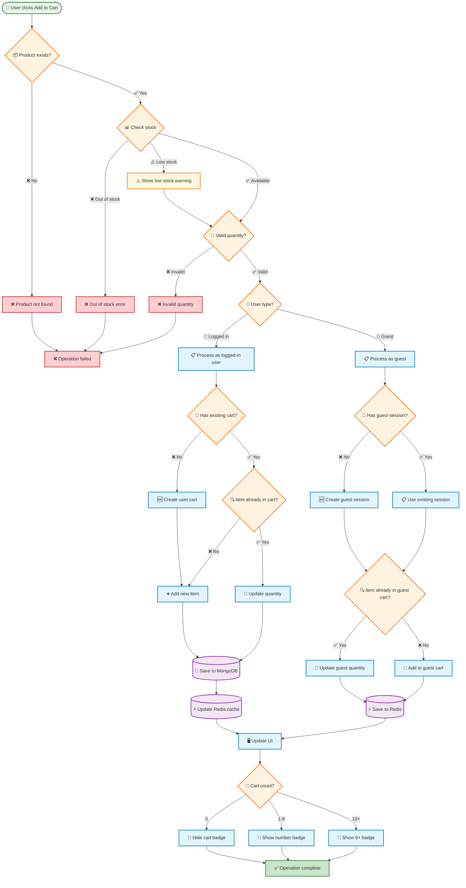

---

## 📦 Orders System Flow

> **מטרה:** הזרימה המלאה מיצירת הזמנה, ביטול, וגם עדכון סטטוס

**🔑 Key Points:**
- Order status: pending → processing → shipped → delivered
- Stock update - מיד אחרי יצירת הזמנה, המלאי יורד
- Cart clearing - עגלה נמחקה אחרי יצירה מוצלחת
- Order cancellation - רק אם pending, לא shipped/delivered

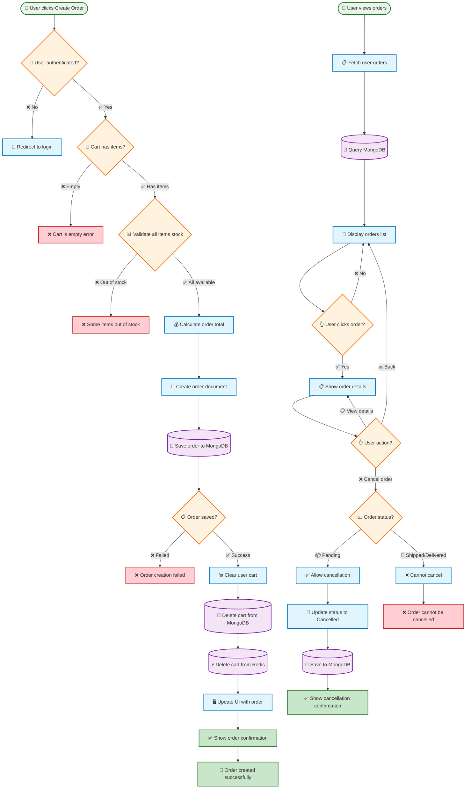

---

## 👤 Profile Management Flow

> **מטרה:** משתמש יכול לעדכן פרטים, לשנות סיסמה, למחוק חשבון

**🔑 Key Points:**
- Profile updates - שם, email, תמונה פרופיל
- Password change - מחייב סיסמה הנוכחית כדי לשנות
- Account deletion - יכול לשחזור תוך 30 יום
- Logout all sessions - אחרי שינוי סיסמה

---

## 🔄 Cart Merge Flow (Login/Register)

> **מטרה:** כשאורח מתחבר/רושם חשבון, אנו מומזגים את העגלה שלו לחשבון החדש

**🔑 Key Points:**
- Guest cart stored in Redis with sessionId
- When merge: לוקחים כל מוצר מעגלת ההארח
- If item exists: מוסיפים את הכמויות (לא מחליפים)
- Guest session deleted after merge

---

## 🎭 State Management Flow with Redux

> **מטרה:** איך Redux שומר את הstate (משתמש, עגלה, טוקן) בכל הזמן

**🔑 Key Points:**
- authSlice - משתמש, token, isAuthenticated
- cartSlice - items, total, sessionId
- apiSlice - RTK Query, auto-caching
- localStorage - token שמור שם בין-הרענוניות

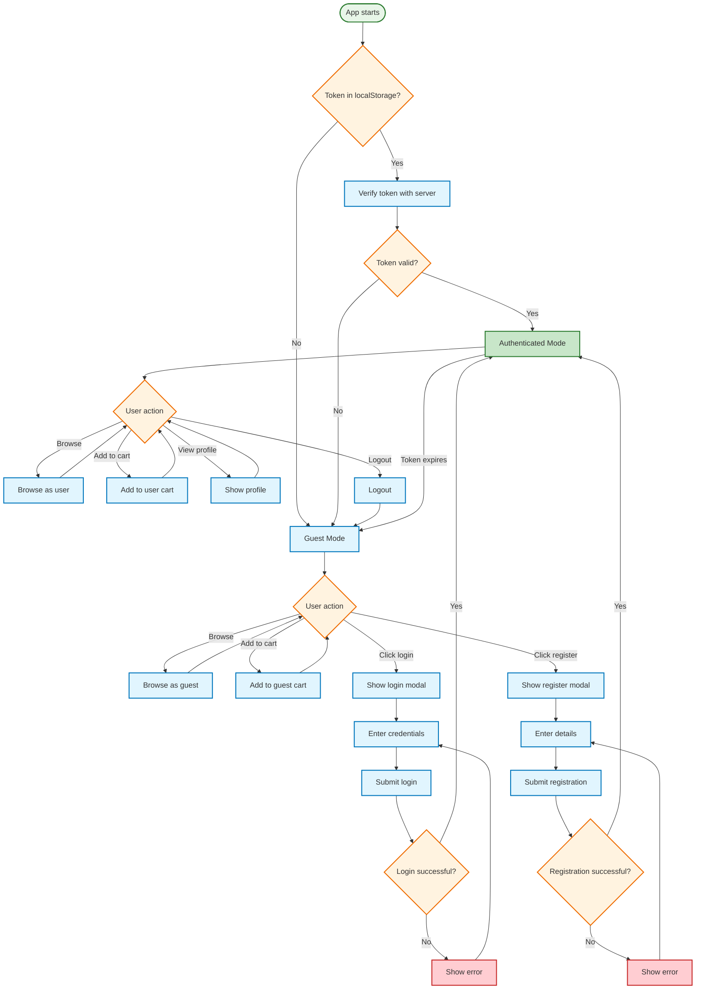

---

## 🔄 Complete Component Lifecycle with Conditions

> **מטרה:** איך הקומפוננטות מטעינות, מתחדשות, וגם אינטראקציות משתנות

**🔑 Key Points:**
- App.tsx mount - בודקים token בלocationStorage
- Token verification - אם תקף, load user data
- Conditional rendering - guests vs authenticated users
- useEffect hooks - מעדכנים UI בזמן real-time

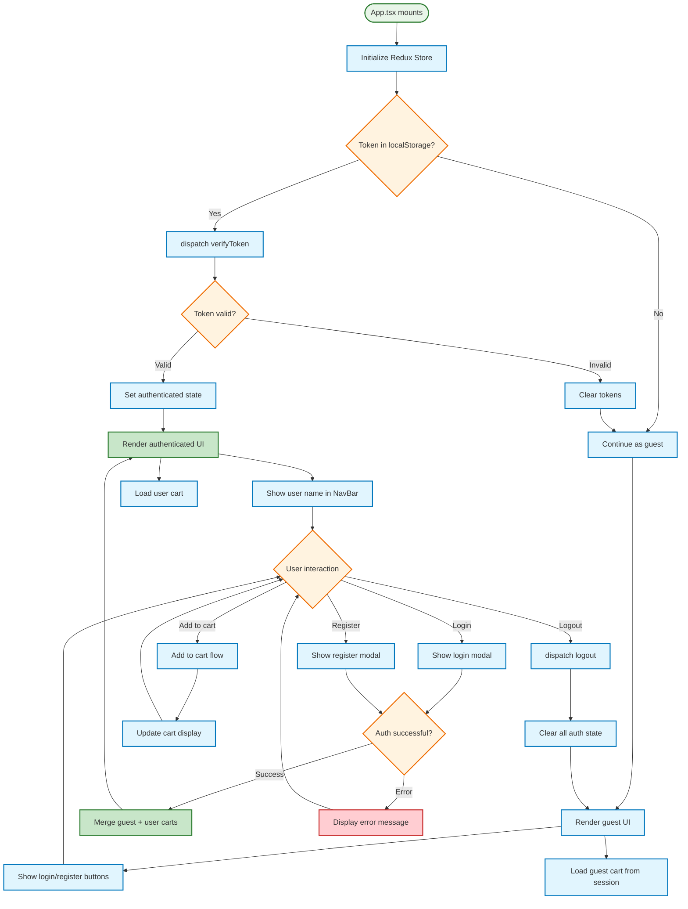

---

## ❌ Error Handling Flow Map

> **מטרה:** איך המערכת מטפלת בשגיאות - network, auth, validation, server

**🔑 Key Points:**
- Network retry - 3 ניסיונות עם wait בין-כל אחד
- Token expired - refresh token מיד
- Validation errors - display לאיזה שדה בדיוק יש בעיה
- Server errors - 500, 503 - show maintenance mode

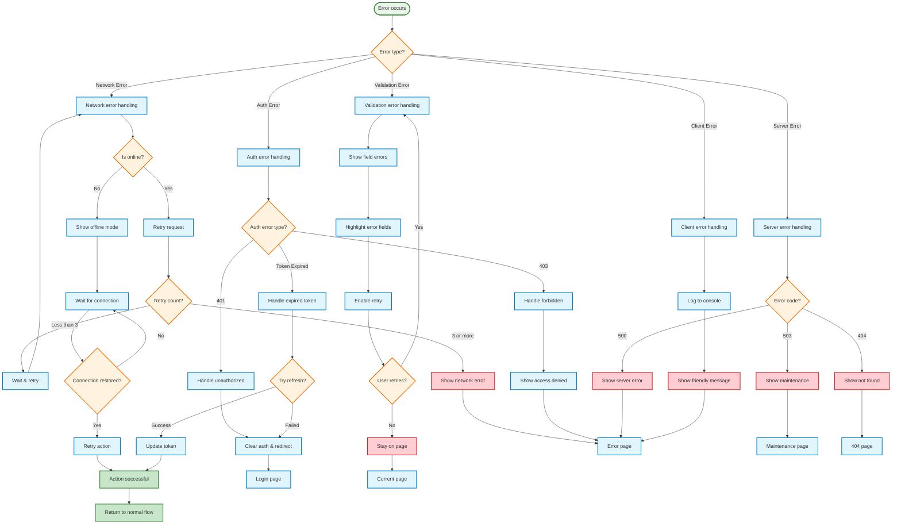

---

## 🗄️ Database Relationships (ERD)

> **מטרה:** איך כל הטבלאות מחובורת - Users, Products, Carts, Orders

**🔑 Key Points:**
- USER → CART (one-to-one) - כל משתמש יש רק עגלה אחת
- USER → ORDER (one-to-many) - משתמש יכול להיות הרבה הזמנות
- CART → PRODUCT (many-to-many via CART_ITEM)
- ORDER → PRODUCT (many-to-many via ORDER_ITEM)

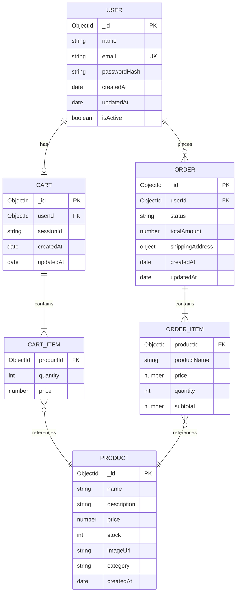

---

## 🔒 Security & Middleware Flow

> **מטרה:** כל בקשה עברה דרך סדרה של middleware לבטיחות

**🔑 Key Points:**
- Rate limiting - 100 requests/minute per IP
- CORS validation - רק origins מאושרים
- Token verification - JWT signature check
- Input validation - all fields validated before processing

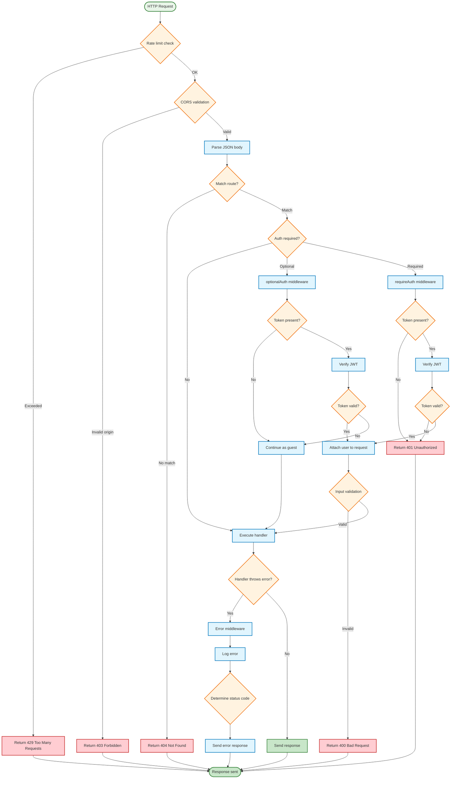

---

## 🔍 Search & Filter Flow

> **מטרה:** משתמש מחפש ומסנן מוצרים - search text, category, price range, sort

**🔑 Key Points:**
- Text search - MongoDB text index on name/description
- Category filter - exact match on category field
- Price range - min/max filter on price
- Sort options - price asc/desc, name, newest

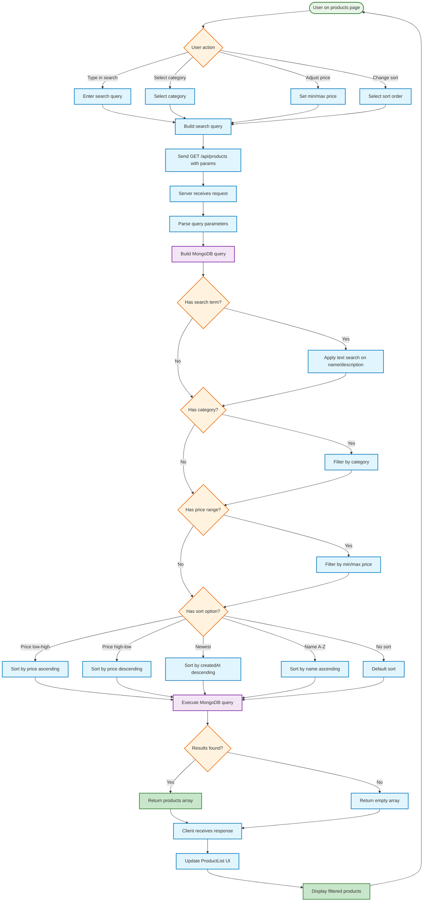

---

## 📧 Notification & Email Flow

> **מטרה:** שליחת emails לאירועים חשובים - welcome, order confirmation, shipping update

**🔑 Key Points:**
- Queue system - emails נשלחות async, לא blocking
- Retry logic - אם failed, spoon 5 minutes (max 3 attempts)
- Templates - HTML templates with dynamic data
- Dev mode - console logging instead of real SMTP

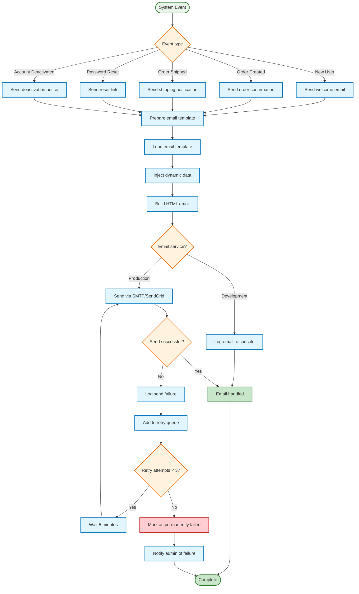

---

## 👨‍💼 Admin Dashboard Flow (Future)

> **מטרה:** Admin יכול לנהל מוצרים, הזמנות, משתמשים

**🔑 Key Points:**
- Role check - רק admins יכולים להיכנס
- CRUD operations - Create, Read, Update, Delete מוצרים
- Order management - update status, view details
- User management - view stats, manage accounts

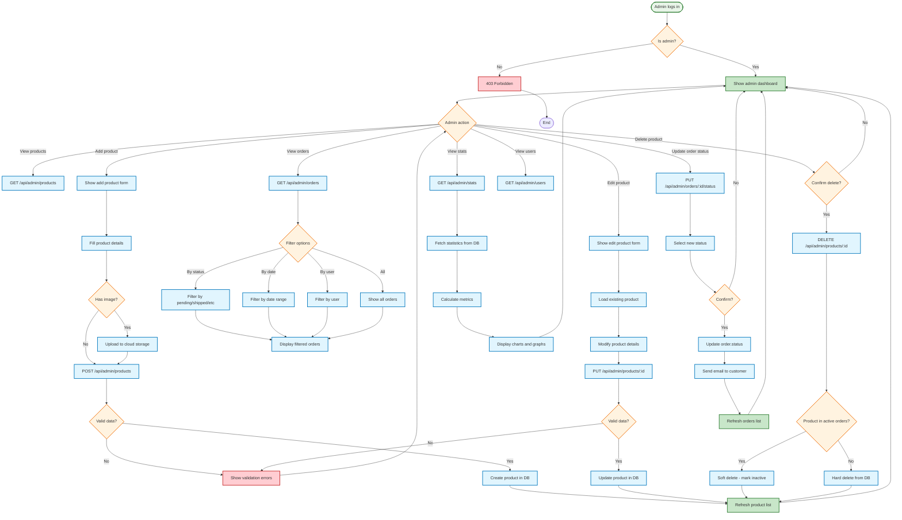

---

## 💳 Payment Flow (Future Integration)

> **מטרה:** משתמש משלם עם credit card או PayPal

**🔑 Key Points:**
- Payment gateway integration - Stripe, PayPal
- Payment intent - secure token generation
- Success/Failure handling - order creation or error
- Webhook validation - verify payment status

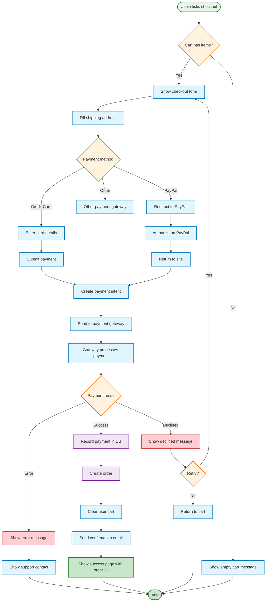

---

## 🔄 Token Refresh & Session Management

> **מטרה:** Token פג תוקף? Refresh אותו אוטומטית בלי להפריע למשתמש

**🔑 Key Points:**
- Access token - 15 minutes validity
- Refresh token - 7 days validity
- Auto-refresh - בפחות מ-500ms
- Logout all - כשמחליפים סיסמה

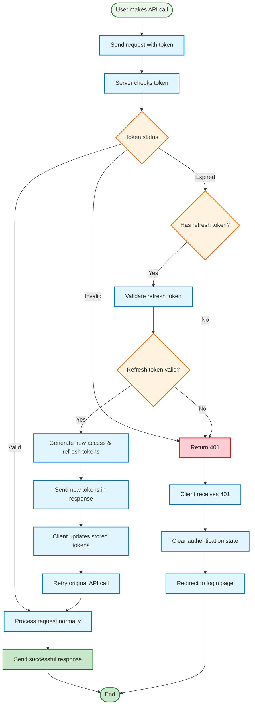

---

## 🎯 Summary & How to Use This Document

### 📚 למה קובץ זה שימושי:

✅ **הבנה מוקדמת** - ראה את כל הקומבינציות לפני לקוד  
✅ **Debugging** - עקוב אחרי הזרימה לדע בדיוק איפה הבעיה  
✅ **Planning** - תכנן features חדשות עם context מלא  
✅ **Onboarding** - הערים צוות חדש בחצי השעה במקום שבועות  
✅ **Documentation** - תיעוד שמעולם לא התישן  

### 🎯 איך להשתמש:

1. **בחר את הסקציה שלך** - תלוי בתפקיד
2. **קרא את ה-diagram משמאל לימין** - בעקבות החיצים
3. **הבן כל decision point** - מה הפעולה בכל תנאי
4. **חזור כשצריך** - הו reference שמעדכנים עם הכל

### 🔧 איך עוديים אלו:

כל תרשים יכול להעדכן:
- כשיש feature חדשה
- כשמצאים bug ותיקון הזרימה
- כשיש optimization או refactor

---

## 💡 Best Practices לקריאת Diagrams

| טריק | הסבר |
|------|-----|
| **Follow arrows** | כל חץ = פעולה הבאה בזרימה |
| **Check diamonds** | כל ◇ = decision point, יש multiple paths |
| **Read labels** | כל box יש תיאור בדיוק מה קורה שם |
| **Use colors** | צבעים עוזרים להבדיל בין success/error/process |
| **Zoom in** | VS Code preview - אפשר להזום ולראות פרטים |

---

**Perfect for:**
- 🎯 **Understanding** - הבן את כל המערכת
- 🔧 **Debugging** - מצא באגים בדיוק בנקודה
- 📋 **Planning** - תכנן features חדשות בנבון
- 👥 **Onboarding** - הערים צוות חדש בחצי שעה
- 📚 **Documentation** - Reference שמעולם לא מתישן