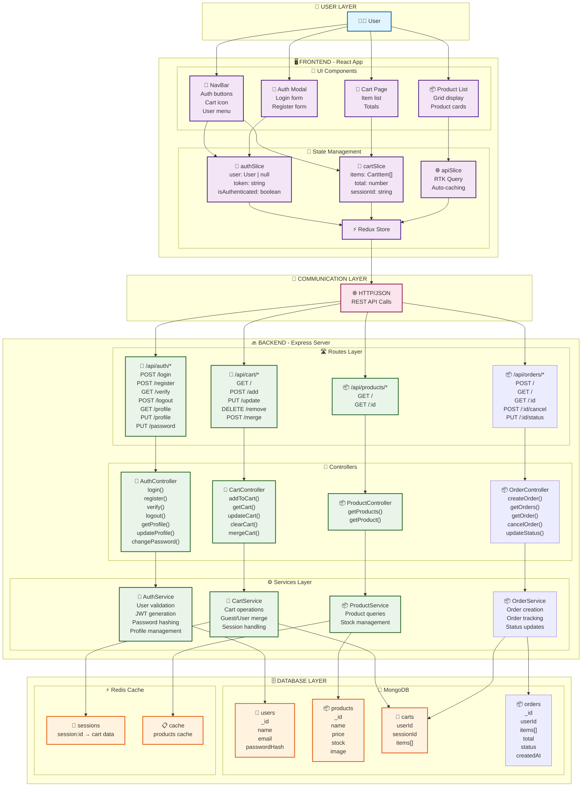
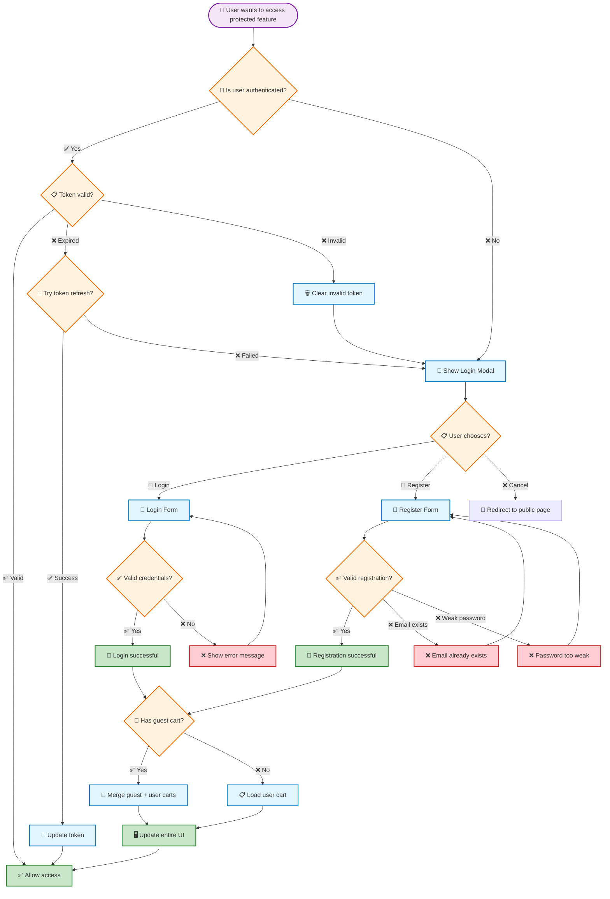
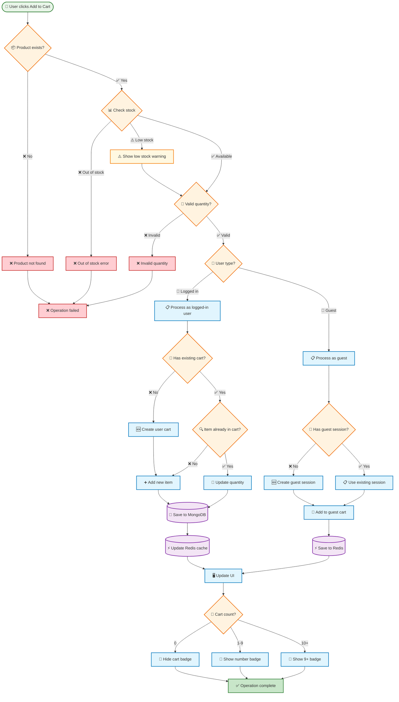
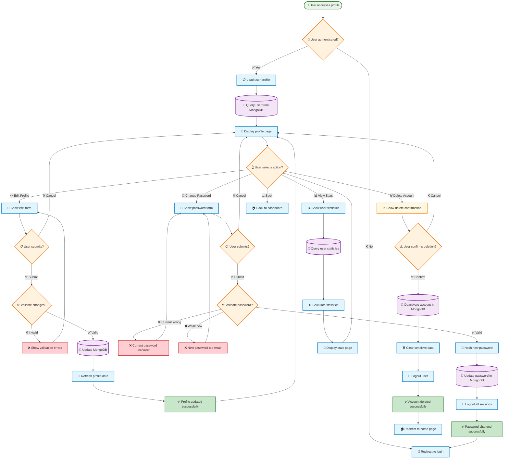
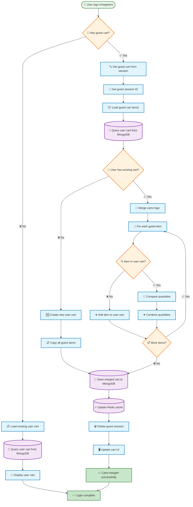
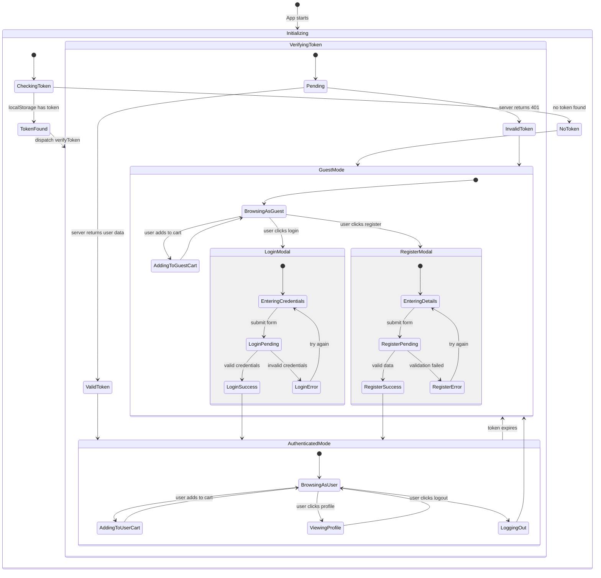
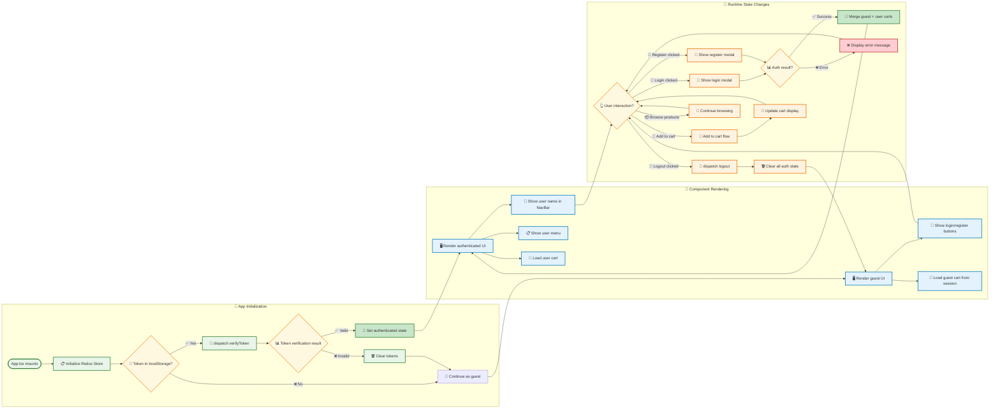
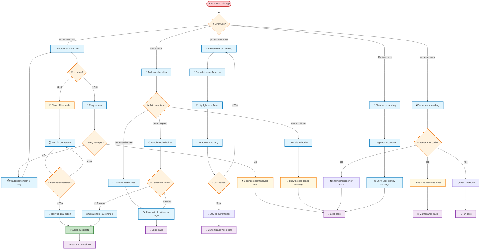

# 🗺️ Simple Shop - Complete Visual System Map

## 📋 Quick Navigation
- [🗺️ Simple Shop - Complete Visual System Map](#️-simple-shop---complete-visual-system-map)
  - [📋 Quick Navigation](#-quick-navigation)
  - [🏗️ System Architecture](#️-system-architecture)
  - [🔐 Authentication Flow with Conditions](#-authentication-flow-with-conditions)
  - [🛒 Cart Flow with Multiple Conditions](#-cart-flow-with-multiple-conditions)
  - [📦 Orders System Flow](#-orders-system-flow)
  - [👤 Profile Management Flow](#-profile-management-flow)
  - [🔄 Cart Merge Flow (Login/Register)](#-cart-merge-flow-loginregister)
  - [🎭 State Management Flow with Redux](#-state-management-flow-with-redux)
  - [🔄 Complete Component Lifecycle with Conditions](#-complete-component-lifecycle-with-conditions)
  - [❌ Error Handling Flow Map](#-error-handling-flow-map)
  - [🎯 Summary](#-summary)

---

## 🏗️ System Architecture

---

## 🔐 Authentication Flow with Conditions

---

## 🛒 Cart Flow with Multiple Conditions

---

## 📦 Orders System Flow

---

## 👤 Profile Management Flow

---

## 🔄 Cart Merge Flow (Login/Register)

---

## 🎭 State Management Flow with Redux

---

## 🔄 Complete Component Lifecycle with Conditions

---

## ❌ Error Handling Flow Map

---

## 🎯 Summary

This visual map provides:

✅ **Complete System Overview** - All layers from UI to Database  
✅ **Detailed Condition Logic** - Every decision point mapped  
✅ **Orders System** - Complete order creation, tracking, and cancellation flows  
✅ **Profile Management** - User profile updates, password changes, account deletion  
✅ **Cart Merging** - Guest to user cart merge on login/register  
✅ **Error Handling** - Comprehensive error recovery flows  
✅ **State Management** - Redux state transitions  
✅ **Component Lifecycle** - Full initialization to runtime  
✅ **User Journey** - Every possible user interaction  

**How to use:**
1. Copy this content to `docs/SYSTEM_MAP.md`
2. View in GitHub/VS Code with Mermaid preview
3. Each diagram is interactive and shows the complete logic flow
4. Update by editing the text - diagrams auto-generate

**Perfect for:**
- 🎯 **Understanding** the complete system
- 🔧 **Debugging** issues by following the flow
- 📋 **Planning** new features
- 👥 **Onboarding** new team members
- 📚 **Documentation** and maintenance