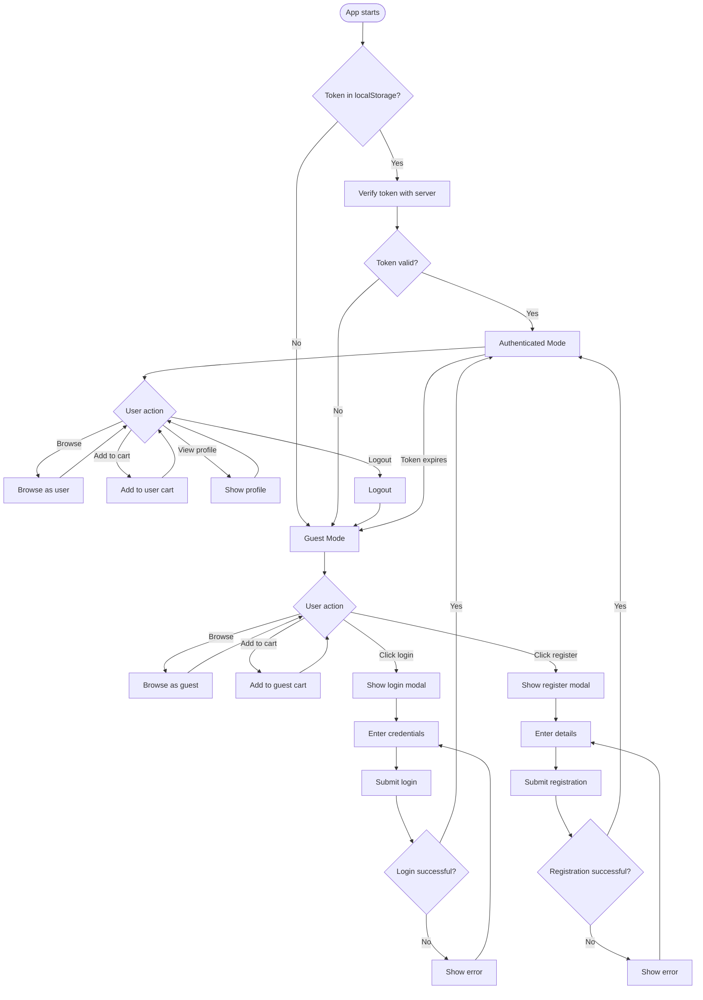
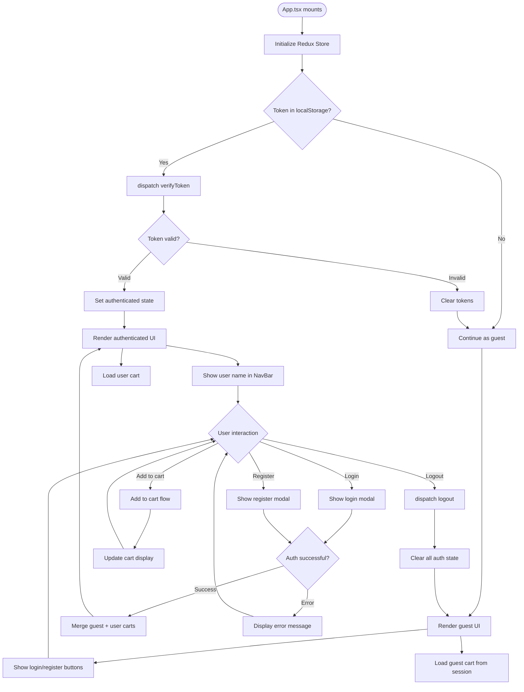
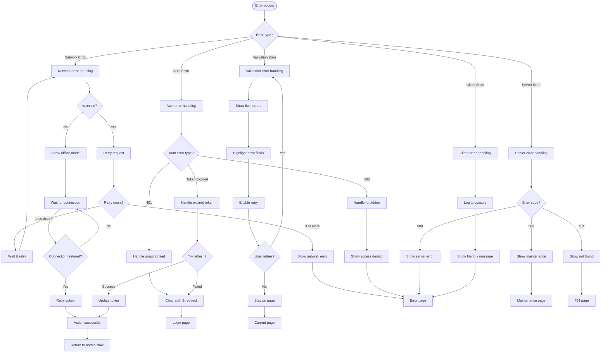

# 🗺️ Simple Shop - Complete Visual System Map

## 📋 Quick Navigation
- [🗺️ Simple Shop - Complete Visual System Map](#️-simple-shop---complete-visual-system-map)
  - [📋 Quick Navigation](#-quick-navigation)
  - [🏗️ System Architecture](#️-system-architecture)
  - [🔐 Authentication Flow with Conditions](#-authentication-flow-with-conditions)
  - [🛒 Cart Flow with Multiple Conditions](#-cart-flow-with-multiple-conditions)
  - [📦 Orders System Flow](#-orders-system-flow)
  - [👤 Profile Management Flow](#-profile-management-flow)
  - [🔄 Cart Merge Flow (Login/Register)](#-cart-merge-flow-loginregister)
  - [🎭 State Management Flow with Redux](#-state-management-flow-with-redux)
  - [🔄 Complete Component Lifecycle with Conditions](#-complete-component-lifecycle-with-conditions)
  - [❌ Error Handling Flow Map](#-error-handling-flow-map)
  - [🎯 Summary](#-summary)

---

## 🏗️ System Architecture

```mermaid
graph TB
    subgraph "👤 USER LAYER"
        User[🧑‍💻 User]
    end
    
    subgraph "🖥️ FRONTEND - React App"
        subgraph "📱 UI Components"
            NavBar["🧭 NavBar<br/>Auth buttons<br/>Cart icon<br/>User menu"]
            ProductList["📦 Product List<br/>Grid display<br/>Product cards"]
            AuthModal["🔐 Auth Modal<br/>Login form<br/>Register form"]
            Cart["🛒 Cart Page<br/>Item list<br/>Totals"]
        end
        
        subgraph "🧠 State Management"
            Redux[⚡ Redux Store]
            AuthSlice["🔐 authSlice<br/>user: User | null<br/>token: string<br/>isAuthenticated: boolean"]
            CartSlice["🛒 cartSlice<br/>items: CartItem[]<br/>total: number<br/>sessionId: string"]
            ApiSlice["🌐 apiSlice<br/>RTK Query<br/>Auto-caching"]
        end
    end
    
    subgraph "🔗 COMMUNICATION LAYER"
        HTTP[🌐 HTTP/JSON<br/>REST API Calls]
    end
    
    subgraph "🔙 BACKEND - Express Server"
        subgraph "🛣️ Routes Layer"
            AuthRoutes["🔐 /api/auth/*<br/>POST /login<br/>POST /register<br/>GET /verify<br/>POST /logout<br/>GET /profile<br/>PUT /profile<br/>PUT /password"]
            CartRoutes["🛒 /api/cart/*<br/>GET /<br/>POST /add<br/>PUT /update<br/>DELETE /remove<br/>POST /merge"]
            ProductRoutes["📦 /api/products/*<br/>GET /<br/>GET /:id"]
            OrderRoutes["📦 /api/orders/*<br/>POST /<br/>GET /<br/>GET /:id<br/>POST /:id/cancel<br/>PUT /:id/status"]
        end
        
        subgraph "🎯 Controllers"
            AuthController["🔐 AuthController<br/>login()<br/>register()<br/>verify()<br/>logout()<br/>getProfile()<br/>updateProfile()<br/>changePassword()"]
            CartController["🛒 CartController<br/>addToCart()<br/>getCart()<br/>updateCart()<br/>clearCart()<br/>mergeCart()"]
            ProductController["📦 ProductController<br/>getProducts()<br/>getProduct()"]
            OrderController["📦 OrderController<br/>createOrder()<br/>getOrders()<br/>getOrder()<br/>cancelOrder()<br/>updateStatus()"]
        end
        
        subgraph "⚙️ Services Layer"
            AuthService["🔐 AuthService<br/>User validation<br/>JWT generation<br/>Password hashing<br/>Profile management"]
            CartService["🛒 CartService<br/>Cart operations<br/>Guest/User merge<br/>Session handling"]
            ProductService["📦 ProductService<br/>Product queries<br/>Stock management"]
            OrderService["📦 OrderService<br/>Order creation<br/>Order tracking<br/>Status updates"]
        end
    end
    
    subgraph "🗄️ DATABASE LAYER"
        subgraph "💾 MongoDB"
            Users["👤 users<br/>_id<br/>name<br/>email<br/>passwordHash"]
            Products["📦 products<br/>_id<br/>name<br/>price<br/>stock<br/>image"]
            Carts["🛒 carts<br/>userId<br/>sessionId<br/>items[]"]
            Orders["📦 orders<br/>_id<br/>userId<br/>items[]<br/>total<br/>status<br/>createdAt"]
        end
        
        subgraph "⚡ Redis Cache"
            Sessions["🔄 sessions<br/>session:id → cart data"]
            Cache["📋 cache<br/>products cache"]
        end
    end

    %% User Interactions
    User --> NavBar
    User --> ProductList
    User --> AuthModal
    User --> Cart
    
    %% Component to State
    NavBar --> AuthSlice
    NavBar --> CartSlice
    ProductList --> ApiSlice
    AuthModal --> AuthSlice
    Cart --> CartSlice
    
    %% State Management
    AuthSlice --> Redux
    CartSlice --> Redux
    ApiSlice --> Redux
    
    %% Frontend to Backend
    Redux --> HTTP
    HTTP --> AuthRoutes
    HTTP --> CartRoutes
    HTTP --> ProductRoutes
    HTTP --> OrderRoutes
    
    %% Routes to Controllers
    AuthRoutes --> AuthController
    CartRoutes --> CartController
    ProductRoutes --> ProductController
    OrderRoutes --> OrderController
    
    %% Controllers to Services
    AuthController --> AuthService
    CartController --> CartService
    ProductController --> ProductService
    OrderController --> OrderService
    
    %% Services to Database
    AuthService --> Users
    CartService --> Carts
    CartService --> Sessions
    ProductService --> Products
    ProductService --> Cache
    OrderService --> Orders
    OrderService --> Carts

    %% Styling
    classDef userLayer fill:#e1f5fe,stroke:#01579b,stroke-width:2px
    classDef frontend fill:#f3e5f5,stroke:#4a148c,stroke-width:2px
    classDef backend fill:#e8f5e8,stroke:#1b5e20,stroke-width:2px
    classDef database fill:#fff3e0,stroke:#e65100,stroke-width:2px
    classDef communication fill:#fce4ec,stroke:#880e4f,stroke-width:2px

    class User userLayer
    class NavBar,ProductList,AuthModal,Cart,Redux,AuthSlice,CartSlice,ApiSlice frontend
    class AuthRoutes,CartRoutes,ProductRoutes,AuthController,CartController,ProductController,AuthService,CartService,ProductService backend
    class Users,Products,Carts,Sessions,Cache database
    class HTTP communication
```

---

## 🔐 Authentication Flow with Conditions

```mermaid
flowchart TD
    Start([👤 User wants to access protected feature]) --> CheckAuth{🔐 Is user authenticated?}
    
    %% Authentication Check
    CheckAuth -->|✅ Yes| CheckToken{📋 Token valid?}
    CheckAuth -->|❌ No| ShowLoginModal[🔐 Show Login Modal]
    
    %% Token Validation
    CheckToken -->|✅ Valid| Allow[✅ Allow access]
    CheckToken -->|❌ Expired| RefreshToken{🔄 Try token refresh?}
    CheckToken -->|❌ Invalid| ClearToken[🗑️ Clear invalid token]
    
    %% Token Refresh Logic
    RefreshToken -->|✅ Success| UpdateToken[📝 Update token]
    RefreshToken -->|❌ Failed| ShowLoginModal
    UpdateToken --> Allow
    ClearToken --> ShowLoginModal
    
    %% Login Modal Flow
    ShowLoginModal --> LoginChoice{📋 User chooses?}
    LoginChoice -->|🔑 Login| LoginForm[📝 Login Form]
    LoginChoice -->|📝 Register| RegisterForm[📝 Register Form]
    LoginChoice -->|❌ Cancel| Redirect[🔄 Redirect to public page]
    
    %% Login Process
    LoginForm --> ValidateLogin{✅ Valid credentials?}
    ValidateLogin -->|✅ Yes| LoginSuccess[🎉 Login successful]
    ValidateLogin -->|❌ No| LoginError[❌ Show error message]
    LoginError --> LoginForm
    
    %% Register Process
    RegisterForm --> ValidateRegister{✅ Valid registration?}
    ValidateRegister -->|✅ Yes| RegisterSuccess[🎉 Registration successful]
    ValidateRegister -->|❌ Email exists| EmailError[❌ Email already exists]
    ValidateRegister -->|❌ Weak password| PasswordError[❌ Password too weak]
    EmailError --> RegisterForm
    PasswordError --> RegisterForm
    
    %% Success Flows
    LoginSuccess --> MergeCart{🛒 Has guest cart?}
    RegisterSuccess --> MergeCart
    
    MergeCart -->|✅ Yes| MergeCarts[🔄 Merge guest + user carts]
    MergeCart -->|❌ No| LoadUserCart[📋 Load user cart]
    
    MergeCarts --> UpdateUI[🖥️ Update entire UI]
    LoadUserCart --> UpdateUI
    UpdateUI --> Allow

    %% Styling
    classDef success fill:#c8e6c9,stroke:#2e7d32,stroke-width:2px
    classDef error fill:#ffcdd2,stroke:#c62828,stroke-width:2px
    classDef process fill:#e1f5fe,stroke:#0277bd,stroke-width:2px
    classDef decision fill:#fff3e0,stroke:#ef6c00,stroke-width:2px
    classDef start fill:#f3e5f5,stroke:#7b1fa2,stroke-width:2px

    class Start start
    class CheckAuth,CheckToken,RefreshToken,LoginChoice,ValidateLogin,ValidateRegister,MergeCart decision
    class ShowLoginModal,LoginForm,RegisterForm,ClearToken,UpdateToken,MergeCarts,LoadUserCart,UpdateUI process
    class Allow,LoginSuccess,RegisterSuccess,UpdateUI success
    class LoginError,EmailError,PasswordError error
```

---

## 🛒 Cart Flow with Multiple Conditions

---

## 📦 Orders System Flow

---

## 👤 Profile Management Flow

```mermaid
flowchart TD
    ProfileAccess([👤 User accesses profile]) --> CheckAuth{🔐 User authenticated?}
    
    %% Authentication Check
    CheckAuth -->|❌ No| RedirectLogin[🔑 Redirect to login]
    CheckAuth -->|✅ Yes| LoadProfile[📋 Load user profile]
    
    LoadProfile --> QueryUserData[(💾 Query user from MongoDB)]
    QueryUserData --> DisplayProfile[📱 Display profile page]
    
    %% Profile Actions
    DisplayProfile --> UserAction{👆 User selects action?}
    
    UserAction -->|✏️ Edit Profile| EditProfile[📝 Show edit form]
    UserAction -->|🔑 Change Password| ChangePassword[🔐 Show password form]
    UserAction -->|📊 View Stats| ViewStats[📊 Show user statistics]
    UserAction -->|🗑️ Delete Account| ConfirmDelete[⚠️ Show delete confirmation]
    UserAction -->|🔙 Back| Dashboard[🏠 Back to dashboard]
    
    %% Edit Profile Flow
    EditProfile --> EditForm{📋 User submits?}
    EditForm -->|❌ Cancel| DisplayProfile
    EditForm -->|✅ Submit| ValidateProfile{✅ Validate changes?}
    
    ValidateProfile -->|❌ Invalid| ShowProfileErrors[❌ Show validation errors]
    ValidateProfile -->|✅ Valid| UpdateProfile[(💾 Update MongoDB)]
    
    ShowProfileErrors --> EditProfile
    UpdateProfile --> RefreshProfile[🔄 Refresh profile data]
    RefreshProfile --> ShowProfileSuccess[✅ Profile updated successfully]
    ShowProfileSuccess --> DisplayProfile
    
    %% Change Password Flow
    ChangePassword --> PasswordForm{📋 User submits?}
    PasswordForm -->|❌ Cancel| DisplayProfile
    PasswordForm -->|✅ Submit| ValidatePassword{✅ Validate password?}
    
    ValidatePassword -->|❌ Current wrong| ShowPasswordError[❌ Current password incorrect]
    ValidatePassword -->|❌ Weak new| ShowWeakPassword[❌ New password too weak]
    ValidatePassword -->|✅ Valid| HashPassword[🔐 Hash new password]
    
    ShowPasswordError --> ChangePassword
    ShowWeakPassword --> ChangePassword
    
    HashPassword --> UpdatePassword[(💾 Update password in MongoDB)]
    UpdatePassword --> LogoutAllSessions[🚪 Logout all sessions]
    LogoutAllSessions --> ShowPasswordSuccess[✅ Password changed successfully]
    ShowPasswordSuccess --> RedirectLogin
    
    %% View Stats Flow
    ViewStats --> QueryStats[(💾 Query user statistics)]
    QueryStats --> CalculateStats[📊 Calculate statistics]
    CalculateStats --> DisplayStats[📱 Display stats page]
    DisplayStats --> UserAction
    
    %% Delete Account Flow
    ConfirmDelete --> UserConfirms{⚠️ User confirms deletion?}
    UserConfirms -->|❌ Cancel| DisplayProfile
    UserConfirms -->|✅ Confirm| DeactivateAccount[(💾 Deactivate account in MongoDB)]
    
    DeactivateAccount --> ClearUserData[🗑️ Clear sensitive data]
    ClearUserData --> LogoutUser[🚪 Logout user]
    LogoutUser --> ShowDeleteSuccess[✅ Account deleted successfully]
    ShowDeleteSuccess --> RedirectHome[🏠 Redirect to home page]

    %% Styling
    classDef success fill:#c8e6c9,stroke:#2e7d32,stroke-width:2px
    classDef error fill:#ffcdd2,stroke:#c62828,stroke-width:2px
    classDef warning fill:#fff8e1,stroke:#f57c00,stroke-width:2px
    classDef process fill:#e1f5fe,stroke:#0277bd,stroke-width:2px
    classDef decision fill:#fff3e0,stroke:#ef6c00,stroke-width:2px
    classDef database fill:#f3e5f5,stroke:#7b1fa2,stroke-width:2px
    classDef start fill:#e8f5e8,stroke:#2e7d32,stroke-width:2px

    class ProfileAccess start
    class CheckAuth,UserAction,EditForm,ValidateProfile,PasswordForm,ValidatePassword,UserConfirms decision
    class RedirectLogin,LoadProfile,DisplayProfile,EditProfile,ChangePassword,ViewStats,Dashboard,RefreshProfile,HashPassword,LogoutAllSessions,CalculateStats,DisplayStats,DeactivateAccount,ClearUserData,LogoutUser,RedirectHome process
    class ShowProfileErrors,ShowPasswordError,ShowWeakPassword error
    class ShowProfileSuccess,ShowPasswordSuccess,ShowDeleteSuccess success
    class ConfirmDelete warning
    class QueryUserData,UpdateProfile,UpdatePassword,QueryStats,DeactivateAccount database
```

---

## 🔄 Cart Merge Flow (Login/Register)

```mermaid
flowchart TD
    UserLogsIn([👤 User logs in/registers]) --> CheckGuestCart{🛒 Has guest cart?}
    
    %% Guest Cart Check
    CheckGuestCart -->|❌ No| LoadUserCart[📋 Load existing user cart]
    CheckGuestCart -->|✅ Yes| GetGuestCart[🔍 Get guest cart from session]
    
    %% Load User Cart
    LoadUserCart --> QueryUserCart[(💾 Query user cart from MongoDB)]
    QueryUserCart --> DisplayUserCart[📱 Display user cart]
    DisplayUserCart --> MergeComplete[✅ Login complete]
    
    %% Guest Cart Handling
    GetGuestCart --> GetSessionId[🔑 Get guest session ID]
    GetSessionId --> LoadGuestItems[📦 Load guest cart items]
    LoadGuestItems --> QueryUserCartForMerge[(💾 Query user cart from MongoDB)]
    
    QueryUserCartForMerge --> UserCartExists{🛒 User has existing cart?}
    
    %% Merge Logic
    UserCartExists -->|❌ No| CreateUserCart[🆕 Create new user cart]
    UserCartExists -->|✅ Yes| MergeLogic[🔄 Merge carts logic]
    
    CreateUserCart --> CopyGuestItems[📋 Copy all guest items]
    CopyGuestItems --> SaveMergedCart
    
    %% Detailed Merge Logic
    MergeLogic --> IterateGuestItems[🔄 For each guest item]
    IterateGuestItems --> CheckItemExists{🔍 Item in user cart?}
    
    CheckItemExists -->|❌ No| AddNewItem[➕ Add item to user cart]
    CheckItemExists -->|✅ Yes| CompareQuantities[🔢 Compare quantities]
    
    AddNewItem --> NextItem{📋 More items?}
    CompareQuantities --> CombineQuantities[➕ Combine quantities]
    CombineQuantities --> NextItem
    
    NextItem -->|✅ Yes| IterateGuestItems
    NextItem -->|❌ No| SaveMergedCart
    
    %% Save Merged Result
    SaveMergedCart[(💾 Save merged cart to MongoDB)] --> UpdateRedisCache[(⚡ Update Redis cache)]
    UpdateRedisCache --> DeleteGuestSession[🗑️ Delete guest session]
    DeleteGuestSession --> UpdateUI[🖥️ Update cart UI]
    UpdateUI --> ShowMergeSuccess[✅ Carts merged successfully]
    ShowMergeSuccess --> MergeComplete

    %% Styling
    classDef success fill:#c8e6c9,stroke:#2e7d32,stroke-width:2px
    classDef process fill:#e1f5fe,stroke:#0277bd,stroke-width:2px
    classDef decision fill:#fff3e0,stroke:#ef6c00,stroke-width:2px
    classDef database fill:#f3e5f5,stroke:#7b1fa2,stroke-width:2px
    classDef start fill:#e8f5e8,stroke:#2e7d32,stroke-width:2px

    class UserLogsIn start
    class CheckGuestCart,UserCartExists,CheckItemExists,NextItem decision
    class LoadUserCart,DisplayUserCart,GetGuestCart,GetSessionId,LoadGuestItems,CreateUserCart,CopyGuestItems,MergeLogic,IterateGuestItems,AddNewItem,CompareQuantities,CombineQuantities,DeleteGuestSession,UpdateUI,ShowMergeSuccess process
    class MergeComplete,ShowMergeSuccess success
    class QueryUserCart,QueryUserCartForMerge,SaveMergedCart,UpdateRedisCache database
```

---

## 🎭 State Management Flow with Redux

---

## 🔄 Complete Component Lifecycle with Conditions

---

## ❌ Error Handling Flow Map

---

## 🎯 Summary

This visual map provides:

✅ **Complete System Overview** - All layers from UI to Database  
✅ **Detailed Condition Logic** - Every decision point mapped  
✅ **Orders System** - Complete order creation, tracking, and cancellation flows  
✅ **Profile Management** - User profile updates, password changes, account deletion  
✅ **Cart Merging** - Guest to user cart merge on login/register  
✅ **Error Handling** - Comprehensive error recovery flows  
✅ **State Management** - Redux state transitions  
✅ **Component Lifecycle** - Full initialization to runtime  
✅ **User Journey** - Every possible user interaction  

**How to use:**
1. Copy this content to `docs/SYSTEM_MAP.md`
2. View in GitHub/VS Code with Mermaid preview
3. Each diagram is interactive and shows the complete logic flow
4. Update by editing the text - diagrams auto-generate

**Perfect for:**
- 🎯 **Understanding** the complete system
- 🔧 **Debugging** issues by following the flow
- 📋 **Planning** new features
- 👥 **Onboarding** new team members
- 📚 **Documentation** and maintenance