# 🗺️ Simple Shop - Complete Visual System Map

## 📋 Quick Navigation
- [🏗️ System Architecture](#-system-architecture)
- [🔐 Authentication Flow](#-authentication-flow-with-conditions)
- [🛒 Cart Management](#-cart-flow-with-multiple-conditions)
- [🎭 State Management](#-state-management-flow-with-redux)
- [🔄 Component Lifecycle](#-complete-component-lifecycle-with-conditions)
- [❌ Error Handling](#-error-handling-flow-map)

---

## 🏗️ System Architecture

```mermaid
graph TB
    subgraph "👤 USER LAYER"
        User[🧑‍💻 User]
    end
    
    subgraph "🖥️ FRONTEND - React App"
        subgraph "📱 UI Components"
            NavBar["🧭 NavBar<br/>Auth buttons<br/>Cart icon<br/>User menu"]
            ProductList["📦 Product List<br/>Grid display<br/>Product cards"]
            AuthModal["🔐 Auth Modal<br/>Login form<br/>Register form"]
            Cart["🛒 Cart Page<br/>Item list<br/>Totals"]
        end
        
        subgraph "🧠 State Management"
            Redux[⚡ Redux Store]
            AuthSlice["🔐 authSlice<br/>user: User | null<br/>token: string<br/>isAuthenticated: boolean"]
            CartSlice["🛒 cartSlice<br/>items: CartItem[]<br/>total: number<br/>sessionId: string"]
            ApiSlice["🌐 apiSlice<br/>RTK Query<br/>Auto-caching"]
        end
    end
    
    subgraph "🔗 COMMUNICATION LAYER"
        HTTP[🌐 HTTP/JSON<br/>REST API Calls]
    end
    
    subgraph "🔙 BACKEND - Express Server"
        subgraph "🛣️ Routes Layer"
            AuthRoutes["🔐 /api/auth/*<br/>POST /login<br/>POST /register<br/>GET /verify<br/>POST /logout"]
            CartRoutes["🛒 /api/cart/*<br/>GET /<br/>POST /add<br/>PUT /update<br/>DELETE /remove"]
            ProductRoutes["📦 /api/products/*<br/>GET /<br/>GET /:id"]
        end
        
        subgraph "🎯 Controllers"
            AuthController["🔐 AuthController<br/>login()<br/>register()<br/>verify()<br/>logout()"]
            CartController["🛒 CartController<br/>addToCart()<br/>getCart()<br/>updateCart()<br/>clearCart()"]
            ProductController["📦 ProductController<br/>getProducts()<br/>getProduct()"]
        end
        
        subgraph "⚙️ Services Layer"
            AuthService["🔐 AuthService<br/>User validation<br/>JWT generation<br/>Password hashing"]
            CartService["🛒 CartService<br/>Cart operations<br/>Guest/User merge<br/>Session handling"]
            ProductService["📦 ProductService<br/>Product queries<br/>Stock management"]
        end
    end
    
    subgraph "🗄️ DATABASE LAYER"
        subgraph "💾 MongoDB"
            Users["👤 users<br/>_id<br/>name<br/>email<br/>passwordHash"]
            Products["📦 products<br/>_id<br/>name<br/>price<br/>stock<br/>image"]
            Carts["🛒 carts<br/>userId<br/>sessionId<br/>items[]"]
        end
        
        subgraph "⚡ Redis Cache"
            Sessions["🔄 sessions<br/>session:id → cart data"]
            Cache["📋 cache<br/>products cache"]
        end
    end

    %% User Interactions
    User --> NavBar
    User --> ProductList
    User --> AuthModal
    User --> Cart
    
    %% Component to State
    NavBar --> AuthSlice
    NavBar --> CartSlice
    ProductList --> ApiSlice
    AuthModal --> AuthSlice
    Cart --> CartSlice
    
    %% State Management
    AuthSlice --> Redux
    CartSlice --> Redux
    ApiSlice --> Redux
    
    %% Frontend to Backend
    Redux --> HTTP
    HTTP --> AuthRoutes
    HTTP --> CartRoutes
    HTTP --> ProductRoutes
    
    %% Routes to Controllers
    AuthRoutes --> AuthController
    CartRoutes --> CartController
    ProductRoutes --> ProductController
    
    %% Controllers to Services
    AuthController --> AuthService
    CartController --> CartService
    ProductController --> ProductService
    
    %% Services to Database
    AuthService --> Users
    CartService --> Carts
    CartService --> Sessions
    ProductService --> Products
    ProductService --> Cache

    %% Styling
    classDef userLayer fill:#e1f5fe,stroke:#01579b,stroke-width:2px
    classDef frontend fill:#f3e5f5,stroke:#4a148c,stroke-width:2px
    classDef backend fill:#e8f5e8,stroke:#1b5e20,stroke-width:2px
    classDef database fill:#fff3e0,stroke:#e65100,stroke-width:2px
    classDef communication fill:#fce4ec,stroke:#880e4f,stroke-width:2px

    class User userLayer
    class NavBar,ProductList,AuthModal,Cart,Redux,AuthSlice,CartSlice,ApiSlice frontend
    class AuthRoutes,CartRoutes,ProductRoutes,AuthController,CartController,ProductController,AuthService,CartService,ProductService backend
    class Users,Products,Carts,Sessions,Cache database
    class HTTP communication
```

---

## 🔐 Authentication Flow with Conditions

---

## 🛒 Cart Flow with Multiple Conditions

```mermaid
flowchart TD
    UserAction([👤 User clicks Add to Cart]) --> CheckProduct{📦 Product exists?}
    
    %% Product Validation
    CheckProduct -->|❌ No| ProductError[❌ Product not found]
    CheckProduct -->|✅ Yes| CheckStock{📊 Check stock}
    
    %% Stock Validation
    CheckStock -->|❌ Out of stock| StockError[❌ Out of stock error]
    CheckStock -->|⚠️ Low stock| LowStockWarning[⚠️ Show low stock warning]
    CheckStock -->|✅ Available| CheckQuantity{🔢 Valid quantity?}
    
    LowStockWarning --> CheckQuantity
    
    %% Quantity Validation
    CheckQuantity -->|❌ Invalid| QuantityError[❌ Invalid quantity]
    CheckQuantity -->|✅ Valid| CheckUser{👤 User type?}
    
    %% User Type Check
    CheckUser -->|🔐 Logged in| LoggedInFlow[📋 Process as logged-in user]
    CheckUser -->|👤 Guest| GuestFlow[📋 Process as guest]
    
    %% Guest Flow
    GuestFlow --> CheckGuestSession{🔄 Has guest session?}
    CheckGuestSession -->|❌ No| CreateGuestSession[🆕 Create guest session]
    CheckGuestSession -->|✅ Yes| UseExistingSession[📋 Use existing session]
    
    CreateGuestSession --> AddToGuestCart[🛒 Add to guest cart]
    UseExistingSession --> AddToGuestCart
    
    %% Logged-in Flow
    LoggedInFlow --> CheckUserCart{🛒 Has existing cart?}
    CheckUserCart -->|❌ No| CreateUserCart[🆕 Create user cart]
    CheckUserCart -->|✅ Yes| CheckExistingItem{🔍 Item already in cart?}
    
    CreateUserCart --> AddNewItem[➕ Add new item]
    
    CheckExistingItem -->|❌ No| AddNewItem
    CheckExistingItem -->|✅ Yes| UpdateQuantity[🔄 Update quantity]
    
    %% Cart Operations
    AddToGuestCart --> SaveToRedis[(⚡ Save to Redis)]
    AddNewItem --> SaveToMongoDB[(💾 Save to MongoDB)]
    UpdateQuantity --> SaveToMongoDB
    
    SaveToRedis --> UpdateUI[🖥️ Update UI]
    SaveToMongoDB --> UpdateRedisCache[(⚡ Update Redis cache)]
    UpdateRedisCache --> UpdateUI
    
    %% UI Updates with conditions
    UpdateUI --> CheckCartCount{🔢 Cart count?}
    CheckCartCount -->|0| HideCartBadge[👻 Hide cart badge]
    CheckCartCount -->|1-9| ShowSimpleBadge[🔵 Show number badge]
    CheckCartCount -->|10+| ShowPlusBadge[🔴 Show 9+ badge]
    
    %% Success end states
    HideCartBadge --> Success[✅ Operation complete]
    ShowSimpleBadge --> Success
    ShowPlusBadge --> Success
    
    %% Error end states
    ProductError --> ErrorEnd[❌ Operation failed]
    StockError --> ErrorEnd
    QuantityError --> ErrorEnd

    %% Styling
    classDef success fill:#c8e6c9,stroke:#2e7d32,stroke-width:2px
    classDef error fill:#ffcdd2,stroke:#c62828,stroke-width:2px
    classDef warning fill:#fff8e1,stroke:#f57c00,stroke-width:2px
    classDef process fill:#e1f5fe,stroke:#0277bd,stroke-width:2px
    classDef decision fill:#fff3e0,stroke:#ef6c00,stroke-width:2px
    classDef database fill:#f3e5f5,stroke:#7b1fa2,stroke-width:2px
    classDef start fill:#e8f5e8,stroke:#2e7d32,stroke-width:2px

    class UserAction start
    class CheckProduct,CheckStock,CheckQuantity,CheckUser,CheckGuestSession,CheckUserCart,CheckExistingItem,CheckCartCount decision
    class ProductError,StockError,QuantityError,ErrorEnd error
    class LowStockWarning warning
    class LoggedInFlow,GuestFlow,CreateGuestSession,UseExistingSession,CreateUserCart,AddNewItem,UpdateQuantity,AddToGuestCart,UpdateUI,HideCartBadge,ShowSimpleBadge,ShowPlusBadge process
    class SaveToRedis,SaveToMongoDB,UpdateRedisCache database
    class Success success
```

---

## 🎭 State Management Flow with Redux

---

## 🔄 Complete Component Lifecycle with Conditions

---

## ❌ Error Handling Flow Map

```mermaid
flowchart TD
    ErrorOccurs([❌ Error occurs in app]) --> ErrorType{🔍 Error type?}
    
    %% Network Errors
    ErrorType -->|🌐 Network Error| NetworkErrorFlow[📡 Network error handling]
    NetworkErrorFlow --> IsOnline{📶 Is online?}
    IsOnline -->|✅ Yes| RetryRequest[🔄 Retry request]
    IsOnline -->|❌ No| ShowOfflineMode[📴 Show offline mode]
    
    RetryRequest --> RetryCount{🔢 Retry attempts?}
    RetryCount -->|< 3| WaitAndRetry[⏱️ Wait exponentially & retry]
    RetryCount -->|≥ 3| ShowNetworkError[❌ Show persistent network error]
    
    WaitAndRetry --> NetworkErrorFlow
    
    %% Authentication Errors
    ErrorType -->|🔐 Auth Error| AuthErrorFlow[🔑 Auth error handling]
    AuthErrorFlow --> AuthErrorType{🔍 Auth error type?}
    
    AuthErrorType -->|401 Unauthorized| HandleUnauthorized[🚫 Handle unauthorized]
    AuthErrorType -->|403 Forbidden| HandleForbidden[🚫 Handle forbidden]
    AuthErrorType -->|Token Expired| HandleTokenExpired[⏰ Handle expired token]
    
    HandleUnauthorized --> ClearAuthAndRedirect[🗑️ Clear auth & redirect to login]
    HandleForbidden --> ShowAccessDenied[🚫 Show access denied message]
    HandleTokenExpired --> TryRefreshToken{🔄 Try refresh token?}
    
    TryRefreshToken -->|✅ Success| UpdateToken[📝 Update token & continue]
    TryRefreshToken -->|❌ Failed| ClearAuthAndRedirect
    
    %% Validation Errors
    ErrorType -->|📋 Validation Error| ValidationErrorFlow[✅ Validation error handling]
    ValidationErrorFlow --> ShowFieldErrors[📝 Show field-specific errors]
    ShowFieldErrors --> HighlightFields[🎨 Highlight error fields]
    HighlightFields --> EnableRetry[🔄 Enable user to retry]
    
    %% Server Errors
    ErrorType -->|🔙 Server Error| ServerErrorFlow[🖥️ Server error handling]
    ServerErrorFlow --> ServerErrorCode{🔢 Server error code?}
    
    ServerErrorCode -->|500| ShowGenericError[❌ Show generic server error]
    ServerErrorCode -->|503| ShowMaintenanceMode[🔧 Show maintenance mode]
    ServerErrorCode -->|404| ShowNotFound[🔍 Show not found]
    
    %% Client Errors
    ErrorType -->|💻 Client Error| ClientErrorFlow[📱 Client error handling]
    ClientErrorFlow --> LogError[📝 Log error to console]
    LogError --> ShowUserFriendlyError[😊 Show user-friendly message]
    
    %% Recovery Actions
    ShowOfflineMode --> WaitForConnection[⏱️ Wait for connection]
    WaitForConnection --> CheckConnection{📶 Connection restored?}
    CheckConnection -->|✅ Yes| RetryOriginalAction[🔄 Retry original action]
    CheckConnection -->|❌ No| WaitForConnection
    
    EnableRetry --> UserRetry{👤 User retries?}
    UserRetry -->|✅ Yes| ValidationErrorFlow
    UserRetry -->|❌ No| StayOnPage[📄 Stay on current page]
    
    %% Success Recovery
    RetryOriginalAction --> Success[✅ Action successful]
    UpdateToken --> Success
    
    %% Final states
    Success --> NormalFlow[🎯 Return to normal flow]
    ShowNetworkError --> ErrorPage[📄 Error page]
    ClearAuthAndRedirect --> LoginPage[🔑 Login page]
    ShowAccessDenied --> ErrorPage
    ShowGenericError --> ErrorPage
    ShowMaintenanceMode --> MaintenancePage[🔧 Maintenance page]
    ShowNotFound --> NotFoundPage[🔍 404 page]
    ShowUserFriendlyError --> ErrorPage
    StayOnPage --> CurrentPage[📄 Current page with errors]

    %% Styling
    classDef error fill:#ffcdd2,stroke:#c62828,stroke-width:2px
    classDef success fill:#c8e6c9,stroke:#2e7d32,stroke-width:2px
    classDef process fill:#e1f5fe,stroke:#0277bd,stroke-width:2px
    classDef decision fill:#fff3e0,stroke:#ef6c00,stroke-width:2px
    classDef warning fill:#fff8e1,stroke:#f57c00,stroke-width:2px
    classDef final fill:#f3e5f5,stroke:#7b1fa2,stroke-width:2px

    class ErrorOccurs error
    class Success success
    class NetworkErrorFlow,AuthErrorFlow,ValidationErrorFlow,ServerErrorFlow,ClientErrorFlow,RetryRequest,WaitAndRetry,HandleUnauthorized,HandleForbidden,HandleTokenExpired,ClearAuthAndRedirect,UpdateToken,ShowFieldErrors,HighlightFields,EnableRetry,LogError,ShowUserFriendlyError,WaitForConnection,RetryOriginalAction process
    class ErrorType,IsOnline,RetryCount,AuthErrorType,TryRefreshToken,ServerErrorCode,CheckConnection,UserRetry decision
    class ShowOfflineMode,ShowNetworkError,ShowAccessDenied,ShowMaintenanceMode warning
    class NormalFlow,ErrorPage,LoginPage,MaintenancePage,NotFoundPage,CurrentPage final
```

---

## 🎯 Summary

This visual map provides:

✅ **Complete System Overview** - All layers from UI to Database  
✅ **Detailed Condition Logic** - Every decision point mapped  
✅ **Error Handling** - Comprehensive error recovery flows  
✅ **State Management** - Redux state transitions  
✅ **Component Lifecycle** - Full initialization to runtime  
✅ **User Journey** - Every possible user interaction  

**How to use:**
1. Copy this content to `docs/SYSTEM_MAP.md`
2. View in GitHub/VS Code with Mermaid preview
3. Each diagram is interactive and shows the complete logic flow
4. Update by editing the text - diagrams auto-generate

**Perfect for:**
- 🎯 **Understanding** the complete system
- 🔧 **Debugging** issues by following the flow
- 📋 **Planning** new features
- 👥 **Onboarding** new team members
- 📚 **Documentation** and maintenance