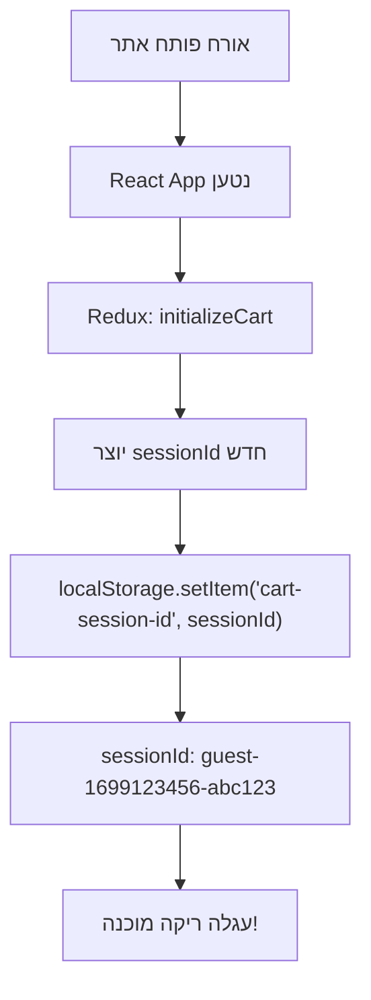
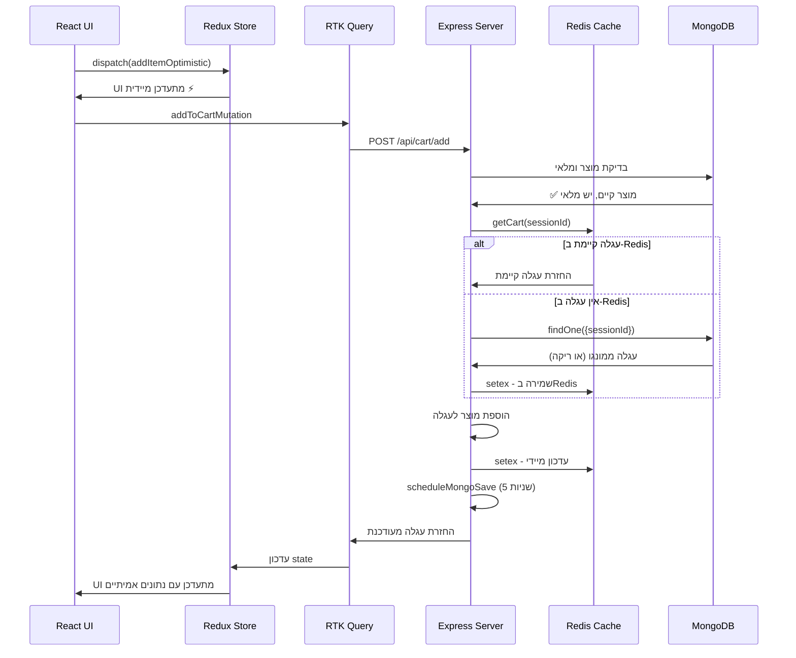
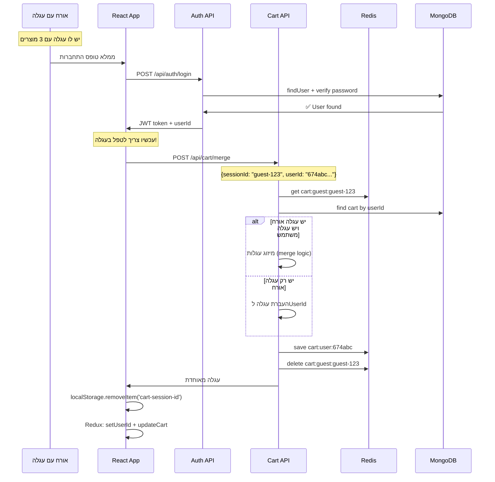
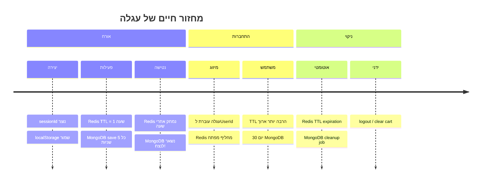
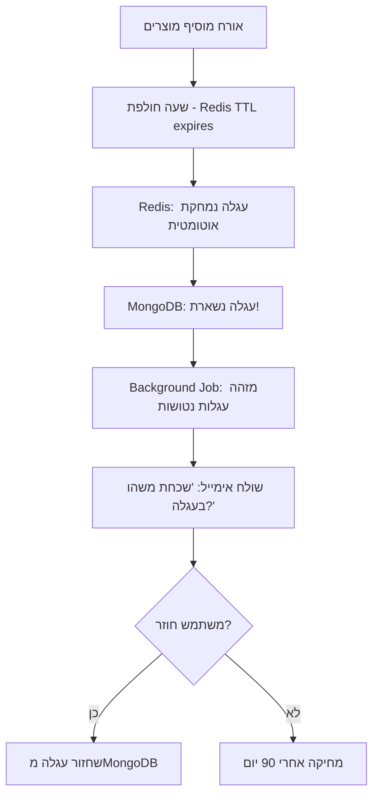
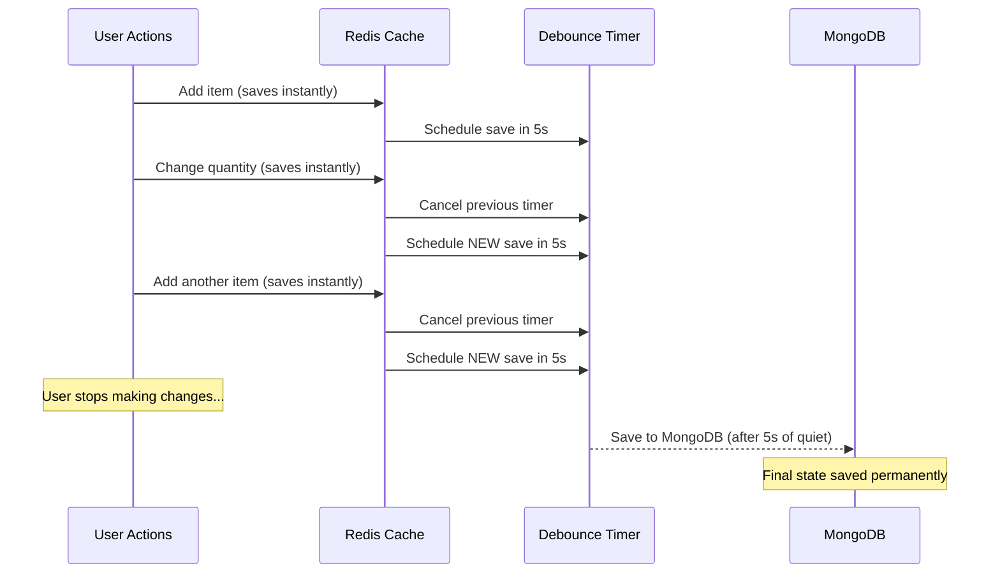

# 🛒 זרימת עגלת קניות מלאה - Redis + MongoDB
*תיעוד מפורט של כל התרחישים והקוד*

---

## 🎯 **סקירה כללית**

מערכת עגלת קניות היברידית המשלבת:
- **Redis**: זיכרון מהיר לפעולות יומיומיות
- **MongoDB**: אחסון קבוע לנתונים חשובים
- **localStorage**: גיבוי בדפדפן
- **Debounce**: שמירה חכמה למונגו

---

## 🗺️ **מפת תרחישים**

### **תרחיש 1: אורח חדש נכנס לאתר** 👤



**קוד Frontend:**
```javascript
// client/src/app/cartSlice.ts
const generateSessionId = (): string => {
  // 🔍 נסה לטעון sessionId קיים מ-localStorage
  const existingSessionId = localStorage.getItem('cart-session-id');
  
  if (existingSessionId) {
    console.log('🔄 Using existing session ID:', existingSessionId);
    return existingSessionId; // ✅ חזרה לעגלה קיימת!
  }
  
  // 🆕 צור sessionId חדש
  const newSessionId = `guest-${Date.now()}-${Math.random().toString(36).substr(2, 9)}`;
  
  // 💾 שמור ב-localStorage לעתיד
  localStorage.setItem('cart-session-id', newSessionId);
  console.log('🆕 Created new session ID:', newSessionId);
  
  return newSessionId;
};
```

---

### **תרחיש 2: הוספת מוצר לעגלה** 🛒



**קוד Backend:**
```typescript
// server/src/services/cart.service.ts
static async addToCart(sessionId: string, productId: string, quantity: number): Promise<ICart> {
  console.log(`🛒 Adding to cart: ${productId} x${quantity}`);

  // ✅ 1. בדיקת מוצר ומלאי (קריטי!)
  const product = await ProductModel.findById(productId);
  if (!product) throw new Error("Product not found");
  if (product.stock < quantity) throw new Error("Insufficient stock");

  // ⚡ 2. קבלת עגלה מהירה מRedis
  let cart = await this.getCart(sessionId);
  if (!cart) {
    cart = new CartModel({ sessionId, items: [], total: 0 });
  }

  // 🔄 3. עדכון עגלה
  const existingItem = cart.items.find(item => item.product.toString() === productId);
  if (existingItem) {
    existingItem.quantity += quantity; // עדכון כמות
  } else {
    cart.items.push({ product: productId, quantity, price: product.price }); // מוצר חדש
  }

  // 💰 4. חישוב מחדש של סכום
  cart.total = cart.items.reduce((sum, item) => sum + (item.price * item.quantity), 0);

  // ⚡ 5. שמירה מיידית בRedis
  await redisClient.setex(`cart:guest:${sessionId}`, 3600, JSON.stringify(cart));
  
  // ⏰ 6. תזמון שמירה למונגו (לא חוסם!)
  this.scheduleMongoSave(sessionId, cart); // 5 שניות debounce

  return cart;
}
```

---

### **תרחיש 3: משתמש נרשם/מתחבר** 🔐



**קוד מיזוג עגלות:**
```typescript
// server/src/services/cart.service.ts
static async mergeGuestCartToUser(sessionId: string, userId: string): Promise<ICart> {
  console.log(`🔄 Merging guest cart ${sessionId} to user ${userId}`);

  // 1. קבל עגלה של אורח
  const guestCart = await this.getCart(sessionId);
  
  // 2. קבל עגלה קיימת של משתמש (אם יש)
  const userCart = await this.getCart(null, userId);

  if (!guestCart) {
    return userCart || new CartModel({ userId, items: [], total: 0 });
  }

  if (!userCart) {
    // אין עגלה למשתמש - פשוט העבר את העגלה
    guestCart.userId = userId;
    guestCart.sessionId = undefined;
    
    await redisClient.setex(`cart:user:${userId}`, 3600, JSON.stringify(guestCart));
    await redisClient.del(`cart:guest:${sessionId}`);
    
    this.scheduleMongoSave(`user:${userId}`, guestCart);
    return guestCart;
  }

  // יש שתי עגלות - צריך למזג! 🤝
  const mergedCart = await this.mergeCarts(userCart, guestCart);
  mergedCart.userId = userId;
  
  // שמור עגלה מאוחדת
  await redisClient.setex(`cart:user:${userId}`, 3600, JSON.stringify(mergedCart));
  await redisClient.del(`cart:guest:${sessionId}`);
  
  this.scheduleMongoSave(`user:${userId}`, mergedCart);
  
  console.log(`✅ Carts merged successfully for user ${userId}`);
  return mergedCart;
}

private static async mergeCarts(userCart: ICart, guestCart: ICart): Promise<ICart> {
  console.log(`🤝 Merging carts: ${userCart.items.length} + ${guestCart.items.length} items`);

  // העתק עגלת משתמש כבסיס
  const merged = { ...userCart };
  
  // הוסף פריטים מעגלת אורח
  for (const guestItem of guestCart.items) {
    const existingItem = merged.items.find(
      item => item.product.toString() === guestItem.product.toString()
    );
    
    if (existingItem) {
      // פריט קיים - חבר כמויות
      existingItem.quantity += guestItem.quantity;
      console.log(`📈 Merged quantities for product ${guestItem.product}: ${existingItem.quantity}`);
    } else {
      // פריט חדש - הוסף
      merged.items.push(guestItem);
      console.log(`➕ Added new item from guest cart: ${guestItem.product}`);
    }
  }
  
  // חשב מחדש סכום
  merged.total = merged.items.reduce((sum, item) => sum + (item.price * item.quantity), 0);
  
  return merged;
}
```

---

### **תרחיש 4: מחזור חיים של עגלה - כמה זמן נשמר** ⏰



**הגדרות זמנים:**
```typescript
// server/src/services/cart.service.ts
class CartService {
  private static readonly CACHE_TTL = {
    GUEST: 3600,      // 1 שעה לאורח
    USER: 2592000,    // 30 יום למשתמש מחובר (2592000 שניות)
    ABANDONED: 7776000 // 90 יום לעגלות נטושות (שימור לשיווק)
  };

  private static readonly SAVE_DELAY = 5000; // 5 שניות debounce

  static async getCart(sessionId: string, userId?: string): Promise<ICart | null> {
    const cartId = userId ? `user:${userId}` : `guest:${sessionId}`;
    const ttl = userId ? this.CACHE_TTL.USER : this.CACHE_TTL.GUEST;
    
    // קבל מRedis עם TTL מתאים
    const redisCart = await redisClient.get(`cart:${cartId}`);
    if (redisCart) {
      // רענן TTL כל פעם שנגשים לעגלה
      await redisClient.expire(`cart:${cartId}`, ttl);
      return JSON.parse(redisCart);
    }
    
    // Fallback למונגו...
  }
}
```

---

### **תרחיש 5: עגלה נטושה - הזהב החבוי** 💰



**קוד לזיהוי עגלות נטושות:**
```typescript
// server/src/services/abandoned-cart.service.ts
export class AbandonedCartService {
  static async findAbandonedCarts(): Promise<ICart[]> {
    const oneDayAgo = new Date(Date.now() - 24 * 60 * 60 * 1000);
    
    // מצא עגלות שעודכנו לאחרונה לפני יום
    const abandonedCarts = await CartModel.find({
      updatedAt: { $lt: oneDayAgo },
      items: { $not: { $size: 0 } }, // לא ריקות
      'items.0': { $exists: true },   // יש פריטים
      emailSent: { $ne: true }        // עוד לא נשלח אימייל
    }).populate('items.product');

    console.log(`📧 Found ${abandonedCarts.length} abandoned carts`);
    return abandonedCarts;
  }

  static async sendAbandonedCartEmail(cart: ICart): Promise<boolean> {
    try {
      const totalValue = cart.total;
      const itemCount = cart.items.length;
      
      // בעתיד - אינטגרציה עם SendGrid/MailChimp
      console.log(`📧 Sending abandoned cart email for cart ${cart._id}`);
      console.log(`   Value: $${totalValue}, Items: ${itemCount}`);
      
      // סימון שאימייל נשלח
      await CartModel.findByIdAndUpdate(cart._id, {
        emailSent: true,
        emailSentAt: new Date()
      });
      
      return true;
    } catch (error) {
      console.error('❌ Failed to send abandoned cart email:', error);
      return false;
    }
  }

  // Cron job שרץ כל יום
  static async processAbandonedCarts(): Promise<void> {
    console.log('🔍 Processing abandoned carts...');
    
    const abandonedCarts = await this.findAbandonedCarts();
    
    for (const cart of abandonedCarts) {
      await this.sendAbandonedCartEmail(cart);
      
      // מרווח קטן בין אימיילים
      await new Promise(resolve => setTimeout(resolve, 1000));
    }
    
    console.log(`✅ Processed ${abandonedCarts.length} abandoned carts`);
  }
}
```

---

## 🔄 **Debounce Pattern - הקסם של 5 השניות**



**קוד ה-Debounce:**
```typescript
private static async scheduleMongoSave(cartId: string, cart: ICart): Promise<void> {
  // בטל timer קודם אם יש
  const existingTimer = this.pendingSaves.get(cartId);
  if (existingTimer) {
    clearTimeout(existingTimer);
    console.log(`⏰ Cancelled previous save for ${cartId}`);
  }

  // צור timer חדש
  const timer = setTimeout(async () => {
    console.log(`💾 ACTUALLY saving to MongoDB: ${cartId}`);
    
    await CartModel.findOneAndUpdate(
      { sessionId: cart.sessionId, userId: cart.userId },
      { items: cart.items, total: cart.total, updatedAt: new Date() },
      { upsert: true }
    );
    
    this.pendingSaves.delete(cartId);
    console.log(`✅ MongoDB save completed: ${cartId}`);
  }, 5000); // 5 שניות

  this.pendingSaves.set(cartId, timer);
  console.log(`⏰ MongoDB save scheduled for ${cartId} in 5 seconds`);
}
```

---

## 🧹 **ניקוי אוטומטי**

### **MongoDB Cleanup Job:**
```typescript
// server/src/jobs/cleanup.job.ts
export class CleanupJob {
  // נקה עגלות ישנות מאוד (90 יום)
  static async cleanupOldCarts(): Promise<void> {
    const ninetyDaysAgo = new Date(Date.now() - 90 * 24 * 60 * 60 * 1000);
    
    try {
      const result = await CartModel.deleteMany({
        updatedAt: { $lt: ninetyDaysAgo },
        userId: { $exists: false } // רק עגלות אורח
      });
      
      console.log(`🧹 Cleaned up ${result.deletedCount} old guest carts`);
      
    } catch (error) {
      console.error('❌ Cleanup failed:', error);
    }
  }

  // נקה עגלות ריקות
  static async cleanupEmptyCarts(): Promise<void> {
    try {
      const result = await CartModel.deleteMany({
        $or: [
          { items: { $size: 0 } },
          { items: { $exists: false } }
        ]
      });
      
      console.log(`🗑️ Cleaned up ${result.deletedCount} empty carts`);
      
    } catch (error) {
      console.error('❌ Empty cart cleanup failed:', error);
    }
  }

  // הפעל כל הניקויים
  static async runAllCleanups(): Promise<void> {
    console.log('🧹 Starting cleanup jobs...');
    
    await this.cleanupOldCarts();
    await this.cleanupEmptyCarts();
    
    console.log('✅ Cleanup jobs completed');
  }
}
```

---

## 📊 **מטריקות וניטור**

```typescript
// server/src/services/analytics.service.ts
export class CartAnalyticsService {
  // סטטיסטיקות עגלות
  static async getCartStats(): Promise<any> {
    try {
      const stats = await CartModel.aggregate([
        {
          $group: {
            _id: null,
            totalCarts: { $sum: 1 },
            totalValue: { $sum: '$total' },
            averageValue: { $avg: '$total' },
            averageItems: { $avg: { $size: '$items' } }
          }
        }
      ]);

      const guestCarts = await CartModel.countDocuments({ userId: { $exists: false } });
      const userCarts = await CartModel.countDocuments({ userId: { $exists: true } });

      const thirtyDaysAgo = new Date(Date.now() - 30 * 24 * 60 * 60 * 1000);
      const recentCarts = await CartModel.countDocuments({ 
        updatedAt: { $gte: thirtyDaysAgo } 
      });

      return {
        total: stats[0]?.totalCarts || 0,
        totalValue: stats[0]?.totalValue || 0,
        averageValue: stats[0]?.averageValue || 0,
        averageItems: stats[0]?.averageItems || 0,
        guestCarts,
        userCarts,
        recentCarts,
        abandonmentRate: ((stats[0]?.totalCarts || 0) - recentCarts) / (stats[0]?.totalCarts || 1) * 100
      };

    } catch (error) {
      console.error('❌ Analytics error:', error);
      return null;
    }
  }
}
```

---

## 📋 **סיכום הזמנים**

| מצב | Redis TTL | MongoDB | localStorage | הערות |
|-----|-----------|---------|--------------|--------|
| **אורח חדש** | 1 שעה | ∞ (עם debounce 5s) | sessionId שמור | יוצר מזהה ייחודי |
| **אורח פעיל** | מתחדש בכל פעולה | ∞ | sessionId קיים | TTL נרענן |
| **התחברות** | → 30 יום | ∞ | נמחק sessionId | מיזוג עגלות |
| **משתמש מחובר** | 30 יום | ∞ | - | עגלה קבועה |
| **logout** | נמחק | ∞ (שמור) | - | עגלה נשמרת |
| **נטישה** | פג אחרי TTL | נשאר 90 יום | - | אימיילי שיווק |

---

## 💡 **יתרונות הגישה**

- ⚡ **מהירות**: Redis לכל הפעולות הרגילות
- 💾 **אמינות**: MongoDB לשמירה קבועה 
- 🎯 **שיווק**: עגלות נטושות לקמפיינים
- 🔄 **גמישות**: מיזוג חכם בין אורח למשתמש
- 🧹 **ניקוי**: אוטומטי ומתוזמן
- 📊 **אנליטיקה**: מעקב מלא אחר התנהגות